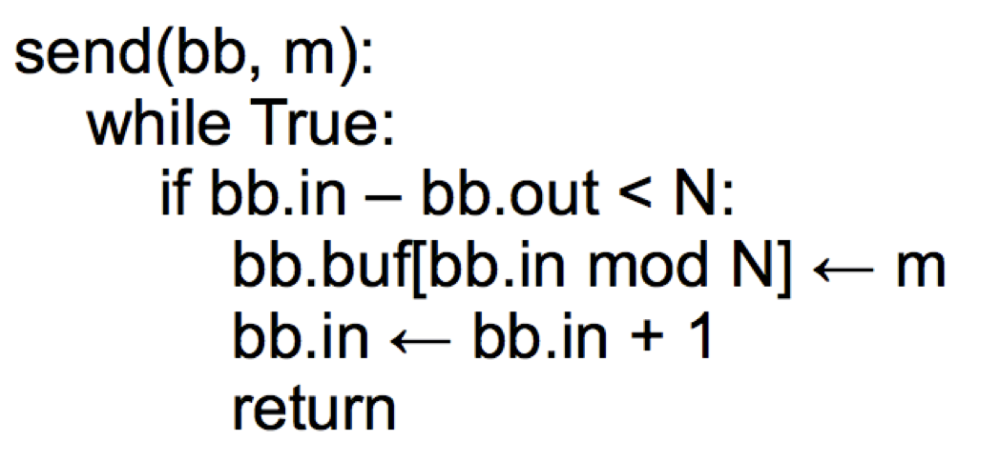
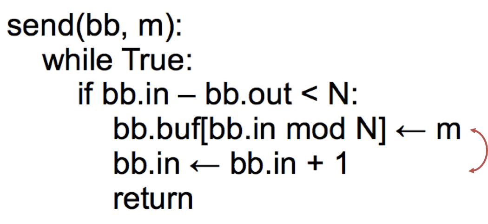
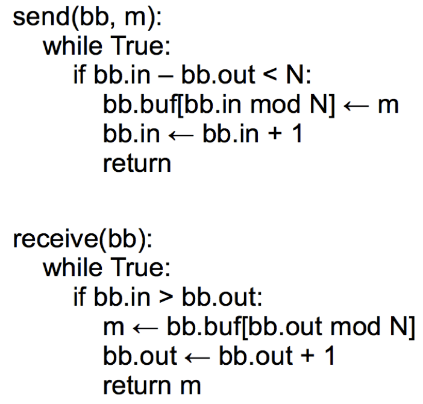
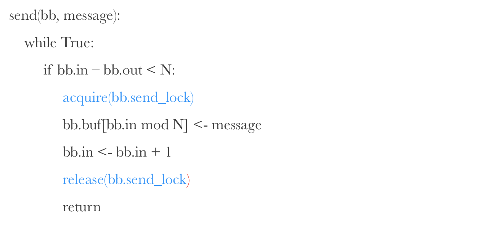
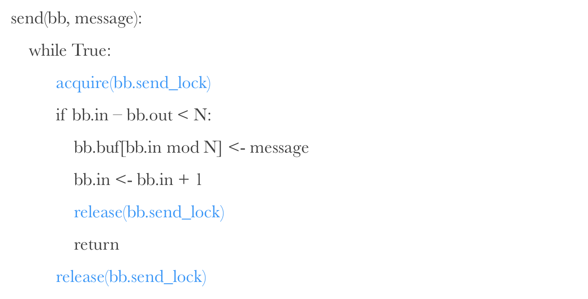
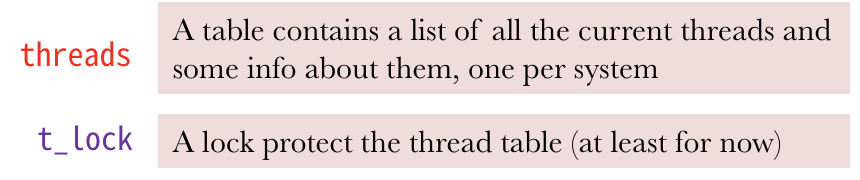
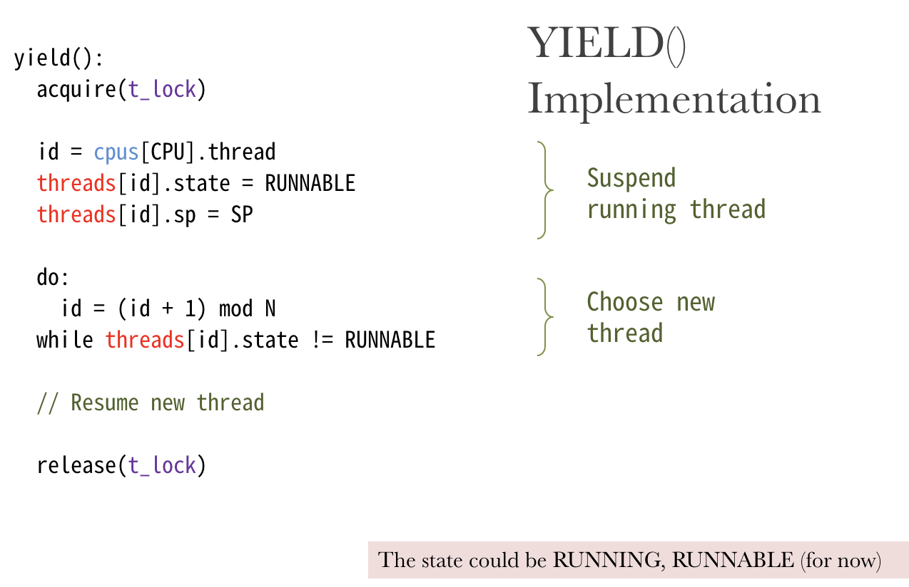
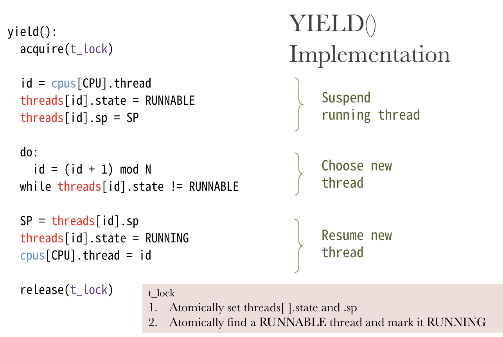

# Nov 12 Tue

>    絕望的星期二

## SE-302::Compilers

今天要講的內容是 Global Optimization。全局性的優化。

### Flow Analysis

對全局的控制流進行分析，觀察是否有什麼可以刪除的 Code。

先看局部的情形。

####Local Optimization

The simple optimizations in basic blocks are: 

-   Constant propagation

-   Dead code elimination

如臨時變量的常數指派就可以被安全地刪除：

```tiger
X := 3
Y := Z * W
Q := X + Y

=>

X := 3
Y := Z * W
Q := 3 + Y

=>

Y := Z * W
Q := 3 + Y
```

如是。

#### Goes to Global

到了全局就比較複雜了；如果要做一個點的優化，會影響到全局所有變量、所有路徑。都會產生干涉。

如何確定我們的優化的「正確性」呢？這是我們最關心的。

#### Correctness

我們把所有變元分為兩類：Live or Dead。

Live: 可能在其後被用到的（Might be used）

Dead: 不可能在其後被用到的（Never be used）

留意：Live 只是可能被用到，我們就不能刪掉它。只有完全確定不可能被用到的 Dead 才能被安全地優化掉。

#### Liveness

判斷一個變量：他是活著的嗎？

我們有這樣一套判據：

A variable $x$ is live at statement $s$ if

-   There exists a statement $s’$ that uses $x$

-   There is a path from $s$ to $s’$

-   That path has no intervening assignment to $x$

好像很有道理：如果 $s$ 有到 $s'$ 的通路（或者乾脆就是他自己），在 $s'$ 處用到了 $x$，且這條通路之間沒有介入對 $x$ 的賦值，則稱 $x$ 在 $s$ 中是活的。

### Global Analysis

Global optimization tasks share several traits:

-   The optimization depends on knowing a property $X$ at a particular point in program execution

-   Proving $X$ at any point requires knowledge of the entire function body

-   It is OK to be conservative. If the optimization requires $X$ to be true, then want to know either

    -   $X$ is definitely true

    -   Don’t know if $X$ is true

-   It is always safe to say “don’t know”

總歸，要判斷任何位置的 $X$ 都需要全局的信息才能確定。

如果你不能確定，那麼就走保守路線，在優化的時候 Being Conservative 不會錯。

####Rules

#####規則一


#####規則二


這種賦值，新值跟原值是有關係的。因此是有作用的。不能視為死的。

#####規則三


假若 $e$ 沒有利用到 $x$，那就不算他活著。

#####規則四


#### Algorithms

1.  Let all L_(…) = false initially

2.  Repeat until all statements s satisfy rules 1 - 4

    Pick s where one of 1 - 4 does not hold and update using the appropriate rule.

一開始把所有人都認定為 False。然後重複利用規則 1 到規則 4，重複對整體進行 True 化，直到沒有可以繼續執行的部分。


總歸，整個過程就是不斷利用四個規則將 False 改寫成 True 的過程。

#### Computing Liveness Set

現在我們已經分析出了每個位置的 Liveness 性；那麼接下來我們該拿這個 True / False 集合怎麼辦呢？

#### Termination

-   A value can change from false to true, but not the other way around

註：一個變量從 False 變成 True 之後，就不可能再從 True 變回到 False 了。

-   Each value can change only once, so termination is guaranteed

由上條可知，每一個值最多只可能變換一次。因此不會不停地變下去。

-   Once the analysis is computed, it is simple to eliminate dead code

一旦所有的「轉換分析」結束，就很容易分析死代碼了。

#### Example


### Termination

#### When?

Simply saying “repeat until nothing changes” doesn’t guarantee that eventually nothing changes.

### Register Allocation

#### Main Idea

之前生成代碼的時候，從來都是隨便用寄存器的。一分錢不花，想加多少加多少。

#### Interference Graph

-   Step 1 (build): build an Interference graph
    -   Nodes of the graph = variables
    -   Edges connect variables that interfere with one another

-   Nodes will be assigned a color corresponding to the register assigned to the variable

-   Two nodes with the same color can’t be next to one another in the graph

## SE-227::CSE

上節課講過了 Lock 的實現。可以軟件實現也可以硬件實現；但軟件實現總是不靠譜的。（如底層硬件用了弱化版的 Cache Consistency 的話，那鎖就不牢靠了。）

總歸還是硬件實現的最靠譜；如果沒按實際情況來你可以去找 Intel/AMD 退錢（×）

### Thread & Condition Variable

#### Buffer API

-   Bounded buffer: a buffer that stores (up to) N messages

-   Bounded buffer API

    send (m)

    m <- receive()

API 設計很簡單；直接 call `send` 跟 `receive` 就能實現 Buffer 交換了。

####SEND & RECEIVE

留意到 Send 和 Receive 都是 System Call 級別的。

-   Supervisor calls (e.g., system calls)

-   Copy the message from/to the thread's domain to/from the shared buffer

-   Programs running in kernel mode is written carefully

-   Transitions between user mode and kernel mode can be expensive

#### Bounded Buffer Send



Send 的實現如上所述；旁註特別說明不可以交換雙向箭頭所指的兩行語句。

原因是什麼？



如果我們先 + 1 再放置 Buffer Value，那麼就可以直接 Call Receive 了。然而此時值還沒進去！

假如在這兩條語句之間 Receive 被 call，那麼就等於是讀到了垃圾值。這不應該。

Before or After 告訴我們不能把錯誤的中間狀態暴露給別人。

所以，先放值再廣播說「喜+1」，而非反過來。

#### Lock Myth

我們之前不是說，所有的多線程操作都得加鎖嗎。這裡怎麼沒有鎖，實現居然也可以用？

因為我們這個算法只能被用在 One Sender & One Receiver 的情況。

如果有兩個 Sender 或是兩個 Receiver，就會同時遞增／遞減 bb.in，這肯定會有問題。

但是，這裏在 Single Producer & Single Consumer 的情況下是可以用的。

#### Bounded Buffer Send & Receive



同樣的，有下面的 Assumption：

1.  Single producer & Single consumer 

2.  Each on its own CPU

3.  in and out do not overflow 

4.  read/write coherence (e.g., on cache)

5.  in and out ensure before-or-after atomicity

6.  The result of executing a statement becomes visible to other threads in program order
    -   Compilers cannot optimize it

### Lockerize

現在我們希望我們的 Send / Receive 程序可以運行在多個 CPU 上，可以支持多個 Sender 和 Receiver。

因此我們得加鎖。

#### Wrong Version



這個算法的問題在於：if  bb.in - bb.out 條件沒被加鎖，因此可能有多個 Sender 同時被允許進入 acquire 中，可是其實這時候可能已經沒有足夠的空間給 Send 了。（錯誤判斷形勢的原因是髒讀了 bb.in - bb.out。）

#### Right Version



這個版本裡進去就先拿鎖；假如空間不夠（bb.in - bb.out >= N），就直接放棄鎖。

### `yield()`

何謂 yield？

-   When using locking, current thread is busy waiting for an event

-   Implementation of yield():

1.  Suspend running thread: save stack pointer and page-table register

2.  Choose new thread: round-robin fashion until we hit a RUNNABLE thread (perhaps the one that just called yield)

3.  Resume thread to run: reload state all of this happens as an atomic action

-   Data structures
    -   threads table, CPUs table, t_lock

#### Appliance

您在 yield 的時候，切莫拿著鎖做這個操作。否則就鎖死了。

#### Implementation

yield 是怎麼實現的呢？主要分三步走：

```c++
// Suspend the running thread

// Choose a new thread

// Resume the new thread
```

##### Suspend the Running Thread

```c++
yield():
  acquire(t_lock)

  id = id of current thread
  threads[id].state = RUNNABLE
  threads[id].sp = SP

  // Choose a new thread
  // Resume the new thread
  
  release(t_lock)
```



##### Choose a New Thread



##### Resume New Thread



### Conditional Variables

Yield 的問題就在於造成了 a lot of unnecessary checking as well as a lot of acquiring locks。

更好的解決方案：不要一次把所有人都叫一遍，不如 the sender (receiver) just got woken up when the buffer is not full (empty)。

#### Definition

-   Condition Variable
    -   Let threads wait for events

    -   The threads get notified when the events occur

-   Condition variable API
    -   WAIT(cv): yield processor and wait to be notified of cv
    -   NOTIFY(cv): notify waiting threads of cv

