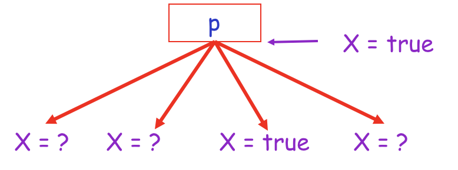
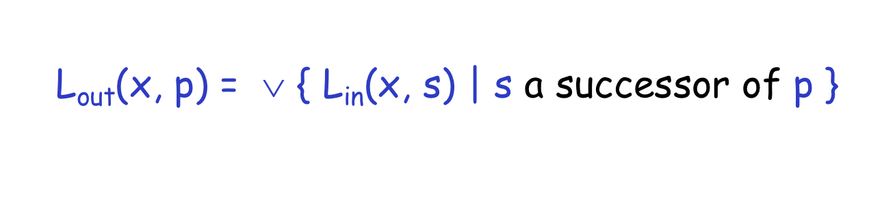
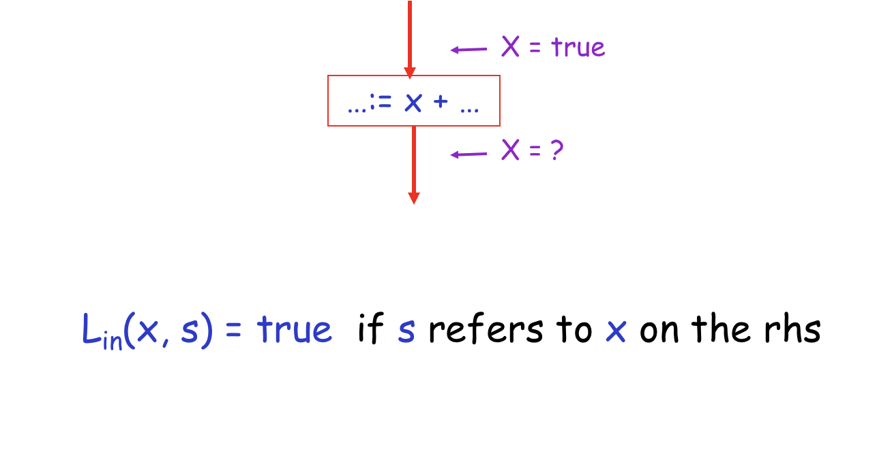
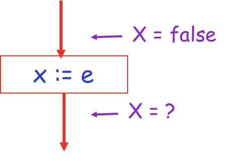
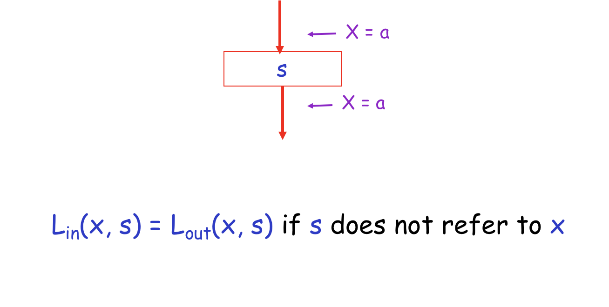
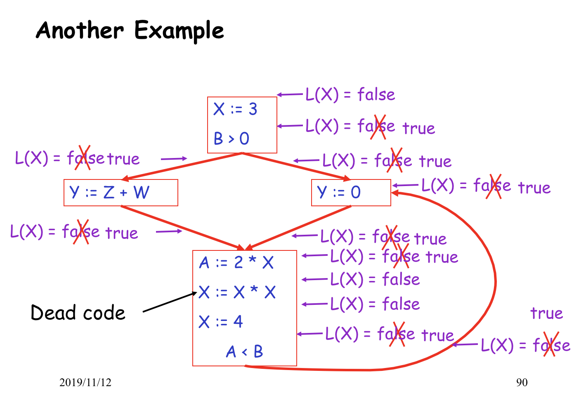
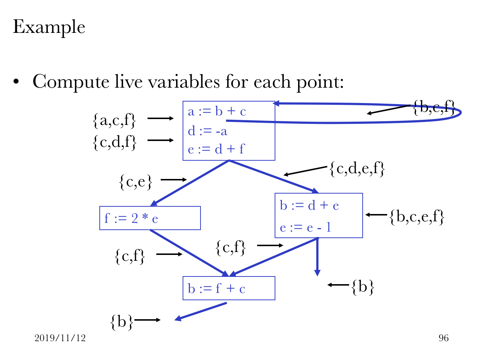

# Oct 12 Tue

>    絕望的星期二

## SE-302::Compilers

今天要講的內容是 Global Optimization。全局性的優化。

### Flow Analysis

對全局的控制流進行分析，觀察是否有什麼可以刪除的 Code。

先看局部的情形。

####Local Optimization

The simple optimizations in basic blocks are: 

-   Constant propagation

-   Dead code elimination

如臨時變量的常數指派就可以被安全地刪除：

```tiger
X := 3
Y := Z * W
Q := X + Y

=>

X := 3
Y := Z * W
Q := 3 + Y

=>

Y := Z * W
Q := 3 + Y
```

如是。

#### Goes to Global

到了全局就比較複雜了；如果要做一個點的優化，會影響到全局所有變量、所有路徑。都會產生干涉。

如何確定我們的優化的「正確性」呢？這是我們最關心的。

#### Correctness

我們把所有變元分為兩類：Live or Dead。

Live: 可能在其後被用到的（Might be used）

Dead: 不可能在其後被用到的（Never be used）

留意：Live 只是可能被用到，我們就不能刪掉它。只有完全確定不可能被用到的 Dead 才能被安全地優化掉。

#### Liveness

判斷一個變量：他是活著的嗎？

我們有這樣一套判據：

A variable $x$ is live at statement $s$ if

-   There exists a statement $s’$ that uses $x$

-   There is a path from $s$ to $s’$

-   That path has no intervening assignment to $x$

好像很有道理：如果 $s$ 有到 $s'$ 的通路（或者乾脆就是他自己），在 $s'$ 處用到了 $x$，且這條通路之間沒有介入對 $x$ 的賦值，則稱 $x$ 在 $s$ 中是活的。

### Global Analysis

Global optimization tasks share several traits:

-   The optimization depends on knowing a property $X$ at a particular point in program execution

-   Proving $X$ at any point requires knowledge of the entire function body

-   It is OK to be conservative. If the optimization requires $X$ to be true, then want to know either

    -   $X$ is definitely true

    -   Don’t know if $X$ is true

-   It is always safe to say “don’t know”

總歸，要判斷任何位置的 $X$ 都需要全局的信息才能確定。

如果你不能確定，那麼就走保守路線，在優化的時候 Being Conservative 不會錯。

####Rules

#####規則一





#####規則二



這種賦值，新值跟原值是有關係的。因此是有作用的。不能視為死的。

#####規則三



假若 $e$ 沒有利用到 $x$，那就不算他活著。

#####規則四



#### Algorithms

1.  Let all L_(…) = false initially

2.  Repeat until all statements s satisfy rules 1 - 4

    Pick s where one of 1 - 4 does not hold and update using the appropriate rule.

一開始把所有人都認定為 False。然後重複利用規則 1 到規則 4，重複對整體進行 True 化，直到沒有可以繼續執行的部分。



總歸，整個過程就是不斷利用四個規則將 False 改寫成 True 的過程。

#### Computing Liveness Set

現在我們已經分析出了每個位置的 Liveness 性；那麼接下來我們該拿這個 True / False 集合怎麼辦呢？

#### Termination

-   A value can change from false to true, but not the other way around

註：一個變量從 False 變成 True 之後，就不可能再從 True 變回到 False 了。

-   Each value can change only once, so termination is guaranteed

由上條可知，每一個值最多只可能變換一次。因此不會不停地變下去。

-   Once the analysis is computed, it is simple to eliminate dead code

一旦所有的「轉換分析」結束，就很容易分析死代碼了。

#### Example



