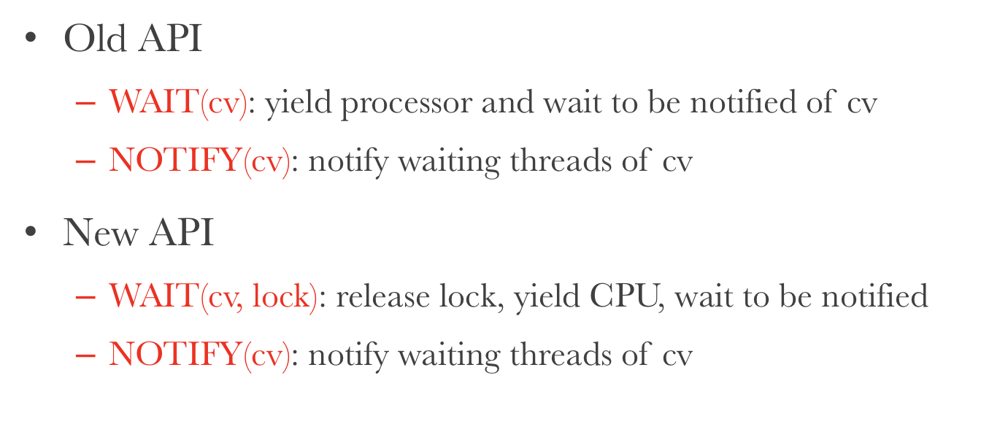
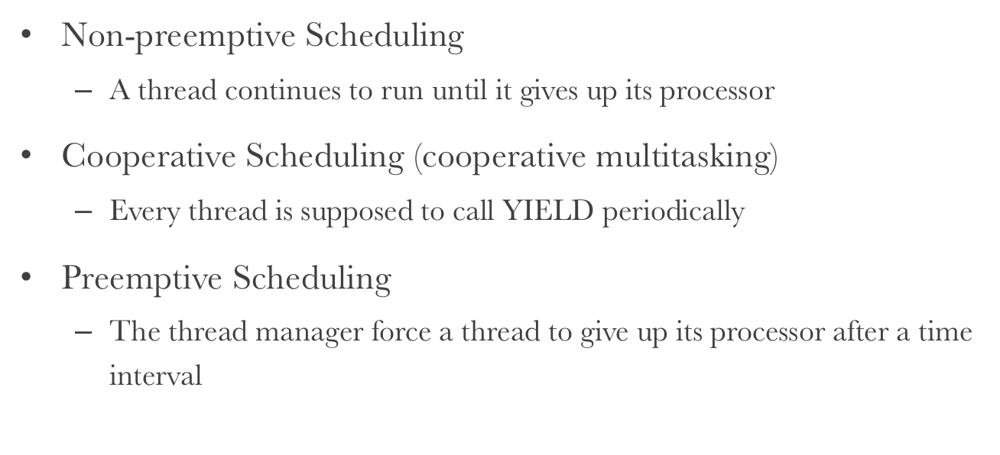
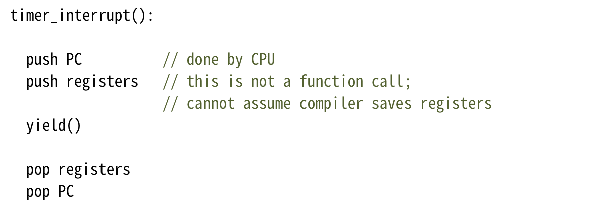
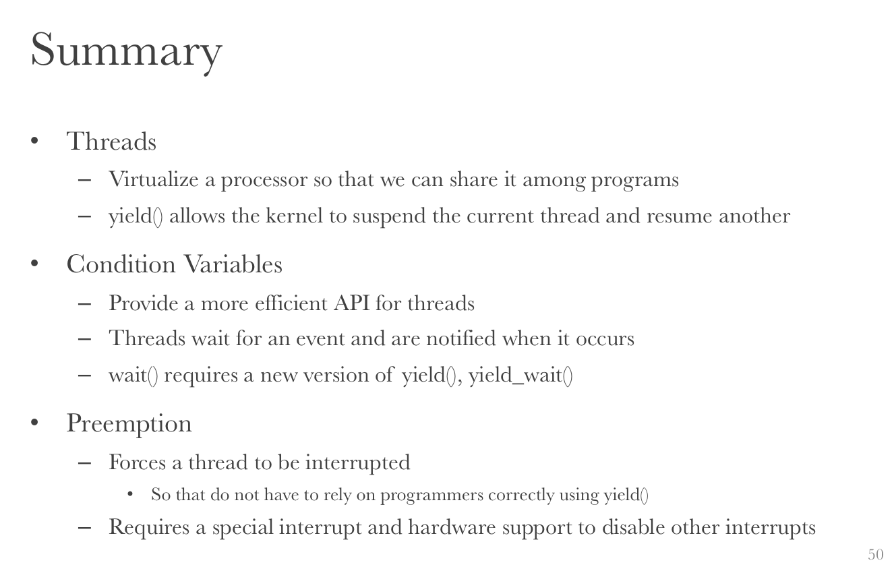

# Oct 14 Thu

## SE-227::CSE

### Re-provision

又一次。噩夢。

####New API Design

為了避免拿著鎖睡覺的問題。設計了一套新的 API。

### Threads

為了徹底理解「進程／線程切換」，不得不理解一下：在一台機器上，是怎麼衍生出這些「Thread」抽象的。

實際上是分時使用、切換上下文（Context）來偽裝出一個「多進程」的環境；而多線程則毋須切換上下文。

本質上就是來回切換運行控制權。切換的時機完全由 CPU 決定。因此就存在了切換時機組合的不確定性；這就帶來了多線程的複雜性和不可預知性，同時帶來了一堆 Race Conditions。

### Thread Layer / Processor Layer

yield 之前，還是在 Thread Layer，也就是用戶狀態裡。而在調用 yield 之後，CPU 就會被切換到內核狀態（Processor Layer）。

####     Preemption

所謂 Preemption，就是「搶佔式的」。

搶佔式的任務調度，就是說一個正在運行中的 Task 不會願意自己退休。必須有一段更高級的指令*逼宮*，才可能讓他*退位*。

誰來做這件事呢？

#### Implementation

在設備中建立一個時鐘；時鐘到期的時候，就觸發一次 Interrupt（中斷），切換到 Kernel Mode，並在此模式下執行 Clock Interrupt Handler。

隨後，Clock Interrupt Handler 會根據條件，選擇性交予 Thread Layer 控制權。

偽匯編大概長這樣。

通過這樣簡單的分工，計算機就開始執行了。

### Summary

