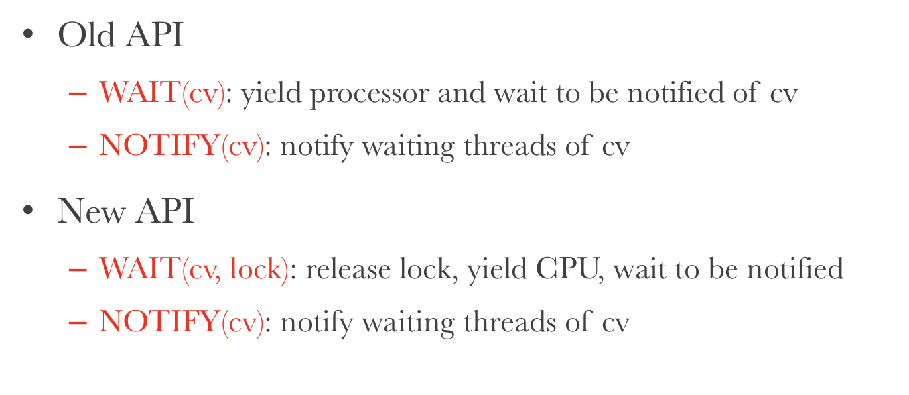
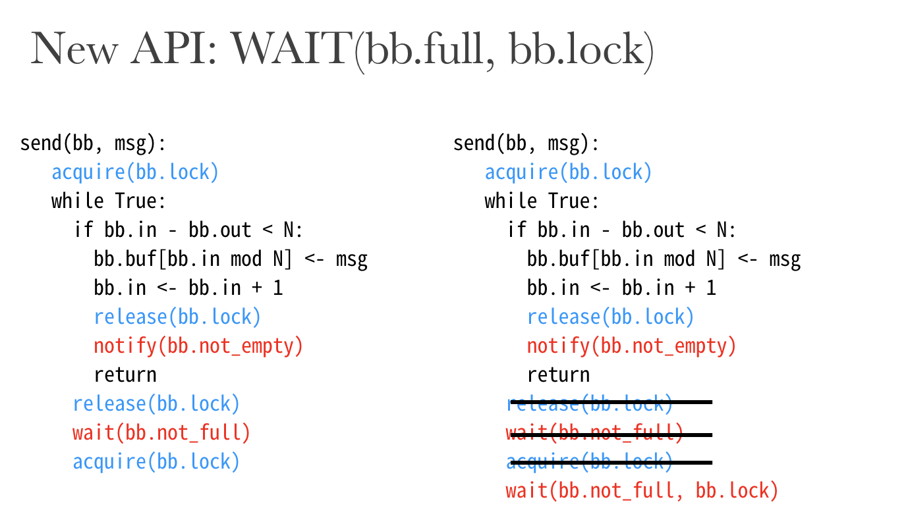
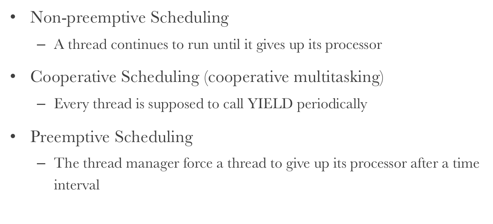
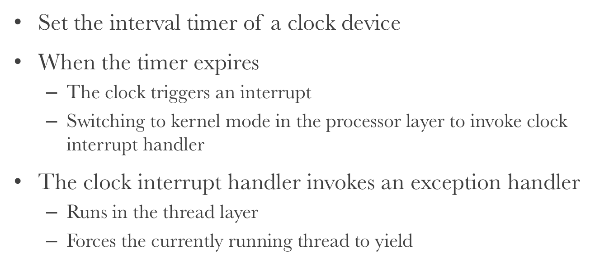
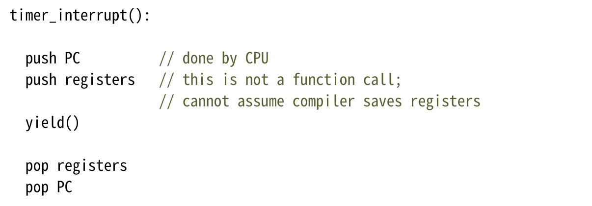
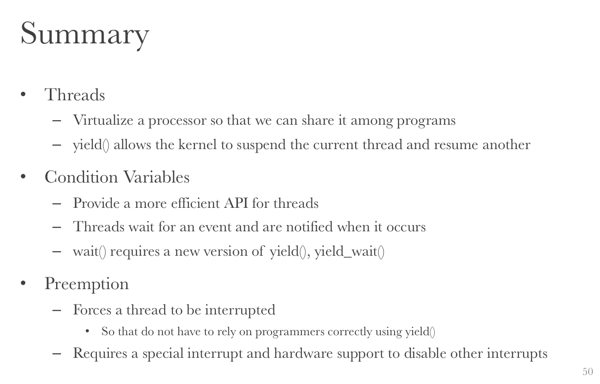

# Nov 14 Thu

## SE-227::CSE

### Re-provision

又一次。噩夢。

####New API Design

為了避免拿著鎖睡覺的問題。設計了一套新的 API。

### Threads

為了徹底理解「進程／線程切換」，不得不理解一下：在一台機器上，是怎麼衍生出這些「Thread」抽象的。

實際上是分時使用、切換上下文（Context）來偽裝出一個「多進程」的環境；而多線程則毋須切換上下文。

本質上就是來回切換運行控制權。切換的時機完全由 CPU 決定。因此就存在了切換時機組合的不確定性；這就帶來了多線程的複雜性和不可預知性，同時帶來了一堆 Race Conditions。

### Thread Layer / Processor Layer

yield 之前，還是在 Thread Layer，也就是用戶狀態裡。而在調用 yield 之後，CPU 就會被切換到內核狀態（Processor Layer）。

####     Preemption

所謂 Preemption，就是「搶佔式的」。

搶佔式的任務調度，就是說一個正在運行中的 Task 不會願意自己退休。必須有一段更高級的指令*逼宮*，才可能讓他*退位*。

誰來做這件事呢？

#### Implementation

在設備中建立一個時鐘；時鐘到期的時候，就觸發一次 Interrupt（中斷），切換到 Kernel Mode，並在此模式下執行 Clock Interrupt Handler。

隨後，Clock Interrupt Handler 會根據條件，選擇性交予 Thread Layer 控制權。

偽匯編大概長這樣。

通過這樣簡單的分工，計算機就開始執行了。

### Summary

## SE-344::CG

_could someone take me away from this planet_

### 復習

上節課我們提到了⋯⋯多邊形化的方法。

希望盡可能快（高效率）。

用盡可能少的頂點數。

且最多地保留原有形狀（保形性）。

滿足上面三條的算法：自適應型多邊形化。這個有用的。

###合併與條帶化

考慮到如果我們分別獨立存儲每個三角形，就會造成同樣的頂點被多次存儲。同樣的，被三角形共享的邊也會被多次存儲，不夠經濟實惠。

如果我們抽離出那些被共享的頂點和邊，然後據此來構建條帶化的三角形，就能節約空間，提升效能。

「合併與條帶化」做的事情就是這些了。

### 網格簡化與 LOD

網格簡化的目的：在圖形外觀（基本）不變的情況下，盡可能減少模型的頂點數量。

實際最好的情況是可以動態地調整目標頂點數量。

#### LOD

多分辨率模型：預先計算好多種分辨率的模型。

*   Remeshing
*   Parametric Surfaces
*   Subdivision Surfaces

#### Vertex Clustering

頂點聚合。[Rossignac & Borrel 93]

這個問題就在於，沒辦法保證下一次做聚合時，哪些點會遭到聚合，哪些又不會。

並且，無法控制頂點聚合之後，結果的細粒度是多少。

再並且，這個操作是不可逆的。聚合了就再也分不開。

#### Edge Collapse

邊塌陷法。所謂邊塌陷，相當於兩點合併為一點。減少了一個點，減少了兩個三角形，減少了三條邊。

好處就在於，我們做一次邊塌陷，減少的點、邊、三角形數目都是固定的。

可以精細地控制最終剩餘多少點、邊、三角形。

而且，我們只要記錄下來我們把哪兩個點合併了，就還能進行 Undo。是個可逆操作。

### 動態網格簡化

#### Hoppe's 漸進網格法

#### Garland 和 Heckbert 的方法

利用「代價函數」來改進。代價函數定義為平面與該頂點新位置之間距離的平方和。

通過定量的代價函數，我們就可以嚴格地進行動態網格簡化。

#### 基於保持表面特徵不變的代價函數

人類的觀察是很複雜的。要保持其表面特徵，很難量化地表述。

Linston & Turk 提出了一種可以量化「相似性」的算法，可以定量地衡量走樣的程度。

###Transformation

I love transformation!

OpenGL has provided much APIs, and it could be implemented quite easily.

However, what does the transformation APIs do indeed? What should we do if we're going to implement it by ourselves?

####Geometric Transformation

Changing Shapes' position, size, rotation to implement animation, design, and layout.

#### Animations

As human eye are not functionally good, it can't separatedly tell the segmentation of frames when the FPS (Frame per Second) is about over than 24fps. Human eyes sucked at all.

So we can trick our eyes, constructing animation at low costs.

#### Coordinate

Coordinate: 所謂坐標系。Commonly accepted coordinate includes: 

*   **Modeling Coordinate**, created by the main object (model) as the central of the object. 
*   **World Coordinate**, created when the world was created.
*   **Vision Coordinate**, transformed from the world coordinate. That could be used for the viewpoint's generation.

#### Rotation

That's simple. Give me the base point $(x_0, y_0)$ and the rotation angle $\theta$.

The transformed point would be $(x_0\cos\theta, y_0\cos\theta)$。

It's very easy to conclude under the polar coordinate.

If the rotation operation was referenced as another point, we just need to move the coordinate to the reference point, do the rotation, and then move back the coordinate.

#### Scaling

Under 2D coordinate, the transformed position can be calculated by:

$x' = x \times s_x$, $y' = y \times s_y$.

If we want to scale by another base point, just do as above!

*   Move the object to another base point
*   Scale
*   Move it back

That's it.

####2D to 3D

It's getting more complex. Why?

Moving and Scaling are nothing different. However, here's the problem:

The rotation stuff 需要指定在哪個平面上進行旋轉。

##Inconsistency

在笛卡兒坐標系下，矩陣變換的平移、縮放和旋轉的形式不統一。

這真是太痛苦了。不統一的東西實在讓人想死得要命。

有什麼辦法嗎？只好用數學語言來說話。

數學語言能幹這事嗎？

沒事的本來也沒有什麼交流的需求。

活在 PC 機裡也挺好的。

所有的 System Call 都有著嚴格的規定。明白易懂無歧異，Well Documented. 所有的事情都有文檔可查，所有人都說著一樣的 Arch Assembly. 調用著一樣的底層 API。

但是反過來想。PC 與 PC 之間的區隔一點不少。

同屬 Unix-like 的就已有大量的不兼容，Mac OS X 的根本不向下兼容，Windows 的努力向下兼容卻根本做不好的向下兼容。差勁的東西一點不少。

如果生活在一個屬於 Apple 當局的 OS，那連存在安全也很難得到保障。說不定明天 Apple 一不開心就把你下架了，把舊版 OS 給鎖了。清除掉了低端 App。或者因為沒連結到 Apple 的中央軟件驗證服務器，直接被拒絕啟動。

如果生活在 Windows 裡，那大概會骯髒地在混亂裡面勉強地生活下去，捏著鼻子 Call 那些又臭又長、為了向下兼容而設定的垃圾一樣的 API。

可算發現了。人造出來的東西就總是沒法好。OS、語言、文字、政體，都跳不出作為人類的本性。一旦達到了一定的複雜度，就是會有人去把它弄亂、打著簡化的名頭弄出醜陋和不一致。大家都想著各立山頭，想著要進步，卻又被積俗拉著沒法達到理想的目標；想要 Undo 卻又積重難返。

人類還是回去山洞裡住得了。我們的大腦不足夠管理這麼複雜的系統。

少禍害人了。