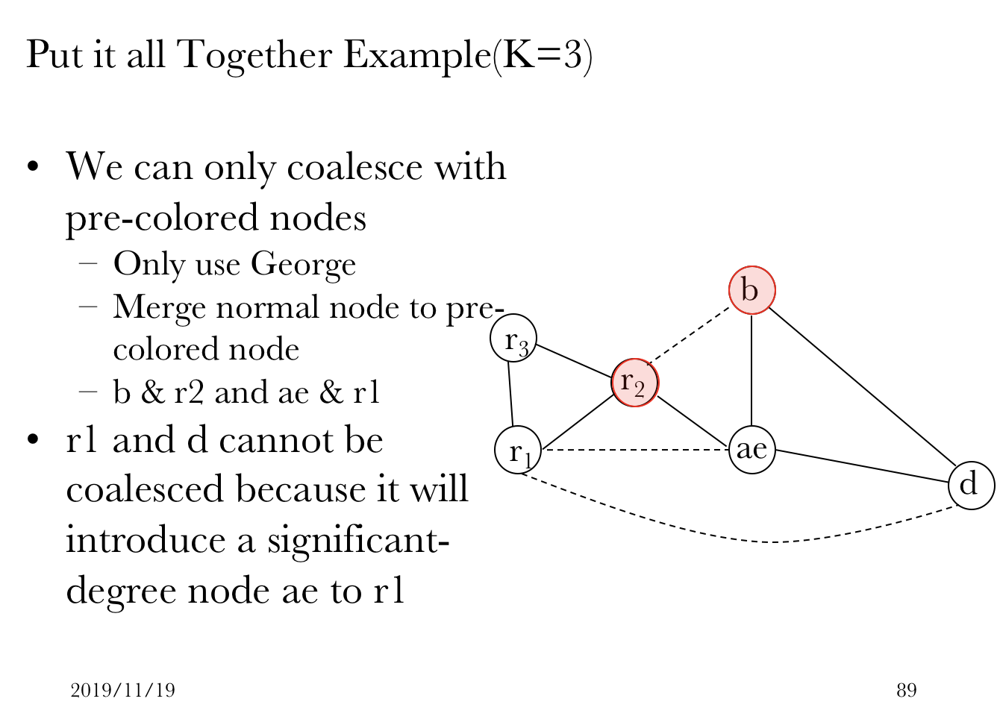
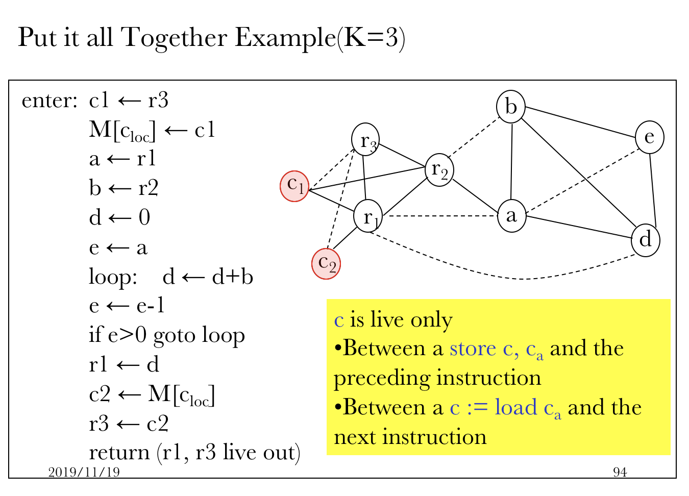

# Nov 19 Tue

Register Allocation 好難。

### Example

用上節課最後的例子來看；是 K = 3（三個可用寄存器）的情形。

這裏，給出一個例子。

####Registers

R1：Return Value 所在的寄存器。

R2：Caller Saved。由調用者負責保存。

R3：Callee Saved。由被調用者負責保存。

#### Spilling Criteria

我們用了一個相對客觀的方法來決定 Spill 誰。

udol = Usage and Definition Outside Loop

udil = Usage and Definition Inside Loop

d = Node's Degree

Spill Priority = $\frac {(udol + 10\times udil)} d$

Priority 越低，Spilling 優先級別越高。

#### Coalesce

我們在做 Coalesce 的時候，例如在這裡，希望將 b 同 r2 做 Coalesce，此時需要逐個檢視他的鄰居們。

鄰居 d 的 Degree = 2（數度不數虛線），小於 3，因此完全無需納入考慮。他不是個問題。

而對 d 同 r1，就無法做 Coalesce，因為這樣 ae 到 r1 間有 Hard Link（硬實線）。

#### Finally

最後我們得到的結果就是這樣。

留意我們用了 Callee Saved Register R3。因此需要在 Intro 和 Outro 中加入 Push / Pop 操作。

### Optimization

不是吧還要做優化（

####      Saving Spilling Spaces

優化點在哪裡？

可能需要 Spill 的局部變量過多。

況且，在 Spilled Temporaries 之間 MOVE 非常慢（讀／寫內存當然慢了⋯⋯）。

因此解決方案已經說出來了：

-   We can coalesced move related temporaries without restriction

-   Because there are unlimited number of colors in memory

因為 Memory 對於放變量來說（幾乎）無限，因此可以認為 Memory 中的變量有無數種可以上色的顏色。

### Implementation

在 Tiger 裏頭，我們該怎麼實現這回事？

抽象數據類型 Graph 來了⋯

#### Graph

*   `G_Graph()`

    Creates an empty directed graph.

*   `G_Node(g, x)`

    Makes a new node within graph g.

    `x` may contain any extra information *attached* to the new node.

*   `G_addEdge(n, m)`

    Creates a direct edge *from* `n` *to* `m`. (Notice the graph is directed.)

*   `G_emEdge()`

    Removes a direct edge.

*   `g_succ(n)`, `g_pred(n)`, `g_adj(n)`

    `g_succ(n)` 返回的是在圖中頂點 `n` 所連結的所有後繼節點。

    `g_pred(n)` 返回的是在圖中頂點 `n` 所連結的所有前驅節點。

    `g_adj(n)` 返回的是 `g_succ(n)` 和 `g_pred(n)` 的並集。

#### Node

每個 Node 都包含一些東西的。

可能是一段程序指令，可能是數據流的附加信息，也可能是程序裡的一個變數。

### Two Graphs

-   Control Flow Graph

-   Interference Graph

利用上面的 Graph 設計思路，我們可以完成這兩類圖的 C++ 實現。

#### Control Flow Graph

我們的主要目標是做 Liveliness Analysis。

