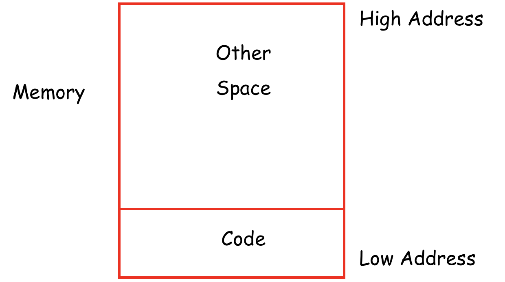

# 惡補

惡性補習我失去的東西，一切關於著 Compiler。

這個是要答辯的 Lab。佔總成績 20% 的 Lab 5。考慮到 Lab 5 爆炸會連帶著炸掉 Lab 6，可以認為佔總成績的分數是 40%。

## 我需要知道什麼？

 • **src/tiger/frame/.\*** Files related to function stack frame(chapter 6)

 • **src/tiger/translate/.\*** Files related to IR tree translation(chapter 7)

 • **src/tiger/canon/.\*** Files related to basic blocks & traces(chapter 8, this part has already been implemented)

 • **src/tiger/codegen/.\*** Files related to assembly code generation(chapter 9)

 • **src/tiger/runtime/runtime.c** Tiger program runtime file(will be linked with code files generated by your compiler)

 • **src/tiger/env/env.\*** The EnvEntry classes which help compiler store the information of variables&functions

## 我該看哪些章節？

Before you start this lab, you should carefully read the chapter **6, 7, 8, 9, 12** of the textbook.

>    那我開始了。

## Chapter 6: Activation Records

在實現 Tiger 的過程中，主要的難點是支持下面兩個東西：

*   局部變量

    在一個語句塊（Scope）中，要可以訪問在*當前語句塊內*及*上層語句塊內*定義的變量。

*   函數嵌套

    函數像一個普通變量一樣可以嵌套聲明。內層函數體裏可以調用同層及外層函數（這裡的同層包括它自己：遞歸調用）。

    但是為了簡化起見，Tiger 不支持將函數作為返回值。ML 跟 Scheme 等語言都是支持的。

### 6.1 棧幀

需要知道，所謂的這些局部變量、函數等等東西，都是基於一層基本的抽象：棧幀（Stack Frame）。

棧本身不是什麼高級東西；他是一種支持 Push 和 Pop 的數據結構；且總是保證先進後出。

要理解 Stack 本身，只需要想像一層疊放在一起的紙張就好了；總是只能從頂部放一張、或取一張。

---

#### 棧位置

在聲明局部變量時，我們採用一套約定俗成的辦法：

>    在進入 Scope 時將該層級的局部變量成批壓入棧；退出該 Scope 時則按照相反順序成批彈出棧。

但是不像 C89 那種「聲明必須在 Scope 開頭！」的老古董語言，實際上我們可以在語句塊內的任何位置離散地聲明變量。

因此上面的論述可能要改一改了：

>   在進入 Scope 時將該層級的局部變量**所需的空間**成批壓入棧；
>
>   退出該 Scope 時則按照相反順序成批將**佔用的空間**彈出棧。

或者，用我們所熟悉的 `x86-64` 的黑話來講，

>   在進入 Scope 時將 %rsp（指定棧頂位置的指針）減少以分配空間；
>
>   在退出 Scope 時將 %rsp 還原以回收空間。

因此，局部變量的**初始化**是可以在任何部分發生的；

然而其內存的分配及內存位置的確定則是在進入 Scope 時就已知了的。

---

因此，對於編譯型語言 Tiger，一個 Scope 中局部變量所需的內存是在編譯期就能確定的。

>   題外話：在這個 Lab 中，我們不用任何寄存器，因此所有的局部變量都是上棧的。

也就是說，在生成實際代碼之前，Tiger Compiler 需要做到：

*   計算局部變量所佔空間；

    以便在 Scope 開頭結尾放置 `subq %rsp, SIZE` 跟 `addq %rsp, SIZE` 這樣的語句。

*   為**每個**（在這個 Lab 裏，就是每個）變量計算棧內存偏移；

    為了實現藉由 `%rsp(OFFSET)` 樣式的訪存。

`SIZE` 跟 `OFFSET` 都是生成代碼前的定數。

>   題外話：由於歷史原因，棧是倒置的；
>
>   棧頂指針向下（減小），同時棧空間增大；棧頂指針向上（增大），同時棧空間減小。

---

#### 棧幀構造

一般的棧幀應該長什麼樣子呢？

（從高地址位到低地址位）依次是：

---

（上一層棧幀）

*   實參 n
*   實參 n − 1
*   ⋯⋯
*   實參 1
*   靜態鏈（這個是什麼我們待會說）

---

（本層棧幀）

*   局部變量區域
*   返回地址
*   臨時變量
*   保護的寄存器
*   實參 m
*   實參 m − 1
*   ⋯⋯
*   實參 1
*   靜態鏈

---

（下一層棧幀）

---

留意到之所以這裡把上層的棧幀給寫出來，是因為那是根據調用層級來看，那些是上層調用者放好，給這一層看的實際參數。

因此實際上要先放局部變量、返回地址、臨時變量、上棧要保護的寄存器，然後如果要再往深層調用，就要再往上堆下層實際參數和靜態鏈。

另外，在 32 位下，會有 %esp 指針指向棧頂，另有 %ebp 指針指向上一層幀之底。

但是，在 64 位下，%rsp 仍承擔 %esp 的職位；%rbp 則退化為普通寄存器，不再具有幀指針的作用。

當然實際上也沒什麼影響；幀的大小在編譯期（晚期）就能確定（除了 C 的 variable array 之類的奇怪玩意）。

因此 %esp + FRAME_SIZE 也就總是等於 %ebp。這大概就是 %ebp 退休的原因吧。

>   題外話：實際上我們仍然會討論幀指針 %ebp：為什麼？
>
>   因為在編譯過程中，要到比較晚的時候（掃描完整個 Scope）我們才能確定幀大小。
>
>   因此我們在掃描 Scope 的過程中，先使用 %ebp 作為一個標的，等到結束再填入。

---

#### 寄存器

你問我寄存器好不好，當然好啊⋯⋯讀寫速度超快，不用訪存。

就是太少了點。

---

我們按照早期人們的編程習慣，把寄存器分為兩類：

一類是調用者負責存儲的（Caller Saved）；一類是被調用者負責存儲的（Callee Saved）。

簡單說，對於一個剛出生的棧幀來說，被調用者負責存儲的寄存器你可以隨便用；

因為你的上層棧幀一定幫你保存好了，在你死掉的時候還原之；

但是調用者負責存儲的寄存器你要是想用，得先把他們上棧，退出的時候出棧，搞得好麻煩。

而當你想要 Invoke 一個新棧幀的時候，要記得把調用者負責存儲的寄存器給上棧，調用完了之後出棧，搞得好麻煩；

但是被調用者負責存儲的寄存器呢，不用特別處理；那是 Callee 的責任。

簡單說⋯大部分棧幀都是上有老下有小；保存寄存器的責任是對半開的。

上面的事情都是約定俗成；你可以不遵守，但是在跟其他程序混調的時候就可能產生問題。

Use as your own risk.

---

