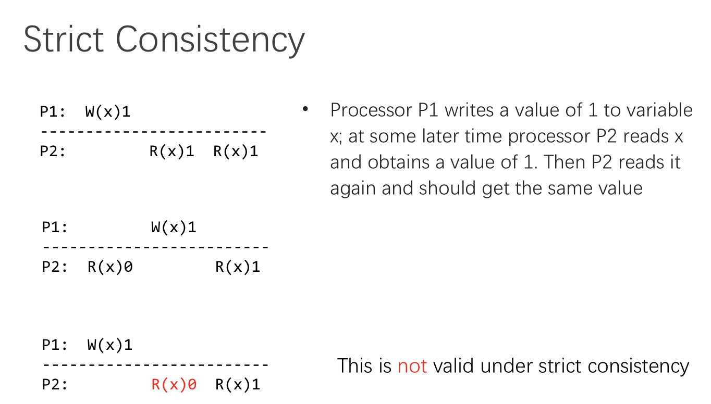
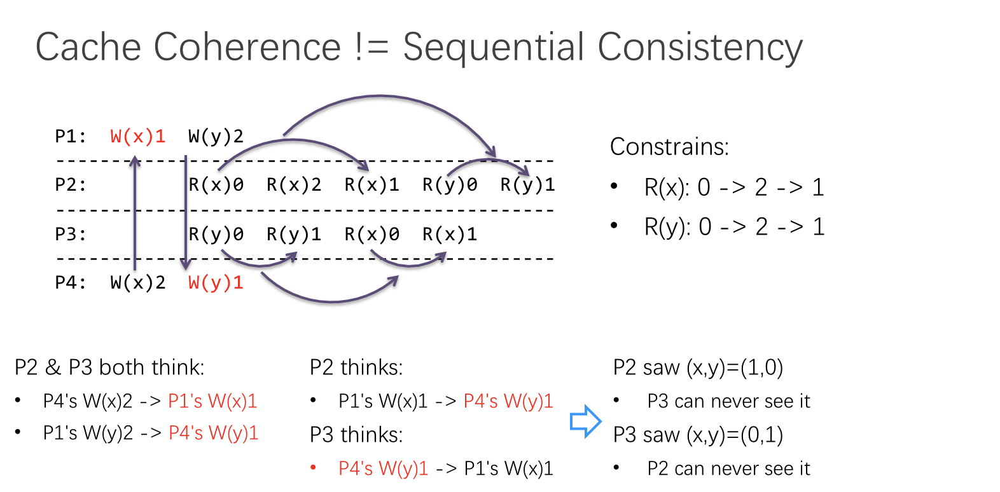
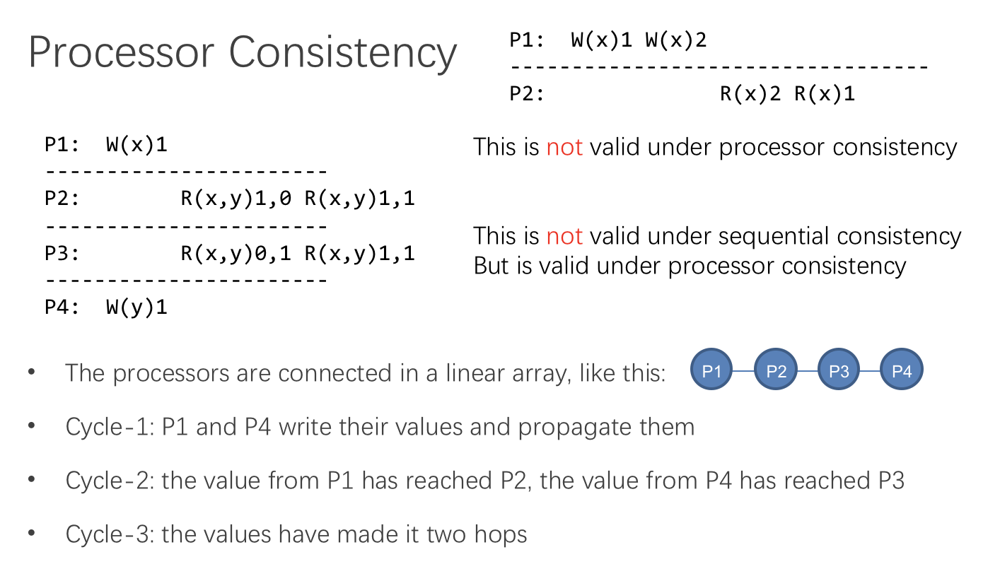
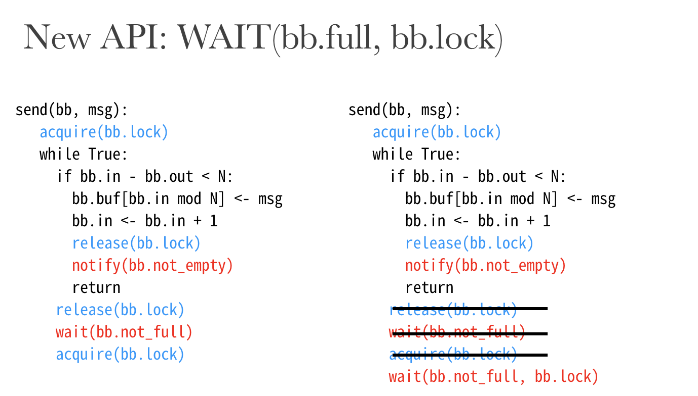

#SE-227

那么我们开始复习 CSE 下半学期的内容吧。

需要复习的内容主要是 Lecture 14～28。实际上最後两 Lecture 主要用于复习，所以我们还是从现在开始瞧一瞧。

## Lecture 14 & 15: AoN & BoA

赌博有个常用术语：Double or Nothing。意思是参加一场赌局，有可能获得 100% 收益，即拿到 100% 赌资的回报，要么全部输光全部赌资。

本节的主要内容也就是 All or Nothing & Before or After。

下面我们详细讲讲。

### The CAP Theory

所谓卡普理论……是什么意思？

也是一个类似不可能三角的理论：无法同时保证「一致性」、「可用性」，「区域性网络故障容忍性」三项；最多只能保证其中两项。

>   • 2010 年由 UC Berkeley 的 Eric Brewer 教授首次提出
>
>   • 2012 年由 MIT 的 Seth Gilbert 和 Nancy lynch 证明

更形式化一点说，对分布式计算机系统来说，同时满足以下三点是不可能的：

*   Consistency、Availability、Partition Tolerance 不可得兼。

这个就是简称 CAP Theorem。

#### Consistency

何谓一致性？令所有节点在同样的时间看见同样的数据。即使在数据有多处备份的情况下依然要保证。

#### Availability

定义为系统对用户请求均有响应，要能在一定时间内回复处理成功或失败。不能在「不确定」状态上停留太久。

#### Partition Tolerance

这个可能比较抽象：在任意消息丢失或一部分的系统故障情况下，系统依然可继续运行。

>   事实上这里没有一个很绝对的故障率标线，而且不存在绝对的 PT；只有某种程度上的 Robust。

### Best Practice

#### CA, not P

我们放弃 Partition Tolerance，而尽力保证 Consistency 和 Availability：这是不可能的。在复杂而糟糕的现实世界中，Partition Tolerance 是不可避免的；消息丢失和系统故障永远出现。因此放弃 P 绝对是糟糕的主意。

#### AP, not C

我们放弃 Consistency（一致性），着力保证 Availability（可用性）。

我们的目的是保证用户体验，用户总能操作成功（或者说总能得到操作结果），即使数据可能不一致。

#### CP, not A

我们放弃 Availability（可用性），但是着力保证 Consistency（一致性）。

我们的目的是必须保证一致性，在此基础上没有办法地放弃 Availability；如当发生区域性断网时，拒绝新的用户请求直到网络恢复。类似于这次支付宝的 2 小时瘫痪，就是在 Partition 的情况下，为了保证 Consistency，无奈放弃 Availability 的结果。

#### Examples

选择 AP 还是 CP？取决于我们的目标要求。

类似于点外卖、在线购物这种无关紧要的内容，我们自然可以先暂时放弃 Consistency，到最后再去善后；

然而对于支付宝这种跟金融有关的重要事务，不能保证一致性的后果是非常严重的；所以不得不选择 CP。

#### Partially Choice

有时候，并非一定要从 AP 和 CP 中二选一；我们存在一个折衷方案可选。

例如，有两个区域欧洲和北美，网络断开后北美可以用，只有欧洲不可用；当网络恢复后，将北美的数据同步回欧洲，即北美为主，欧洲从属……之类的。

### Transaction

Transaction，事务。

#### Facing Difficulties

我们目前的世界总是离理想太远。

我们所有的目标都是在一堆不可靠的结点上构造出一个可靠的系统。

极其困难的事情。

#### Basic Promises


每一个「事务」都抽象为这么一个模型：BEGIN、BODY、END。

BODY 跟 END 都是套话——BODY 里面也就是每一个 Transaction 要干的内容。

然而，关键在于 T1 跟 T2 之间存在一个严格的保证：

*   All-or-nothing
    *   每个 Transaction 中的 Body 指令，要么不执行，要么全部执行。不可以存在执行一半的情况。

*   Before-or-after
    *   T1、T2 必须（表面上）按顺序执行；即使是在多线程情况下也是如此。

这两项保证就足够实现我们的抽象系统了。

---

#### Atomicity


All or Nothing 保证的是原子性（Atomicity）。对于每一个事务，我们要考虑的事情只有「他发生了吗？」「事务之间发生的顺序是什么？」，而不考虑每个事务执行之间发生的事情，也就是认为每个事务是「原子的」、「不可分的」。

#### Commit Point

「提交点」，用图来看就是这样的：


对一个 Transaction 来说，在没有插入 Commit Point 之前，之前执行的 Pre-commit Discipline 都是可以撤销的，且不留下痕迹（trace）。然而一旦插入了 Commit Point，那么还没执行的那些 Post-commit Discipline 都是不可撤销的（Inevitable）了，即使还没有进入，但是也非做不可了。


在我们按照顺序更新数据的过程中途中断的情况下，直接按照 Sector 的多数决就可以了。在数据状态达到 Data State 5 的时候实际上就已经算是绝对完成了。

然而 Data State 4 是不确定的：这种时候我们强行规定它 Backout。只是个规定。

### Shadow Copy

影拷贝。何谓影拷贝？

我们以一个银行系统作为例子。


我们有两个可以调用的程序：

一个是 `xfer(bank, a, b, amt)` 可以在指定银行中新建一笔从 a 到 b，价值 amt 的转账；

另一个是 `audit(bank)` 用于统计指定银行中的所有款额。

---

#### `xfer`

如果我们按照上面的做法来实现 `xfer` 函数，必定无法实现原子性的保证。

这里我们采用了一个影拷贝的形式；


在我们每次执行 `xfer` 的时候，先隐含地把银行数据 Copy 一份，并以 # 前缀将其临时保存下来；最后，再通过一个重命名将其放回原处。

#### Rename Procedure

对于 `rename("#bf", "bf")` 具体的 rename 过程是这几步：

*   1.  将 `bf` 对应的 inode 改写为 `#bf` 对应的 inode
*   2.  增加 Shadow Block 对应的 `refcount`
*   3.  减少正牌 Block 原来的 `refcount`
*   4.  删除 Shadow Block，将其对应的 `refcount` 减少

#### Crash Issues

问题来了：假如在这一过程之中发生了 Crash，会不会产生问题？

想象一下在我们上面的 RENAME 过程里，在第一步和第二步之间发生 Crash，导致两个 Block 指向同样的 inode（经过了 Step 1），然而其 `refcount` 没有递增（没有走到 Step 2），怎么办？这样两个 Reference 具有相同地位，无法判定谁是正身？

#### Fix: Rename Procedure

>   那么我们先更动 `refcount`，再改写，如何？

*   1.  增加 Shadow Block 对应的 `refcount`
*   2.  将 `bf` 对应的 inode 改写为 `#bf` 对应的 inode`
*   3.  减少正牌 Block 原来的 `refcount`
*   4.  删除 Shadow Block，将其对应的 `refcount` 减少

这样最坏的情况也不过就是造成 `refcount` 虚高，inode 释放受阻；但总归不会有大问题；而且这个经过一次 Scan 就能解决。

#### Summary


那么这就是我们的 Shadow Copy Rules 了。

### Logging for AoN

还是以我们的银行系统里的 `xfer` 实现为例。

借助 Transaction 的保证，我们就可以这么实现：


以这个做法为例，它所打出的 Logging 大概是这样：


总之，下面五个事件是跟事务有关系的：

*   Begin

*   Write variable

*   Read variable

*   Commit

*   Abort

#### Begin

Begin: allocates a new transaction ID

#### Write

Write: appends an entry to the log

#### Read

Read: scans the log looking for last committed value

#### Commit

Commit: writes a commit record

#### Abort

Abort: writes an abort record/simply does nothing

#### Recover

Recover: needless to do anything

简单说，将更动原来的数据给分离称在分开的 Transaction 里打 Loggings，在 Commit 的时候完全写入。

如果需要 Abort，可以直接放弃掉这块 Transaction，也可以写一个 ABORT 命令（不强制）。

### Logging Issues

上面我们的 Logging Approach 看起来还不错，写入起来也还挺好的。

非常非常遗憾的是，Read 是非常差劲的。因为上面看到，每次我们要进行一个 Read，就非得 Scan 整个 Logging 不可。

因此我们使用一个 Replica 的做法来实现：对每一个 Transaction，既保留一份上面的 Logging，同时还保存一份 Cell Storage（格化的存储），可以快速地做 Read 而不必扫描全部的 Logging。

只不过要额外留意一下：在出现 Crash 的时候，我们应该把 Cell Storage 给清空，通过重新扫描 Log 来实现 Read。

### Optimization

#### Cache Line

我们还可以直接将我们的 Cell Storage 给改成一个基于 LRU 或 LFU 的 Cache Line。

这样不至于让每次 Write 都需要执行两份工作量（写入 Log 和 Cell），而是分摊到 Cache Missed Read 中更好一点。

#### Log Truncate

目前的实现，Logging 的长度是完全不设限的；很可能会无限扩张。

我们应该在 Logging 超过一定长度的时候，选择将其割断（Truncate），在某些特定的点（叫做 Checkpoint）处，将比这更早的 Operation 都*压平*，以限制 Logging 大小。

#### Synchronize with I/O

Doesn't matter here...

### Before or After

这里，我们开始考虑如何真正地实现 Before or After；即，保证表面上的「一先一後」。在多核心多线程的环境下，这件事并不那么容易。

#### Race Condition

最容易出现的问题就是 Race Condition 了：在两个线程交错执行的情况下，几乎没法保证最终结果的正确性。


当然我们可以严厉地要求两个线程必须工作在 SERIALLY 模式下（严格按顺序）；但那样就无法发挥多线程多核心的优势了。

#### Compromise Solution

我们最终的目的还是在「不可靠」之上抽象出「可靠」。尽量不要给底层强加限制，那样没法保障效率。

回忆我们在 All or Nothing 中所做的事情：我们引入了 Transaction 抽象，借此保证了 AoN。

而在 BoA 之中，我们也要做类似的事情：这里我们的抽象是这两位：

*   **2PL** (Two-phase locking) 
*   **OCC** (Optimistic Concurrency Control)

待会我们详细讲讲。

#### Goal

最后，我们提一句我们的最终目标：目标是什么？

run transactions T1, T2, .., TN concurrently, and have it "**appeared**" as if they ran sequentially

本质上让一系列 Transaction 并行执行，但却让他「**表现得**」像是顺序执行的一样。

#### ...appeared?

表面上看起来是什么意思？

意思就是，我们可以随便让 T1 跟 T2 的 Body 执行，但我们要保证最终产生的结果要么是 SEQ(T1, T2) 的结果，要么是 SEQ(T2, T1) 的结果。

>   A schedule is final-state serializable if its final written state is equivalent to that of some serial schedule.

只要最终的结果是排列组合原子的 Transaction 所能拿到的结果，那么就认定为一个合理的调度（Schedule）。

### Conflict Serializability

有冲突的顺序化。

在什么情况下会出现两个操作冲突的情况？

但或许首先该问：啥是冲突？

#### Conflict

这里有一些规则：


1.  两个操作操作了同一个对象
2.  其中至少有一个是 WRITE
3.  这两个操作分属不同的 Transaction

#### Serializability

如果一个 Schedule 中所有的冲突出现的顺序都和一个原子性的正常 Schedule 中的冲突先后顺序一致，那么就把这个叫做 Conflict Serializability。

这个判别法看起来好简单，实际上无法实际使用的。

后面会提到我们该用什么。

#### Conflict Graph

我们把每个 Transaction 画成 Graph 中的结点（Node）；然后，把有冲突的两个结点连接在一起。

留意这个边是有向的；由冲突始发结点指向冲突收束结点。

结论：如果这个 Graph 是 acyclic（非周期性の、非環式の）的话，这一系列 Transaction 就是 C.S.（可冲突序列化）的了。

#### Conflict Equal

如果两个 Transaction Schedule 的 Conflicts Order 一致，我们就称他们二位是 Conflict Equal 的。

### View Serializability

A schedule is view serializable if the final written state as well as intermediate reads are the same as in some serial schedule.

假如一个 Schedule 最终的结果以及**中间包含的读**结果也都跟某个特定的 Serial Schedule 的结果相同，那么可以说这个 Schedule 是 View  Serializable 的。

简单说，Final-state Serializable 只关心最终对数据产生的影响，而不管程序内部的 READ 是不是正确；

View Serializable 关心了读和最终结果。

Conflict Serializable 最严苛；他要求 Data Dependency 都不出错。


但是生成 View S. 比起生成 Conflict S. 要更困难一些：判断图是否成环还是不难的；但是要判断 VS 就很难了，是个 NP-Hard 问题。

况且，一个 Conflict S. 的调度一定也是 View S. 的（这显然），所以我们在实践中一般追求一个 Conflict Serializability 的调度。

###  Generate Conflict Serializable Schedules

最后一个问题：怎么生成 Conflict Serializable 的 Schedules 呢？

#### Pessimistic

悲观的人对什么都不信任，所以她选择给任何有可能产生冲突的地方挂锁，以此来防止产生数据的 Race Condition。

基于这种思路的策略包括：Global Lock, 2-Phase Locking。

#### Optimistic

乐观的人总是倾向于觉得所有的事情都不会出问题。

所以他们什么都不加限制，直到出现了问题，说：Conflict! Abort, clear history and retry!

基于这种思路的策略主要是 OCC。

#### Global Lock

这个锁就非常暴力了…全局挂一把大锁，每进入一个 Transaction 就拿锁，退出 Transaction 就解锁。

>   那这怎么可能会不 Serializable……你这个本身就是 Serialized

#### Simple Lock

稍微正常一点的上锁办法。

这个上锁办法的关键在于：

*   在进入 Transaction 之前，预先把所有会用到的 Shared Data 都上锁
*   遇到了 Commit 或者 Abort 之后就按照拿锁的反序放锁

这个有一点好处：完全没有利益相关的 Transaction 就不会 Block 彼此了。

但是存在问题：

*   怎么 Enumerate（遍历）全部需要加锁的 Shared Object？
*   或许我们加锁的对象可能比实际访问的对象要更多。这就太浪费了……

#### Two-phase Locking

两步加锁法。听名字就很精妙（

*   每一个共享变量天生就带着一把自己的锁
*   要对这个变量进行任何操作，都必须先拿跟这个变量对应的锁
*   一旦一个 Transaction 释放了一把锁之后，他就不可以再拿新锁了

>   ？？？

这种加锁的方法，好处主要在不需要提前知道到底需要拿锁集合。而是采用「到了要访问数据的最后关头，再去拿锁」这种策略。

这样能使拿锁时间段最短，最小地影响其他 Transactions。

---

#### Fix: Two-phase Locking

两步拿锁法有个致命的问题：可能会死锁。我等你，你等我。

因为没有办法保证顺序拿锁反序放锁。

所以有两个解决方案：

1.  提供一个全局的拿锁顺序（Dirty，不推荐）
2.  出现死锁，就 Abort 其中一个 Transaction 再来！

方法 2 也是基于上面的 Optimistic 的解决方案，而且很好地利用了 原子性。绝好。

#### Concurrency Control

>   并行控制策略

CC 就是 Concurrency Control，也就是并行控制策略，负责调度那些运行时间上有重合的进程们。与此同时，还要保证上面提到的 Serializability。

这对于一个 CC 来说，并不是一件容易做的事情。

因此，Kung 和 Johnson 提出了一套基于乐观心态的 OCC 策略。

#### OCC: Optimistic CC

>    乐观的并行控制策略。


## Lecture 16: Lock & Memory Model

>    锁与内存模型

锁，实在是太重要了。给出了极致简单的抽象和严格的正确性保证。

而且，它为我们在不可靠的基础上抽象出一层可靠的系统提供了保证。

### Implementation

那么我们该怎么实现锁呢？

#### Naïve (and Incorrect) Implementation


或许所有希望制造锁的人最开始都是这么想的。如果拿锁被拒就循环着等待，退出循环就代表拿到了。

真的吗？

不。鉴于 acquire 锁所做的步骤包括了下面两步：

1.  读取锁 L 的状态
2.  将锁 L 的状态设为 LOCKED

这套序列不是原子的。也就是说，在 1. 和 2. 之间可能插入别的事件。或许一个线程插入了 1. 2. 之间，错误地认为它可以拿到锁，结果导致锁被多人持有。这显然是不对的。

#### Primitive Implementation

早期智人尝试过两种不同的锁的实现方法：纯软件实现和掺杂硬件的实现。

软件实现主要有：

*   Using Load and Store instructions only
*   Dekker's & Peterson's Algorithms

硬件实现主要有：

*   RSM instruction: Read and Set Memory
*   T & S: Test and Set
*   C & S: Compare and Swap
*   Load-linked + Store-conditional
*   F & A: Fetch and Add

#### Peterson's Algorithms


分析一下，可以看出来这段代码做的事情在于给每一个 Thread 都提供一个 Flag 位。同时，全局保留一个变量 turn 来记录当前拿锁的线程号。

在请求拿锁的时候，先把自己试图拿锁这一信息设定为 true（`flag[self] = 1;`），并将 turn 设置为对方。

如果 `turn = 1 - self` 成立，且对方仍然持有这把锁，即这仍然是对方的回合，那么就持续 Spin。

这种办法依赖于一个假设，即所有的 LOAD 和 STORE 都满足原子性，即依赖内存系统的正确性。

在上古时代这是对的，然而现在的内存模型已经发展到不满足这件事了（笑）。

所以大家也不用这种锁了。

等等……插一句，讲讲内存模型是怎么一回事。

### Memory Model

内存模型。

#### Definition

确定了 CPU 跟内存如何进行交互的模型。

这很重要，不同的模型可能完全改变 CPU 执行的结果。

#### Memory Consistency

对于内存一致性最朴素的理解就是：对同一块内存空间来说，Read 总是读到最后一次 Write 的内容。

#### Multi-Core

现在的 CPU 几乎都有多核心了。不同的核心却是共享着同一片主存的。他们会在完全随机的时间进行许许多多的读和写。

这件事可不简单。

#### Consistency Strategy

有哪些保持一致性的策略呢？

##### Strict Consistency

严格一致模式。



举例来说，两个处理器核心 P1 和 P2 同时工作，但是 Strict Consistency 的要求完全没有减弱；它要求在任何情况下，任何的读都应该读出任意最近的写的数据，无论他们来自哪一核心。

这个要求显然是很严格的（没法更严格了），基本上是把单核心的策略照搬到多核心来了。

可想而知，要保证这种一致性的代价很高。

##### Sequential Consistency

顺序一致模式。

孔子有云，

>   …the result of any execution is the same as if the operations of all the processors were executed in some sequential order, and the operations of each individual processor appear in this sequence in the order specified by its program.

翻译一下就是，只要访存的结果跟所有处理器严格按照顺序执行的结果一样（而不是瞎混在一起的），那就把它认定为一个顺序一致的访存。


举例来说，图一中 P1 和 P4 写入了 1 和 2；而 P2 和 P3 则是连续进行了两次读取。

这样，P2（或 P3，他们是等地位的）可能读取出 1、1，也就是执行顺序为 P4 -> P1 -> P2_1 -> P2_2；

也可能读取出 2、2，执行顺序是 P1 -> P4 -> P2_1 -> P2_2；也可能读取出 1、2。

但如果读出 2、1，那就是违背了 Sequential Consistency 了。

因为不存在一个处理器的交替执行顺序能满足 2、1 的。

>   Sequential Consistency 比 Strict Consistency 要弱一些。这个大家都看得出吧。

##### Cache Coherence



比较一下 Cache Coherence 和 Sequential Consistency。

不同之处是

*   Sequential consistency requires a globally consistent view of memory operations

*   Cache coherence only requires a locally consistent view

*   ==e.g., for local variable x or y, all CPUs see the same order; but for (x,y), different CPUs may see different orders==

Seq Consistency 要求的是全局的一致性；然而 Cache Coherence 仅仅要求局部的一致性。

##### Process Consistency

>    处理器一致性（这啥？）

也称为 PRAM Consistency (Pipelined RAM Consistency)

定义是：

*   Writes done by a single processor are received by all other processors in the issue order

*   But writes from different processors may be seen in a different order by different processors

单个处理器所有的写操作都保证会被所有的处理器以相同的顺序接收。

但是，多个处理器的写操作可能会被不同的处理器以不同的顺序接收。



每个处理器接收「写」的顺序不同就导致了他可能「读」出不同的序列来。

##### Java Memory Model

JVM 是一层虚拟机，所以他也有自己的 Memory Model（哭）

它的宗旨是：

*   让用户做决定。默认情况下，只保证关键部分的 Sequential Consistency。
*   对非同步的多线程程序，只做最低程度的保证：保证你的读写操作一定发生在内存被初始化之後。

（这已经是……不怎么算保证的保证了）

### Atomic Instructions

上面已经提到了，可以通过软件来实现锁。然后说着说着又提到了内存模型。

现在我们说回来：利用多功能原子指令来实现锁。

这种实现方法需要硬件提供特殊的指令集支持。

#### Test and Set

Test and Set 指令大概做什么呢？

用 C 代码来表示，大概是这样的：

```c++
int TestAndSet(int *old_ptr, int new) {
    int old = *old_ptr; // fetch old value at old_ptr
    *old_ptr = new; // store 'new' into old_ptr
    return old; // return the old value
}
```

将 `old_ptr` 的值设定为 new，并且返回设定之前的值。

注意，这整件事情是由指令集提供的原子指令。也就是说，你可以确保发生了一次从 old 改换成 new 的写入，而必不存在其他涉及到 `old_ptr` 的内存操作，无论写读。

这样，我们很快可以改写我们的 Lock 实现：


而且简洁，优雅，符合直觉（只有我做到了把 0 改成了 1，那才算是拿着锁了）。

#### Compare and Swap

这是 SPARC 的叫法。x86 叫做 Compare and Exchange。

```c
int CompareAndSwap(int *ptr, int expected, int new) {
    int actual = *ptr;
    if (actual == expected)
        *ptr = new;
    return actual;
}
```

基本操作是：只有 `ptr` 对应的内存是我希望得到的 `expected` 的时候，才把 `new` 写入内存。

本质上也是为了保证「我确实是把内存从 `expected` 改成了 `new`」。关键在于**从 `expected`**。

这就能保证不存在两个人同时进行 0 -> 1 的改变，还都以为自己是那个起作用的人。


同样简洁，优雅，符合直觉。

#### Load-linked and Store-conditional

>   这名字也太长

同样，上原子操作的等价 C 代码：

```c
int LoadLinked(int *ptr) {
  return *ptr;
}

int StoreConditional(int *ptr, int value) {
  if (/*no one has updated *ptr since the LoadLinked to this address*/) {
    *ptr = value;
    return 1; // success!
  } else {
    return 0; // failed to update
  }
}
```

这就不是很优美了…拆分成了两条语句，它保证的是在上次 Load 和这次 Store 之间如果没有别人更新过 `ptr`，就写入内存；否则拒绝写入。

这也就是上面的变种。关键在于实现 Read 跟 Write 的「无缝」链接，即其中没有插入别人的 Write。


就是这代码没那么简洁明了了…你要给人解释 LL/SC 估计也得费点功夫。

#### Fetch and Add

老规矩，上 C：

```c
int FetchAndAdd(int *ptr) {
    int old = *ptr;
    *ptr = old + 1;
    return old;
}
```

这个就有点意思了。它解决了 x += 1 无法保证原子性的问题：最经典的 Race Condition Demo 就是开两个线程分别给全局变量 += 1，最后肯定加出来比正确结果少，是吧。

而如果用 `FetchAndAdd` 实现，那么就可以严格保证你的递增是正确的；不仅如此，你还能知道准确的递增之前（当然递增之後也就是 + 1 了）的值。绝对原子。

提供的这一功能所能实现的就是 Ticket Lock 了。


基本策略是：`FetchAndAdd` 保证了每个请求锁的过程都会被分到独一无二的一个 Ticket，并且过程还能明确地知道这个 Ticket 的值。

如果仅仅有 Increase 而没有 Fetch，那么就无法保证拿 Ticket 的正确性了。

所以锁这个东西，一定是要把 Read 跟 Write 绑在一起，没有办法的。

### Bootstrapping

>   引导，自力更生


如何解决一个很少出现的的 Corner Case？

*   实现一个 Special Case 下可以用的解决方案，完全利用 Special Case 下 Special 的特征；

如何将其填补到通用的解决方案中去？

*   找出针对每一种 Special Case 的解决方案；
*   将通用的问题化归到特殊情况下去。

### Lock Performance

>   锁的性能表现

首先，锁是一定会降低性能的。它的本质就是在合适的时候阻塞线程的运行，以保证某种程度上的正确性。

要求的正确性越严苛，阻塞的情况发生越多，那么锁的性能也就越差。

这是理所应当的。

#### Deadlock

性能差到极致，就是死锁。

可以简单理解成互相拿着对方要的东西，互相不撒手。结果双方都停止工作。

#### Deadlock's Rule

如果我们修改代码，保证每个线程拿到的锁都以反向释放，那么就可以保证一定不存在死锁问题。

这是可以被证明的。

反过来说，代码一点点微小改动都可能带来性能的大幅改善或恶化。

#### What causes Deadlock?

四个条件，构成充要：

*   Limited access

    资源有限，只能被有限个实例使用。

    >   也就是说，存在有人需要排队的情况。
    >
    >   可以将互斥锁理解为「只有一个」的资源。

*   No preemption 

    不存在相应的抢占策略：一旦拿到了资源，只有他自己有权释放。

*   Multiple independent requests (hold and wait)

    存在多个独立的请求：这会带来边 Hold 边 Wait 的情况。

    换句话说，存在「一边拿着一些资源一边请求另外的资源」的情形。

*   在 wait-for 图中存在环。

这些看起来都是很自然的事情；但是要留意，这些是充分必要条件，也就是可以跟「有可能出现死锁现象」划等号的。

#### Avoiding

通常来说，只要在多线程里用到了锁，这件事情就是不可避免的。

我们通常有这么两类解决方案：一类积极的，一类消极的。

##### Pessimistic

消极方案是先做一个 a priori：沙盘推演。

先看看在目前的情况下我能拿到什么锁，不能拿到什么锁，是否有可能出现死锁。假如有可能出现，那我直接放弃所有拿锁。

##### Optimistic

积极方案是正常情况下不去考虑出现 Deadlock 的情况，而是等出现了之后再去考虑收拾他。

「在出现之後收拾」的办法，首先你得能 Detect 死锁的出现。

通常利用 Timeout 时间来判断。在检测出来之後，是 Abort 掉一个线程，还是用 Preemption 机制抢走某一个线程的锁，这都由你决定了。

#### Livelock

这个很奇怪：既然是 Live，就说明没有死锁，那有什么问题呢？

实际上，Live Lock 的定义是双方规律性地做同样的事情，并且在很特殊的情况下，这种不断的 Retry 刚好阻止了正常运转。

打个比方，双方同时伸手去摸一个文件，约定如果刚好碰到对方摸，那就等待 500 ms 之后重试。结果他们刚好每次都碰上手，每次双方都立刻缩回手，并且在 500 ms 后重复这一动作。结果大家都摸不到这个文件。

大概就是这么个意思。

## Lecture 17: Thread & CV

>    此 CV 非彼 Computer Vision…

### Intro

#### Producer & Consumer Problem

生产者／消费者问题。简单说，就是独立运行的两个线程进行互相影响的操作。

独立，是因为它们具有各自的逻辑和执行流程；互相影响，是基于他们共享的一块 Buffer（缓冲区）。

Producer 负责往缓冲区里放数据。假如缓冲区已经满了，它就必须等待。

Consumer 负责从缓冲区里拿出数据。假如缓冲区还是空的，它就必须等待。

用经典的流媒体播放器为例：後台的网络请求线程会不断地进行网络请求，往缓冲区里塞还没播放的影片；而前台的播放线程则会按照一定速度从缓冲区里拿数据，并实现连续播放的效果。

假如网络请求太快而播放线程跟不上，那么就会导致缓冲区塞满，网络请求器也不会继续进行请求。而假如网络请求太慢导致缓冲区时常净空，播放线程拿不到数据，则必须等待 Producer 的下一个生产动作。这时候就会「缓冲中…」了。

用 Xia Yubin 的话来讲，这种策略就是 enable communication while keep isolation，在保证隔离的情况下启用通信交流。

而那块 Buffer 就是交流的关键。

但在那些「大规模、分离式」的系统中，就没有那么容易用一块共享的 Buffer 作为 Shared 了；为了保证隔离化和模块化，一般我们会采用类似 RPC 这类技术来实现信息的交流。

在实际的计算机系统中，也有在 Kernel 态保留 Buffer、只允许通过特定 API 来读写 Buffer 的实例。

### Bounded Buffer

#### Bounded Buffer & APIs

Bounded Buffer 就是我们上面提到的：空间有限的缓冲区。

他提供的 API 是这样的：

```c++
void send(void* content);
void* receive();
```

像一块甜蛋糕一样简单。但是留意到 `send` 和 `receive` 永远不会需要一个返回值指示操作能不能完成。

只要他们返回了，就代表成功完成了 Produce／Consume 的操作。换句话说，如果没能完成操作，他们就不会返回。

假如缓冲区满了／空的，那么他们根本不会返回控制流，而是会持续阻塞。

这种实现的问题就是长时间的 Hanging，吊着不返回。

况且，没有一个办法来实现 Sequence Coordination（顺序协调）。Consumer 的排队跟他们最终 Consume 的先后没有关系，完全是随机的。

Producer 也可以看作是争抢者；他们争抢 Buffer 的空位。

#### Bounded Buffer Implementation


这是一种比较典型的 `send` 的实现。注意其中红色双向箭头指向的两行语句。是否可能交换他们？

当然不行了。在这里我们所做的是：先写入内存，再将 `bb.in`  + 1。

但如果我们先写入 `bb.in` ，再写内存 Buffer，那就意味着我们在实际做事之前先声张开来。

特别注意 Send 跟 Send 之间肯定是不能重合的，一定有锁保护。

>   事实上这个例子里只有一个 Sender 和一个 Receiver…

但 Send 跟 Receive 之间不存在互斥锁，他们有可能会交错。

所以我们一定要小心保证，不存在这种「错误的瞬态」。

下面是 Send 跟 Receive 的完整实现。


#### Implicit Assumptions

*   单个 Consumer，单个 Producer。
*   在各自的 CPU 上运行
*   Bounded Buffer 的 in 和 out 变量不溢出
*   Read 和 Write 操作都 Coherence
*   Bounded Buffer 的 in 和 out 变量都满足 Before / After 的原子性
*   The result of executing a statement becomes visible to other threads in program order

>   怎么理解这个呢？意思是说单个线程所有的执行语句在其他线程看起来都是同样顺序的（不会乱序）。

### Optimizations


#### Concurrency

>   有办法把这个 bb 给拓展到多核处理器上吗？

事实上，这个（Single P Single C）的实现在双核 CPU 上工作完全良好。

#### Multiple Senders

>   不满足于 Single P Single C……能给我多个 Sender 吗？

出现多个 Sender，就意味着他们可能同时调用 `send` 接口。

甚至在总线上，寻址指令可能都在同时。

很容易就能想出可能出问题的点：


都以为自己作为 Producer 写入了一块内存，殊不知这块内存被两个人请求了。这样後写的人就白写了。

#### Locked Send


这样加的锁，正确吗？

可能有两个 Sender 同时判断 `if bb.in - bb.out < N`，然后同时落入 TRUE 分支。

然而如果此时 Buffer 只有一个空位，那么就会造成在不该 Send 的时候发送 Send。

#### Locked Send: Corrected


我们把判断 `< N` 的代码也放进锁来，就不是问题了。

#### Locked Send: Another


只是换了一个包围锁的位置。基本类似。

### `yield()`... What?

#### Intro

我们在使用「锁」的时候，会产生大量的 Spinning 的。也就是，不断地在各个线程之间切换，而其中大部分线程都是在 While 循环中 Spinning 着。

好浪费啊！有没有什么办法在条件不满足的时候，直接不要调度给他呢？

#### The Yield: System Call

这个 System Call 主要做这几件事情：

*   Suspend Running Thread
    *   把调用这个 System Call 的线程挂起，但是记录下他的帧指针和页表指针
*   Choose New Thread
    *   用 Round Robin 找下一个可以运行的线程，直到找到一个可以运行的线程（有可能就是他自己）
*   Resume Thread to Run
    *   把那个线程叫醒，恢复上下文继续运行。

我们需要的数据结构是：

*   threads table
*   CPUs table
*   t_lock

---

#### `send()` with `yield()`


用例子来讲一下。在我们发现 Send 条件不满足的时候，先把锁放了，然后 yield 自己等下次被唤醒。

这样，不会有一个失败的 Sender 始终拿着锁 Spin，而是智慧地放弃调度权等下次拿锁。

#### Yield's Implementation


Yield 的具体实现是这个样子的。

假如所有的其他 thread 都不是 Runnable，那就会到她自己身上继续执行。

### Conditional Variables

留意到上面的实现有个问题。有大量的 Check，而且反复地拿锁放锁也不好，很浪费。

有没有什么办法，让 Buffer 有空位的时候，才去唤醒 Sender Thread，而如果没有就让它继续睡？

天底下哪有这样的好事？

标题里的 CV 就是「条件变量」的意思。

#### Solution


条件变量好处都有啥？

可以让 Thread 等待某些特定的事件发生。

#### APIs

*   `wait(cv)`：挂起调用这个函数的线程，等待 cv 把他唤醒
*   `notify(cv)`：把所有等待着 cv 的线程叫醒。当然没法自己把自己叫醒，因为自己挂着不可能调 Notify。


我们按照这个思路写了一个新的 Send。

然而这个是不对的。关键在于 Notify 可能会丢失。

详细解释一下，考虑这么一个情况。

放锁和 Notify 之间可能会插入其他语句，把 bb.lock 锁给拿走了。这样就导致 notify 失效。


本质的问题在于：wait 和 notify 的微小先后次序会导致结果差异。


先 wait 再 notify，wait 会被唤醒。

先 notify 再 wait，那就叫不醒了。

#### New APIs


既然之前是放锁和 wait 两件事之间产生了间隙导致的问题，那我们干脆直接把他们合成一个原子的好了。确保不会有人拿到了锁之后，在我 Wait 之前给我发个什么 Notify。那就倒霉了。



就可以改写成这样了。

### Preemption

抢占。厉害！

#### Types

调度策略有下面几类：

*   非抢占调度

>   一个线程只要拿到了控制权，就有权一直运行下去，直到他自己放弃。

*   合作式调度

>   每个线程都认为彼此会周期性地调用 YIELD 来放弃控制权。
>
>   这样，他们就能放心地交出控制权，以确保自己将来还有机会。

*   抢占式调度

>   经过一定的时间，线程管理器强制让活跃线程交出控制权。

#### Preemptive

我们比较关心抢占式调度。本质上非抢占调度跟合作式调度基于对进程的信任。而抢占式是带有强制性的。

#### Implementation

最简单的实现是基于一个硬件时钟：每隔一段时间发一个中断。中断被截获之后，就可以在 Kernel Mode 里处理调度了。

中断处理程序也就是调度器呢…特别要注意的是他调用的内核态的 Yield 不是一个编译器生成的函数。

你需要自己处理寄存器的保存问题。自己把它们放到 Stack 里。

---

### Summary


*   线程：处理器上的一层抽象。
*   CV：提供了更高效的线程睡眠／唤醒 API。
*   抢占：强行夺取控制权。

## Lecture 18: Distributed Transactions

Xia YB 的目标没有变：Build Reliable Systems from Unreliable Components。

### Intro

举个例子，我们的 Bank 系统大如磐石，必须分拆。我们规定由两台服务器提供服务，其中一台处理 A-M 的事务；另外一台处理 N-Z 的事务。

那么问题就来了：有可能有一些事务需要跨服务器进行。比如 Alice 要给 Zulu 转账，两台服务器都必须知晓并给出正确的记录。

#### Coordinator

这就需要有一个协调人「Coordinator」负责服务器的调度。客户端不知道也不应当知道有几台服务器，自己该去找哪台服务器。客户端只需要找到 Coordinator，报上自己的大名，由协调人来帮助把这个请求转发给对应的服务器。

只涉及到一台服务器的请求很简单。


涉及到两台，因为有 Coordinator 的抽象，也还算能做。


#### Network

网络世界充满了延迟、复杂和丢失。

任何消息都可能会丢失、延迟到达或重复到达。

为了不在这一层上面浪费心思，我们选择用 RPC 来建构抽象。

*   通过 Persistent Sender 来保证「至少一次」
*   通过 Duplicate Suppression 来保证「至多一次」

非常遗憾，基于 RPC 的消息传送机制并非原子的。

我们在后面可以看到很多出错的情形。

#### Problems

多个服务器的情形很可能不一致。

比如，Coordinator 对两台服务器的 Commit，一个成功一个失败。甚至一个成功，一个直接 Crash。

那么对第一个「成功」的 Commit 也不算数了。但按照我们现在的做法，没法简单地把它给召回。（你还得考虑召回是不是成功，etc…麻烦大了）

#### Solution: Two-phase Commit

两步 Commit 法。

把 Commit 分两步走。

*   第一步，叫做 Preparation 或者 Voting。
    *   这一步里，底层的 Transactions 要么 Abort（对应上面的 Commit 失败），要么 **Tentatively** committed（暂定成功，对应上面的 Commit 成功）。
    *   然后，顶层收集这些「一步 Commit」的信息：要么是 Abort 了，要么是「暂定 Commit」了。
*   第二步，才是真正的 Commitment。
    *   这一步里，只有顶层达成一致意见，也就是底层都做好了 Commit 的准备，才进行最后的 Commit 确认。
    *   否则，整个 Commit 大业尽毁。

#### Another Problems


看起来很美好，大家都先做好准备，一致决定之後才去进行 Commit。

非常遗憾的是，消息传递是不可靠的。

甚至连「准备好了」「没准备好」这种消息都没办法可靠地发送给网络中的其他结点。

我们必须提出新的概念来解决这个难题。

### Multiple-Site Atomicity

多点式原子性。

#### Coordinator's Job

对于上面的协调人「Coordinator」来说，他的任务就是收集底层人民的呼声；

假如人民说 ABORT 或者不说话，那就说明不能 COMMIT，对外返回 ABORT。

>   更聪明一点的协调人会把任务分配给其他 Worker…以免脏节点污染

假如人民全部都说 COMMIT READY，那就对外发布 COMMIT 令。

#### Worker's Job

对于普罗大众来说，他们的任务就是：在什么都没收到的情况下，反复广播自己目前的状态 PREPARED，意为「我准备好进行 COMMIT 了！」。

而在收到 Coordinator 的 COMMIT 令後，直接调用 Commit 提交更改。

就是这么回事。

#### Worker's Failure

试想一下，假如一个 Worker 在 Commit Point 之后爆炸了，我们怎么办？

*   我们没办法 Abort 掉 Transaction。
*   我们希望 Worker 自己能从错误中恢复。
*   我们希望 Worker 能记录所有 Transaction 目前的状态（是不是 Pepared for Commit）。

因此，我们决定：

*   Worker 一准备好，就把 Prepared 这件事写到自己的 Log 里。
*   Worker 一旦 Crash 重启，会进入 Recovery Mode。
*   恢复模式下会读取 Log，并确定目前的准备状态。

### Summary

