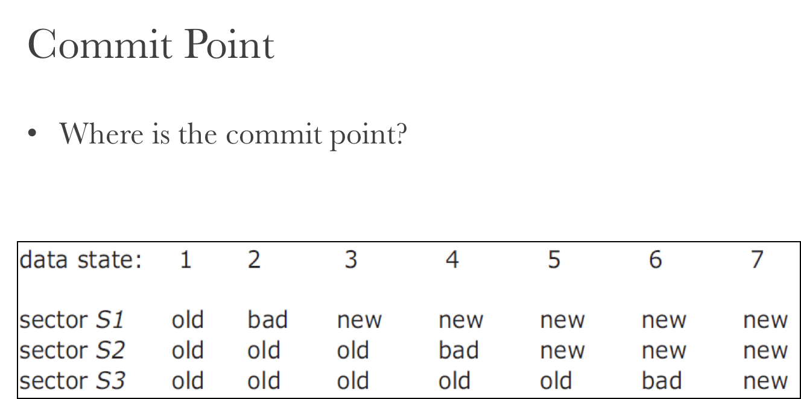

# SE-227

那么我们开始复习 CSE 下半学期的内容吧。

需要复习的内容主要是 Lecture 14～28。实际上最後两 Lecture 主要用于复习，所以我们还是从现在开始瞧一瞧。

## Lecture 14 & 15: AoN & BoA

赌博有个常用术语：Double or Nothing。意思是参加一场赌局，有可能获得 100% 收益，即拿到 100% 赌资的回报，要么全部输光全部赌资。

本节的主要内容也就是 All or Nothing & Before or After。

下面我们详细讲讲。

### The CAP Theory

所谓卡普理论……是什么意思？

也是一个类似不可能三角的理论：无法同时保证「一致性」、「可用性」，「区域性网络故障容忍性」三项；最多只能保证其中两项。

>   • 2010 年由 UC Berkeley 的 Eric Brewer 教授首次提出
>
>   • 2012 年由 MIT 的 Seth Gilbert 和 Nancy lynch 证明

更形式化一点说，对分布式计算机系统来说，同时满足以下三点是不可能的：

*   Consistency、Availability、Partition Tolerance 不可得兼。

这个就是简称 CAP Theorem。

#### Consistency

何谓一致性？令所有节点在同样的时间看见同样的数据。即使在数据有多处备份的情况下依然要保证。

#### Availability

定义为系统对用户请求均有响应，要能在一定时间内回复处理成功或失败。不能在「不确定」状态上停留太久。

#### Partition Tolerance

这个可能比较抽象：在任意消息丢失或一部分的系统故障情况下，系统依然可继续运行。

>   事实上这里没有一个很绝对的故障率标线，而且不存在绝对的 PT；只有某种程度上的 Robust。

### Best Practice

#### CA, not P

我们放弃 Partition Tolerance，而尽力保证 Consistency 和 Availability：这是不可能的。在复杂而糟糕的现实世界中，Partition Tolerance 是不可避免的；消息丢失和系统故障永远出现。因此放弃 P 绝对是糟糕的主意。

#### AP, not C

我们放弃 Consistency（一致性），着力保证 Availability（可用性）。

我们的目的是保证用户体验，用户总能操作成功（或者说总能得到操作结果），即使数据可能不一致。

#### CP, not A

我们放弃 Availability（可用性），但是着力保证 Consistency（一致性）。

我们的目的是必须保证一致性，在此基础上没有办法地放弃 Availability；如当发生区域性断网时，拒绝新的用户请求直到网络恢复。类似于这次支付宝的 2 小时瘫痪，就是在 Partition 的情况下，为了保证 Consistency，无奈放弃 Availability 的结果。

#### Examples

选择 AP 还是 CP？取决于我们的目标要求。

类似于点外卖、在线购物这种无关紧要的内容，我们自然可以先暂时放弃 Consistency，到最后再去善后；

然而对于支付宝这种跟金融有关的重要事务，不能保证一致性的后果是非常严重的；所以不得不选择 CP。

#### Partially Choice

有时候，并非一定要从 AP 和 CP 中二选一；我们存在一个折衷方案可选。

例如，有两个区域欧洲和北美，网络断开后北美可以用，只有欧洲不可用；当网络恢复后，将北美的数据同步回欧洲，即北美为主，欧洲从属……之类的。

### Transaction

Transaction，事务。

#### Facing Difficulties

我们目前的世界总是离理想太远。

我们所有的目标都是在一堆不可靠的结点上构造出一个可靠的系统。

极其困难的事情。

#### Basic Promises

每一个「事务」都抽象为这么一个模型：BEGIN、BODY、END。

BODY 跟 END 都是套话——BODY 里面也就是每一个 Transaction 要干的内容。

然而，关键在于 T1 跟 T2 之间存在一个严格的保证：

*   All-or-nothing
    *   每个 Transaction 中的 Body 指令，要么不执行，要么全部执行。不可以存在执行一半的情况。

*   Before-or-after
    *   T1、T2 必须（表面上）按顺序执行；即使是在多线程情况下也是如此。

这两项保证就足够实现我们的抽象系统了。

---

#### Atomicity

All or Nothing 保证的是原子性（Atomicity）。对于每一个事务，我们要考虑的事情只有「他发生了吗？」「事务之间发生的顺序是什么？」，而不考虑每个事务执行之间发生的事情，也就是认为每个事务是「原子的」、「不可分的」。

#### Commit Point

「提交点」，用图来看就是这样的：

对一个 Transaction 来说，在没有插入 Commit Point 之前，之前执行的 Pre-commit Discipline 都是可以撤销的，且不留下痕迹（trace）。然而一旦插入了 Commit Point，那么还没执行的那些 Post-commit Discipline 都是不可撤销的（Inevitable）了，即使还没有进入，但是也非做不可了。

在我们按照顺序更新数据的过程中途中断的情况下，直接按照 Sector 的多数决就可以了。在数据状态达到 Data State 5 的时候实际上就已经算是绝对完成了。

然而 Data State 4 是不确定的：这种时候我们强行规定它 Backout。只是个规定。

### Shadow Copy

影拷贝。何谓影拷贝？

我们以一个银行系统作为例子。

我们有两个可以调用的程序：

一个是 `xfer(bank, a, b, amt)` 可以在指定银行中新建一笔从 a 到 b，价值 amt 的转账；

另一个是 `audit(bank)` 用于统计指定银行中的所有款额。

---

#### `xfer`

如果我们按照上面的做法来实现 `xfer` 函数，必定无法实现原子性的保证。

这里我们采用了一个影拷贝的形式；

在我们每次执行 `xfer` 的时候，先隐含地把银行数据 Copy 一份，并以 # 前缀将其临时保存下来；最后，再通过一个重命名将其放回原处。

#### Rename Procedure

对于 `rename("#bf", "bf")` 具体的 rename 过程是这几步：

*   1.  将 `bf` 对应的 inode 改写为 `#bf` 对应的 inode
*   2.  增加 Shadow Block 对应的 `refcount`
*   3.  减少正牌 Block 原来的 `refcount`
*   4.  删除 Shadow Block，将其对应的 `refcount` 减少

#### Crash Issues

问题来了：假如在这一过程之中发生了 Crash，会不会产生问题？

想象一下在我们上面的 RENAME 过程里，在第一步和第二步之间发生 Crash，导致两个 Block 指向同样的 inode（经过了 Step 1），然而其 `refcount` 没有递增（没有走到 Step 2），怎么办？这样两个 Reference 具有相同地位，无法判定谁是正身？

#### Fix: Rename Procedure

>   那么我们先更动 `refcount`，再改写，如何？

*   1.  增加 Shadow Block 对应的 `refcount`
*   2.  将 `bf` 对应的 inode 改写为 `#bf` 对应的 inode`
*   3.  减少正牌 Block 原来的 `refcount`
*   4.  删除 Shadow Block，将其对应的 `refcount` 减少

这样最坏的情况也不过就是造成 `refcount` 虚高，inode 释放受阻；但总归不会有大问题；而且这个经过一次 Scan 就能解决。

#### Summary

那么这就是我们的 Shadow Copy Rules 了。

### Logging for AoN

还是以我们的银行系统里的 `xfer` 实现为例。

借助 Transaction 的保证，我们就可以这么实现：

以这个做法为例，它所打出的 Logging 大概是这样：

总之，下面五个事件是跟事务有关系的：

*   Begin

*   Write variable

*   Read variable

*   Commit

*   Abort

#### Begin

Begin: allocates a new transaction ID

#### Write

Write: appends an entry to the log

#### Read

Read: scans the log looking for last committed value

#### Commit

Commit: writes a commit record

#### Abort

Abort: writes an abort record/simply does nothing

#### Recover

Recover: needless to do anything

简单说，将更动原来的数据给分离称在分开的 Transaction 里打 Loggings，在 Commit 的时候完全写入。

如果需要 Abort，可以直接放弃掉这块 Transaction，也可以写一个 ABORT 命令（不强制）。

### Logging Issues

上面我们的 Logging Approach 看起来还不错，写入起来也还挺好的。

非常非常遗憾的是，Read 是非常差劲的。因为上面看到，每次我们要进行一个 Read，就非得 Scan 整个 Logging 不可。

因此我们使用一个 Replica 的做法来实现：对每一个 Transaction，既保留一份上面的 Logging，同时还保存一份 Cell Storage（格化的存储），可以快速地做 Read 而不必扫描全部的 Logging。

只不过要额外留意一下：在出现 Crash 的时候，我们应该把 Cell Storage 给清空，通过重新扫描 Log 来实现 Read。

### Optimization

#### Cache Line

我们还可以直接将我们的 Cell Storage 给改成一个基于 LRU 或 LFU 的 Cache Line。

这样不至于让每次 Write 都需要执行两份工作量（写入 Log 和 Cell），而是分摊到 Cache Missed Read 中更好一点。

#### Log Truncate

目前的实现，Logging 的长度是完全不设限的；很可能会无限扩张。

我们应该在 Logging 超过一定长度的时候，选择将其割断（Truncate），在某些特定的点（叫做 Checkpoint）处，将比这更早的 Operation 都*压平*，以限制 Logging 大小。

#### Synchronize with I/O

Doesn't matter here...

### Before or After

这里，我们开始考虑如何真正地实现 Before or After；即，保证表面上的「一先一後」。在多核心多线程的环境下，这件事并不那么容易。

#### Race Condition

最容易出现的问题就是 Race Condition 了：在两个线程交错执行的情况下，几乎没法保证最终结果的正确性。

当然我们可以严厉地要求两个线程必须工作在 SERIALLY 模式下（严格按顺序）；但那样就无法发挥多线程多核心的优势了。

#### Compromise Solution

我们最终的目的还是在「不可靠」之上抽象出「可靠」。尽量不要给底层强加限制，那样没法保障效率。

回忆我们在 All or Nothing 中所做的事情：我们引入了 Transaction 抽象，借此保证了 AoN。

而在 BoA 之中，我们也要做类似的事情：这里我们的抽象是这两位：

*   **2PL** (Two-phase locking) 
*   **OCC** (Optimistic Concurrency Control)

待会我们详细讲讲。

#### Goal

最后，我们提一句我们的最终目标：目标是什么？

run transactions T1, T2, .., TN concurrently, and have it "**appeared**" as if they ran sequentially

本质上让一系列 Transaction 并行执行，但却让他「**表现得**」像是顺序执行的一样。

#### ...appeared?

表面上看起来是什么意思？

意思就是，我们可以随便让 T1 跟 T2 的 Body 执行，但我们要保证最终产生的结果要么是 SEQ(T1, T2) 的结果，要么是 SEQ(T2, T1) 的结果。

>   A schedule is final-state serializable if its final written state is equivalent to that of some serial schedule.

只要最终的结果是排列组合原子的 Transaction 所能拿到的结果，那么就认定为一个合理的调度（Schedule）。

### Conflict Serializability

有冲突的顺序化。

在什么情况下会出现两个操作冲突的情况？

但或许首先该问：啥是冲突？

#### Conflict

这里有一些规则：

1.  两个操作操作了同一个对象
2.  其中至少有一个是 WRITE
3.  这两个操作分属不同的 Transaction

#### Serializability

如果一个 Schedule 中所有的冲突出现的顺序都和一个原子性的正常 Schedule 中的冲突先后顺序一致，那么就把这个叫做 Conflict Serializability。

这个判别法看起来好简单，实际上无法实际使用的。

后面会提到我们该用什么。

#### Conflict Graph

我们把每个 Transaction 画成 Graph 中的结点（Node）；然后，把有冲突的两个结点连接在一起。

留意这个边是有向的；由冲突始发结点指向冲突收束结点。

结论：如果这个 Graph 是 acyclic（非周期性の、非環式の）的话，这一系列 Transaction 就是 C.S.（可冲突序列化）的了。

#### Conflict Equal

如果两个 Transaction Schedule 的 Conflicts Order 一致，我们就称他们二位是 Conflict Equal 的。

### View Serializability

A schedule is view serializable if the final written state as well as intermediate reads are the same as in some serial schedule.

假如一个 Schedule 最终的结果以及**中间包含的读**结果也都跟某个特定的 Serial Schedule 的结果相同，那么可以说这个 Schedule 是 View  Serializable 的。

简单说，Final-state Serializable 只关心最终对数据产生的影响，而不管程序内部的 READ 是不是正确；

View Serializable 关心了读和最终结果。

Conflict Serializable 最严苛；他要求 Data Dependency 都不出错。

但是生成 View S. 比起生成 Conflict S. 要更困难一些：判断图是否成环还是不难的；但是要判断 VS 就很难了，是个 NP-Hard 问题。

况且，一个 Conflict S. 的调度一定也是 View S. 的（这显然），所以我们在实践中一般追求一个 Conflict Serializability 的调度。

###  Generate Conflict Serializable Schedules

最后一个问题：怎么生成 Conflict Serializable 的 Schedules 呢？

#### Pessimistic

悲观的人对什么都不信任，所以她选择给任何有可能产生冲突的地方挂锁，以此来防止产生数据的 Race Condition。

基于这种思路的策略包括：Global Lock, 2-Phase Locking。

#### Optimistic

乐观的人总是倾向于觉得所有的事情都不会出问题。

所以他们什么都不加限制，直到出现了问题，说：Conflict! Abort, clear history and retry!

基于这种思路的策略主要是 OCC。

#### Global Lock

这个锁就非常暴力了…全局挂一把大锁，每进入一个 Transaction 就拿锁，退出 Transaction 就解锁。

>   那这怎么可能会不 Serializable……你这个本身就是 Serialized

#### Simple Lock

稍微正常一点的上锁办法。

这个上锁办法的关键在于：

*   在进入 Transaction 之前，预先把所有会用到的 Shared Data 都上锁
*   遇到了 Commit 或者 Abort 之后就按照拿锁的反序放锁

这个有一点好处：完全没有利益相关的 Transaction 就不会 Block 彼此了。

但是存在问题：

*   怎么 Enumerate（遍历）全部需要加锁的 Shared Object？
*   或许我们加锁的对象可能比实际访问的对象要更多。这就太浪费了……

#### Two-phase Locking

两步加锁法。听名字就很精妙（

*   每一个共享变量天生就带着一把自己的锁
*   要对这个变量进行任何操作，都必须先拿跟这个变量对应的锁
*   一旦一个 Transaction 释放了一把锁之后，他就不可以再拿新锁了

>   ？？？

这种加锁的方法，好处主要在不需要提前知道到底需要拿锁集合。而是采用「到了要访问数据的最后关头，再去拿锁」这种策略。

这样能使拿锁时间段最短，最小地影响其他 Transactions。