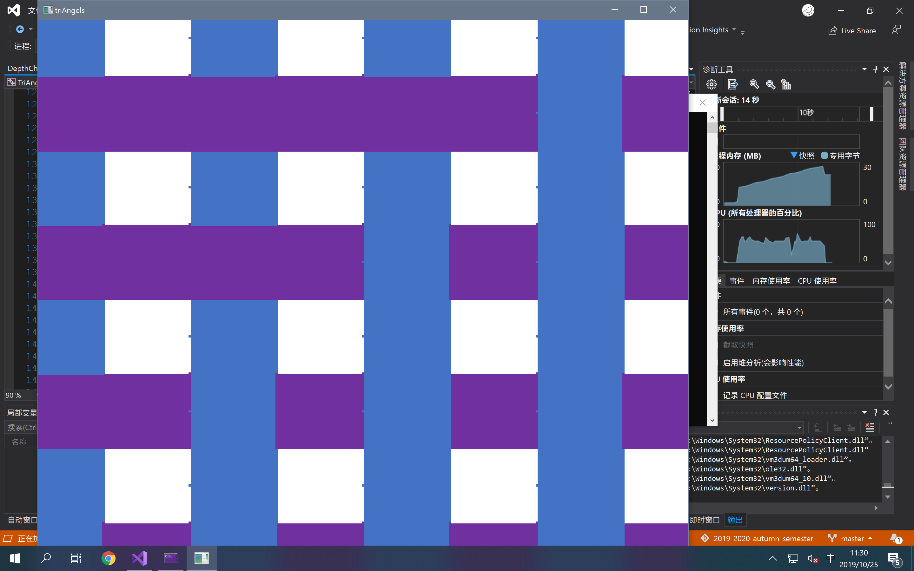

# SE-344

## Assignment #2 Report

*   姓名：于喜千
*   学号：`517030910168`
*   任务：Assignment #2

### 细节描述

#### 第一部分：搭建 OpenGL 编程环境

#####环境设定

*   Windows 10 x64 LTSC 1809 (`17763.737`)
*   Visual Studio 2019 Community (`16.2.4`)
*   FreeGLUT

此处，比照 Assignment #1 中的环境设定办理。

#### 第二部分：数据处理

由于本次 Assignment 中的三角形数据来自 `overlapping.tri` 和 `intersecting.tri`，因此我们首先需要实现三角形数据的读取。

##### 标准库使用

这里，主要利用了 C++ 中的 `<fstream>` 和 `<iostream>` 标准库来实现文件数据的读取。

##### 数据格式

在作业提供的 `.tri` 文件中，包含由不定数量的空格符及 ``'\n'`` 分隔的数字；这些数字依次代表了三角形每个顶点的 x、y、z 坐标位置（有符号整数）及 R、G、B 颜色分量（0 ～ 1 之间的浮点数）。

文件以 ``'\n'`` + EOF 结束。

##### 程序结构

相关文件包括 `Triangle.hpp`、`Reader.h`、和 `Reader.cpp`。

在 `Triangle.hpp` 中，定义着 `TrianglePoint` 和 `Triangle` 两个类；他们用于结构化地描述三角形的顶点位置及顶点颜色。同时，提供了默认的无参构造函数及完整构造函数，方便各种形式的调用；同时在构造时还对 R、G、B 颜色分量进行了范围检测和归一化纠错，减少错误调用的可能性。

在 `Reader.cpp` + `Reader.h` 两个文件中，定义了一个名为 `readTriangle` 的参数；它可以通过提供文件名作为参数来读取所有满足上述条件的 `.tri` 文件，并将其放置在 `vector<Triangle>` 中并返回。这就意味着我们可以在随后的 Phases 中复用这个函数，减少重复工作，提高程序效能。

##### 执行结果

通过断点调试方法，发现程序可以成功处理 `overlapping.tri` 和 `intersecting.tri` 两个 `.tri` 文件，并能正确生成 `Triangle` 对象。

#### 第三部分：三角形绘制

##### 程序结构

这一部分的代码更改主要在 `main.cpp` 的渲染部分。另外，扫描线算法的实现位于 `DepthChecker.hpp` 中。

首先，我们引入 `Triangle.hpp` 及 `Reader.h` 头文件来读入所需的文件。

##### 读取数据

```c++
auto triangles = readTriangle("./overlapping.tri");
/* 'triangles' type: std::vector<Triangles> */
```

由于除错调试时的 `.tri` 文件路径和实际运行时的路径有出入，因此为了保证程序灵活性，采用运行时指定文件路径的做法，如此：

```c++
std::cin >> path;
auto triangles = readTriangle(path);
```

##### 绘制三角形

为了减少代码绘制时产生的问题，这里复用了上一次的视角旋转代码来实现视角的改变。

同样，绘制图形的代码在 `onRender()` 函数中实现。

###### 启用深度检测

在 `main` 函数中，我们使用下列方法来启用深度检测：

```c++
// 设置深度缓存
glClearDepth(1.0);

// 启用深度测试
glEnable(GL_DEPTH_TEST);

// 所作深度测试的类型
glDepthFunc(GL_LEQUAL);

// 启用平滑
glShadeModel(GL_SMOOTH);
```

关键方法为 `glEnable(GL_DEPTH_TEST)`，该函数启用了 GLUT 提供的深度测试。

留意到我们需要使用重心差值渐变来绘制三角形，因此我们调用 `glShadeModel(GL_SMOOTH)` 函数。

而 `glDepthFunc(...)` 函数可以指定进行深度测试的类型。可以使用的参数包括：

*   `GL_NEVER`, 总是不通过（输入的深度值不取代参考值）
*   `GL_LESS`, 如果输入的深度值小于参考值，则通过
*   `GL_EQUAL`, 如果输入的深度值等于参考值，则通过
*   `GL_LEQUAL`, 如果输入的深度值小于或等于参考值，则通过
*   `GL_GREATER`, 如果输入的深度值大于参考值，则通过
*   `GL_NOTEQUAL`, 如果输入的深度值不等于参考值，则通过
*   `GL_GEQUAL`, 如果输入的深度值大于或等于参考值，则通过
*   `GL_ALWAYS`, 总是通过（输入的深度值取代参考值）

（Refs: glDepthFunc - OpenGL 4 Reference Pages）

###### 清除缓存

由于开启了深度检测，因此我们在每次开始渲染时，不仅要清除像素缓存 Bit（`GL_COLOR_BUFFER_BIT`），同时还要清除深度缓存 Bit（`GL_DEPTH_BUFFER_BIT`）。

```c++
glClear(GL_COLOR_BUFFER_BIT | GL_DEPTH_BUFFER_BIT);
```

###### 绘制三角形

因为我们已经得到了 `Triangle` 数组，因此只需要使用 `glBegin(GL_TRIANGLES)` 来绘制就好了。

在 `glBegin` 和 `glEnd` 之间，连续调用 `glColor3d` 和 `glVertex3d` 来绘制不同颜色的顶点。

######绘制参考线

```c++
glColor3d(0.6, 0.6, 0.7);
for (float i = -50; i <= 50; i += 0.2f)
{
	/** 绘制线 */
	glBegin(GL_LINES);

	/** x 轴方向 */
	glVertex3f(-50, 0, i);
	glVertex3f(50, 0, i);

	/** z 轴方向 */
	glVertex3f(i, 0, -50);
	glVertex3f(i, 0, 50);

	glEnd();
}
```

为了保证空间视觉观看体验，因此我们在 xOz 平面上绘制一系列的灰色网格来帮助我们观察。

##### 观察结果

根据程序读取 `overlapping.tri` 和 `intersecting.tri` 的结果来看，可以看出 OpenGL 提供的深度检测算法表现优异，运行高效。


>   「`overlapping.tri`」的渲染结果，使用随附的深度检测算法


>   「`intersecting.tri`」的渲染结果，使用随附的深度检测算法

#### 第四部分：扫描线算法

#####兼容修改

为了保证在实现扫描线算法的过程中，不要破坏上面已经完成的代码，这里新增了一个名为 `useDefaultDepthCheck` 的开关；程序运行起始会询问是否打开这一开关。

##### 思路说明

为了简便起见，也因为图形较为简单，这里使用了最简单的思路：

1.  在 $xOy$ 平面内遍历所有点，判断其是否和三角形存在交点；映射完成后跳转到第 5 步。
2.  如果不存在交点，则忽略该点，回到第 1 步；
3.  若存在唯一交点，则插值计算该交点的 $z$ 坐标，并将 $(x, y, z)$ 加入点映射表，回到第 1 步；
4.  若存在多于 1 个交点，则分别计算不同三角形的插值坐标，并比较采用其中最大的 $z$ 值，将其加入映射表；回到第 1 步；
5.  从映射表中抽离出一个点集并返回给渲染器进行绘制。

#####数学分析

这里存在两个数学问题：

一是如何判断与 $z$ 轴平行的直线 $x = x_0, y = y_0$ 是否穿过三角形；

二是如果穿过三角形，如何计算这条直线和三角形的交点坐标；

三是已知交点坐标，如何确定交点的 R、G、B 分量。

我们分别来进行分析。

######相交判定

由于我们的渲染方向固定（沿着 $z$ 轴向负方向观察），因此可以将三角形投影到 $xOy$ 平面上进行计算。

于是问题可以抽象化为：已知平面 $xOy$ 上四点 $A$、$B$、$C$、$P$，判断点 P 是否在 $A$、$B$、$C$ 构成的三角形内部。

这是一个简单的平面几何题。

要判断点是否在三角形内部，我们首先简化到判断点是否在一个方向向量的一侧。

而判断一个点是否在一个方向向量的一侧（左侧或右侧），我们可以采用差积（符号为 $\times$）进行计算。

设已知的方向向量为 $\overrightarrow{AB}$，要判断的点为 $P$，则我们只需要判断向量 $\overrightarrow{AB}$  和 $\overrightarrow{AP}$ 差积的符号即可。

当 $P$ 在 $\overrightarrow{AB}$ 左侧时，$\overrightarrow{AB} \times \overrightarrow{AP}$ 应为正（根据右手螺旋法则）；反之则在其右侧。

那么拓展到整个三角形，当点 $P$ 同时在 $\overrightarrow{AB}$、$\overrightarrow{BC}$、$\overrightarrow{CA}$ 的同侧时，即可判断其在三角形内部了。

>   `DepthChecker.hpp` 中的 `inTriangle` 函数实现了上述算法。

###### 交点计算

根据立体几何知识，不共线三点能确定一个平面。因此我们首先根据公式组
$$
\left\{
\begin{aligned}
a & = & (p_{2_y} - p_{1_y}) \times (p_{3_z} - p_{1_z}) - (p_{2_z} - p_{1_z}) \times (p_{3_y} - p_{1_y}) \\
b & = & (p_{2_z} - p_{1_z}) \times (p_{3_x} - p_{1_x}) - (p_{2_x} - p_{1_x}) \times (p_{3_z} - p_{1_z}) \\
c & = & (p_{2_x} - p_{1_x}) \times (p_{3_y} - p_{1_y}) - (p_{2_y} - p_{1_y}) \times (p_{3_x} - p_{1_x}) \\
d & = &  - (a \times p_{1_x} + b \times p_{1_y} + c \times p_{1_z})
\end{aligned}
\right.
$$
解出三点确定的平面公式 $ax + by + cx + d = 0$。

之后，我们将已知的射线 $x = x_0, y = y_0$ 代入即可求出交点 $(x_0, y_0, z_0)$。

>   `Triangle.hpp` 中的成员方法 `getPanelEquation` 实现了上述算法。

###### 颜色确定

这是一个比较麻烦的算法，主要原因是为了保证效果和原始图像的统一性，必须使用和原图相似的重心差值算法来进行颜色填充。

考虑到三角形是个平面图形，投影不会改变其插值性质；因此直接将其向观察面 $xOy$ 上投影并计算颜色。

而计算颜色分量，本质上是计算三角形三个顶点的颜色决定权重；即每个点对于目标点具有多大的影响力。

重心坐标算法的思路是：$A$ 点对于 $P$ 点的权重，等于三角形 $BCP$ 的面积在大三角形 $ABC$ 的面积中所占的比例。

这样的计算方法可以保证在端点处的颜色分配正确性，以及始终能保证归一：三角形的总面积分成三份，总能保证其和为整个三角形的面积。

>   利用了 Mathematica 对各点权值进行计算。工作簿文件参见 `/ass2/math/color_setting.nb`。

实际公式如下：
$$
\left\{
\begin{aligned}
u & = & -\frac{(P.y-\text{P1}.y) (\text{P1}.x-\text{P3}.x)-(P.x-\text{P1}.x) (\text{P1}.y-\text{P3}.y)}{(\text{P1}.y-\text{P2}.y) (\text{P1}.x-\text{P3}.x)-(\text{P1}.x-\text{P2}.x) (\text{P1}.y-\text{P3}.y)} \\

v & = & -\frac{-P.y \text{P1}.x+P.x \text{P1}.y+P.y \text{P2}.x-P.x \text{P2}.y+\text{P1}.x \text{P2}.y-\text{P1}.y \text{P2}.x}{\text{P1}.y \text{P2}.x-\text{P1}.x \text{P2}.y-\text{P1}.y \text{P3}.x+\text{P1}.x \text{P3}.y-\text{P2}.x \text{P3}.y+\text{P2}.y \text{P3}.x}

\end{aligned}
\right.
$$
其中，$u$ 对应 $P1$ 的权值；$v$ 对应 $P2$ 的权值；而 $P3$ 的权值可利用 $1 - u - v$ 计算得出。

>   `DepthChecker.hpp` 的 `analyse` 方法中实现了颜色确定算法。

##### 栅格渲染

使用 `DepthChecker` 类即可实现栅格化的三角形渲染。

`onRender` 方法被调用时，会首先检测 `useDefaultDepthCheck` 开关是否被打开。

如果该开关被关闭，则会关闭默认的深度检测，并且先使用 `DepthChecker` 来栅格化得到的三角形。

随后，使用 `glBegin(GL_POINTS)` 方法来逐个绘制二维像素点。

##### 观察结果


>「`overlapping.tri`」的渲染结果，使用自定义的扫描线算法


>   「`intersecting.tri`」的渲染结果，使用自定义的扫描线算法

>   ⚠️ 留意到由于视角问题，两个三角形略有重合。但是从三角形中点连线的颜色突变可以看出 Intersecting 效果。

#### 第五部分：矩形编织

此部分相对于上面的算法没有特别之处。为了实现编织效果，这里采用的方式是模拟真实世界中的编织方式，令水平方向的条带始终维持在 $xOy$ 平面上（即 $z = 0$），而令竖直方向的条带深度在 $-1$ 和 $1$ 之间摇摆，以实现类似于实际的编织效果。

##### 程序结构

相关文件包括 `Weaving.hpp`，其中的 `Weaving` 类可以生成实现矩形编织效果的三角形数组。

其主要逻辑为在一个 for 循环内反复生成三角形所构成的四边形，连接成条带状。

为了体现渲染器的普适性，将不对上面的渲染算法做任何更改。

##### 优化效能

由于这里的所有连续条带都是单色的（不存在颜色渐变问题），因此在栅格化方法内提供一个单色模式，在此时不去计算颜色插值，而直接采用提供的单色来提高效率。

##### 观察结果


>   矩形编织效果，使用随附的深度检测算法



>   矩形编织效果，使用自定义的扫描线算法

>   ⚠️ 注意：由于需要绘制的三角形较多，使用自定义扫描线方法渲染较慢，开启优化后在测试机器上大约需要 5 至 10 秒完成渲染。请耐心等待。

