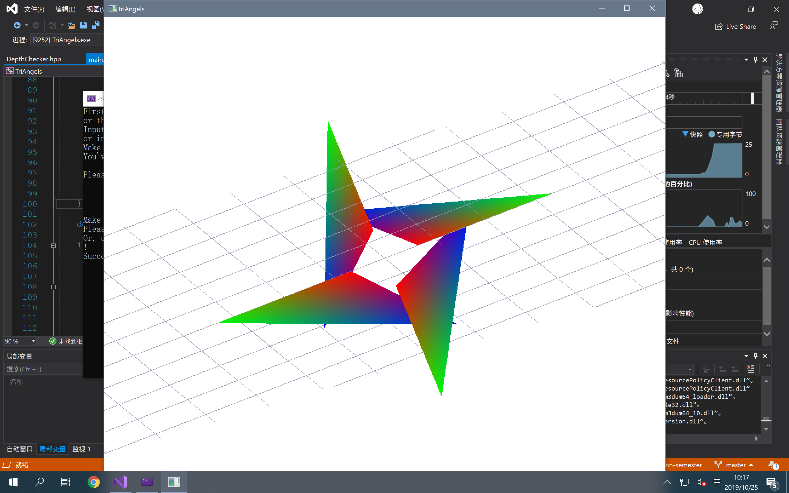

# SE-344

## Assignment #2 Report

*   姓名：于喜千
*   学号：`517030910168`
*   任务：Assignment #2

### 过程描述

#### 第一部分：搭建 OpenGL 编程环境

#####环境设定

*   Windows 10 x64 LTSC 1809 (`17763.737`)
*   Visual Studio 2019 Community (`16.2.4`)
*   FreeGLUT

此处，比照 Assignment #1 中的环境设定办理。

#### 第二部分：数据处理

由于本次 Assignment 中的三角形数据来自 `overlapping.tri` 和 `intersecting.tri`，因此我们首先需要实现三角形数据的读取。

##### 标准库使用

这里，主要利用了 C++ 中的 `<fstream>` 和 `<iostream>` 标准库来实现文件数据的读取。

##### 数据格式

在作业提供的 `.tri` 文件中，包含由不定数量的空格符及 ``'\n'`` 分隔的数字；这些数字依次代表了三角形每个顶点的 x、y、z 坐标位置（有符号整数）及 R、G、B 颜色分量（0 ～ 1 之间的浮点数）。

文件以 ``'\n'`` + EOF 结束。

##### 程序结构

相关文件包括 `Triangle.hpp`、`Reader.h`、和 `Reader.cpp`。

在 `Triangle.hpp` 中，定义着 `TrianglePoint` 和 `Triangle` 两个类；他们用于结构化地描述三角形的顶点位置及顶点颜色。同时，提供了默认的无参构造函数及完整构造函数，方便各种形式的调用；同时在构造时还对 R、G、B 颜色分量进行了范围检测和归一化纠错，减少错误调用的可能性。

在 `Reader.cpp` + `Reader.h` 两个文件中，定义了一个名为 `readTriangle` 的参数；它可以通过提供文件名作为参数来读取所有满足上述条件的 `.tri` 文件，并将其放置在 `vector<Triangle>` 中并返回。这就意味着我们可以在随后的 Phases 中复用这个函数，减少重复工作，提高程序效能。

##### 执行结果

通过断点调试方法，发现程序可以成功处理 `overlapping.tri` 和 `intersecting.tri` 两个 `.tri` 文件，并能正确生成 `Triangle` 对象。

#### 第三部分：三角形绘制

##### 程序结构

这一部分的代码更改主要在 `main.cpp` 的渲染部分。另外，扫描线算法的实现位于 `DepthChecker.hpp` 中。

首先，我们引入 `Triangle.hpp` 及 `Reader.h` 头文件来读入所需的文件。

##### 读取数据

```c++
auto triangles = readTriangle("./overlapping.tri");
/* 'triangles' type: std::vector<Triangles> */
```

由于除错调试时的 `.tri` 文件路径和实际运行时的路径有出入，因此为了保证程序灵活性，采用运行时指定文件路径的做法，如此：

```c++
std::cin >> path;
auto triangles = readTriangle(path);
```

##### 绘制三角形

为了减少代码绘制时产生的问题，这里复用了上一次的视角旋转代码来实现视角的改变。

同样，绘制图形的代码在 `onRender()` 函数中实现。

###### 启用深度检测

在 `main` 函数中，我们使用下列方法来启用深度检测：

```c++
// 设置深度缓存
glClearDepth(1.0);

// 启用深度测试
glEnable(GL_DEPTH_TEST);

// 所作深度测试的类型
glDepthFunc(GL_LEQUAL);

// 启用平滑
glShadeModel(GL_SMOOTH);
```

关键方法为 `glEnable(GL_DEPTH_TEST)`，该函数启用了 GLUT 提供的深度测试。

留意到我们需要使用重心差值渐变来绘制三角形，因此我们调用 `glShadeModel(GL_SMOOTH)` 函数。

而 `glDepthFunc(...)` 函数可以指定进行深度测试的类型。可以使用的参数包括：

*   `GL_NEVER`, 总是不通过（输入的深度值不取代参考值）
*   `GL_LESS`, 如果输入的深度值小于参考值，则通过
*   `GL_EQUAL`, 如果输入的深度值等于参考值，则通过
*   `GL_LEQUAL`, 如果输入的深度值小于或等于参考值，则通过
*   `GL_GREATER`, 如果输入的深度值大于参考值，则通过
*   `GL_NOTEQUAL`, 如果输入的深度值不等于参考值，则通过
*   `GL_GEQUAL`, 如果输入的深度值大于或等于参考值，则通过
*   `GL_ALWAYS`, 总是通过（输入的深度值取代参考值）

（Refs: glDepthFunc - OpenGL 4 Reference Pages）

###### 清除缓存

由于开启了深度检测，因此我们在每次开始渲染时，不仅要清除像素缓存 Bit（`GL_COLOR_BUFFER_BIT`），同时还要清除深度缓存 Bit（`GL_DEPTH_BUFFER_BIT`）。

```c++
glClear(GL_COLOR_BUFFER_BIT | GL_DEPTH_BUFFER_BIT);
```

###### 绘制三角形

因为我们已经得到了 `Triangle` 数组，因此只需要使用 `glBegin(GL_TRIANGLES)` 来绘制就好了。

在 `glBegin` 和 `glEnd` 之间，连续调用 `glColor3d` 和 `glVertex3d` 来绘制不同颜色的顶点。

######绘制参考线

```c++
glColor3d(0.6, 0.6, 0.7);
for (float i = -50; i <= 50; i += 0.2f)
{
	/** 绘制线 */
	glBegin(GL_LINES);

	/** x 轴方向 */
	glVertex3f(-50, 0, i);
	glVertex3f(50, 0, i);

	/** z 轴方向 */
	glVertex3f(i, 0, -50);
	glVertex3f(i, 0, 50);

	glEnd();
}
```

为了保证空间视觉观看体验，因此我们在 xOz 平面上绘制一系列的灰色网格来帮助我们观察。

##### 观察结果

根据程序读取 `overlapping.tri` 和 `intersecting.tri` 的结果来看，可以看出 OpenGL 提供的深度检测算法表现优异，运行高效。



>   「`overlapping.tri`」的渲染结果，使用随附的深度检测算法


>   「`intersecting.tri`」的渲染结果，使用随附的深度检测算法

#### 第四部分：扫描线算法

#####兼容修改

为了保证在实现扫描线算法的过程中，不要破坏上面已经完成的代码，这里新增了一个名为 `useDefaultDepthCheck` 的开关；程序运行起始会询问是否打开这一开关。

##### 思路说明

为了简便起见，也因为图形较为简单，这里使用了最简单的思路：

1.  在 $xOy$ 平面内遍历所有点，判断其是否和三角形存在交点；映射完成后跳转到第 5 步。
2.  如果不存在交点，则忽略该点，回到第 1 步；
3.  若存在唯一交点，则插值计算该交点的 $z$ 坐标，并将 $(x, y, z)$ 加入点映射表，回到第 1 步；
4.  若存在多于 1 个交点，则分别计算不同三角形的插值坐标，并比较采用其中最大的 $z$ 值，将其加入映射表；回到第 1 步；
5.  从映射表中抽离出一个点集并返回给渲染器进行绘制。

#####数学分析

这里存在两个数学问题：

一是如何判断与 $z$ 轴平行的直线 $x = x_0, y = y_0$ 是否穿过三角形；

二是如果穿过三角形，如何计算这条直线和三角形的交点坐标；

三是已知交点坐标，如何确定交点的 R、G、B 分量。

我们分别来进行分析。

######相交判定

由于我们的渲染方向固定（沿着 $z$ 轴向负方向观察），因此可以将三角形投影到 $xOy$ 平面上进行计算。

于是问题可以抽象化为：已知平面 $xOy$ 上四点 $A$、$B$、$C$、$P$，判断点 P 是否在 $A$、$B$、$C$ 构成的三角形内部。

这是一个简单的平面几何题。

要判断点是否在三角形内部，我们首先简化到判断点是否在一个方向向量的一侧。

而判断一个点是否在一个方向向量的一侧（左侧或右侧），我们可以采用差积（符号为 $\times$）进行计算。

设已知的方向向量为 $\overrightarrow{AB}$，要判断的点为 $P$，则我们只需要判断向量 $\overrightarrow{AB}$  和 $\overrightarrow{AP}$ 差积的符号即可。

当 $P$ 在 $\overrightarrow{AB}$ 左侧时，$\overrightarrow{AB} \times \overrightarrow{AP}$ 应为正（根据右手螺旋法则）；反之则在其右侧。

那么拓展到整个三角形，当点 $P$ 同时在 $\overrightarrow{AB}$、$\overrightarrow{BC}$、$\overrightarrow{CA}$ 的同侧时，即可判断其在三角形内部了。

>   `DepthChecker.hpp` 中的 `inTriangle` 函数实现了上述算法。

###### 交点计算

根据立体几何知识，不共线三点能确定一个平面。因此我们首先根据公式组
$$
\left\{
\begin{aligned}
a & = & (p_{2_y} - p_{1_y}) \times (p_{3_z} - p_{1_z}) - (p_{2_z} - p_{1_z}) \times (p_{3_y} - p_{1_y}) \\
b & = & (p_{2_z} - p_{1_z}) \times (p_{3_x} - p_{1_x}) - (p_{2_x} - p_{1_x}) \times (p_{3_z} - p_{1_z}) \\
c & = & (p_{2_x} - p_{1_x}) \times (p_{3_y} - p_{1_y}) - (p_{2_y} - p_{1_y}) \times (p_{3_x} - p_{1_x}) \\
d & = &  - (a \times p_{1_x} + b \times p_{1_y} + c \times p_{1_z})
\end{aligned}
\right.
$$
解出三点确定的平面公式 $ax + by + cx + d = 0$。

之后，我们将已知的射线 $x = x_0, y = y_0$ 代入即可求出交点 $(x_0, y_0, z_0)$。

>   `Triangle.hpp` 中的成员方法 `getPanelEquation` 实现了上述算法。

###### 颜色确定

这是一个比较麻烦的算法，主要原因是为了保证效果和原始图像的统一性，必须使用和原图相似的重心差值算法来进行颜色填充。

考虑到三角形是个平面图形，投影不会改变其插值性质；因此直接将其向观察面 $xOy$ 上投影并计算颜色。

而计算颜色分量，本质上是计算三角形三个顶点的颜色决定权重；即每个点对于目标点具有多大的影响力。

重心坐标算法的思路是：$A$ 点对于 $P$ 点的权重，等于三角形 $BCP$ 的面积在大三角形 $ABC$ 的面积中所占的比例。

这样的计算方法可以保证在端点处的颜色分配正确性，以及始终能保证归一：三角形的总面积分成三份，总能保证其和为整个三角形的面积。

>   利用了 Mathematica 对各点权值进行计算。工作簿文件参见 `/ass2/math/color_setting.nb`。

实际公式如下：
$$
\left\{
\begin{aligned}
u & = & -\frac{(P.y-\text{P1}.y) (\text{P1}.x-\text{P3}.x)-(P.x-\text{P1}.x) (\text{P1}.y-\text{P3}.y)}{(\text{P1}.y-\text{P2}.y) (\text{P1}.x-\text{P3}.x)-(\text{P1}.x-\text{P2}.x) (\text{P1}.y-\text{P3}.y)} \\

v & = & -\frac{-P.y \text{P1}.x+P.x \text{P1}.y+P.y \text{P2}.x-P.x \text{P2}.y+\text{P1}.x \text{P2}.y-\text{P1}.y \text{P2}.x}{\text{P1}.y \text{P2}.x-\text{P1}.x \text{P2}.y-\text{P1}.y \text{P3}.x+\text{P1}.x \text{P3}.y-\text{P2}.x \text{P3}.y+\text{P2}.y \text{P3}.x}

\end{aligned}
\right.
$$
其中，$u$ 对应 $P1$ 的权值；$v$ 对应 $P2$ 的权值；而 $P3$ 的权值可利用 $1 - u - v$ 计算得出。

>   `DepthChecker.hpp` 的 `analyse` 方法中实现了颜色确定算法。

##### 栅格渲染

使用 `DepthChecker` 类即可实现栅格化的三角形渲染。

`onRender` 方法被调用时，会首先检测 `useDefaultDepthCheck` 开关是否被打开。

如果该开关被关闭，则会关闭默认的深度检测，并且先使用 `DepthChecker` 来栅格化得到的三角形。

随后，使用 `glBegin(GL_POINTS)` 方法来逐个绘制二维像素点。

##### 观察结果


>「`overlapping.tri`」的渲染结果，使用自定义的扫描线算法


>   「`intersecting.tri`」的渲染结果，使用自定义的扫描线算法

>   ⚠️ 留意到由于视角问题，两个三角形略有重合。但是从三角形中点连线的颜色突变可以看出 Intersecting 效果。

#### 第四又半部分：视角调整

我们可以看到在自定义的扫描线算法中，正面看起来两个三角形重合了。

为了解决这个问题，我们在 `Triangle` 类中增加一个旋转方法。

算法的思路很简单：绕着 $y$ 轴旋转 $\theta$ 角只需要用 $x = x\cos\theta \times z\sin\theta$ 计算即可。 

绕着其他轴的计算结果类比得出。

旋转之后，`intersecting.tri` 的渲染结果如下：


>   经旋转矫正后「`intersecting.tri`」的渲染结果，使用自定义的扫描线算法

#### 第五部分：矩形编织

此部分相对于上面的算法没有特别之处。为了实现编织效果，这里采用的方式是模拟真实世界中的编织方式，令水平方向的条带始终维持在 $xOy$ 平面上（即 $z = 0$），而令竖直方向的条带深度在 $-1$ 和 $1$ 之间摇摆，以实现类似于实际的编织效果。

##### 程序结构

相关文件包括 `Weaving.hpp`，其中的 `Weaving` 类可以生成实现矩形编织效果的三角形数组。

其主要逻辑为在一个 for 循环内反复生成三角形所构成的四边形，连接成条带状。

为了体现渲染器的普适性，将不对上面的渲染算法做任何更改。

##### 优化效能

由于这里的所有连续条带都是单色的（不存在颜色渐变问题），因此在栅格化方法内提供一个单色模式，在此时不去计算颜色插值，而直接采用提供的单色来提高效率。

##### 观察结果


>   矩形编织效果，使用随附的深度检测算法


>   矩形编织效果，使用自定义的扫描线算法

>   ⚠️ 注意：由于需要绘制的三角形较多，使用自定义扫描线方法渲染较慢，开启优化后在测试机器上大约需要 5 至 10 秒完成渲染。请耐心等待。

### 笔记整理

#### Sep 26

```markdown
## SE-344::CG2019

### Review of Assignment #1

### CG 发展 + 应用

#### 發展

1946, ENIAC, 其创始人做了个梦…当时的 ENIAC 吃的是打孔纸带（输出也是），完全没有图形输出。

1950, MIT, Whirl Wind I 实现了第一台带显示器的计算机。用的是类似示波器的 CRT，只能显示非常简单的图形。

1958, Calcomp, 滚筒绘图仪。

1958, GerBer, 平板式绘图仪。

1960s, MIT, Lincoln Lab, 可交互的 CRT 显示器

> 插一句：此时电视技术已经非常成熟了，因此也影响了计算机图形的发展历程。迄今为止，计算机图形技术都采用基于光栅的图形显示。

1980s, 出现了使用光栅图形显示器的 PC & Graphics Workstation。

> 请注意：计算机图形所采用的 RGB 色域事实上并不能很好地表示出真实世界中的所有颜色。这个色域是比较窄的。图形工作站意在支持更多色彩的表示方式，实现真正的颜色「WYSIWYG」。

#### 應用

* Films，辅助影视后期制作。
* Games，对于实时性的要求特别高。
* Medical Imaging，医学图像学。

### Graphics 的存储 + 表示 + 显示

表示和显示的区别：表示需要将所有的数据都表示出来，
然而显示的话仅仅显示那些必要的内容，很可能只有表示的数据（或者，实际的数据）的一部分。

例如：被空间遮挡的物体不会被显示；物体的一些信息：如法线等不会显示；

甚至，生成的图像也并非全部用于显示；一般会从生成的管线中进行剪裁（Clipping），这个图形显示的小窗口（Window）会因视点的位置（Viewpoint，视口）变换而变换。

> 注意：此 Window 非彼 `Windows` 之 Window。

#### 存儲

#### 表示

图形是如何表示的？

这很难讲，主要是无法提出一个永远适用的标准来。

不同的应用场景总是会适用不同的表示方法。不同的物体也应该用不同的方式来表示。不能存在一个放四海准的统一标准。

在我们的 OpenGL 表示方法中，常用的表示方法是 顶点 三角形 上色。

三个顶点所构成的三角形都会被上成相同的颜色。在此基础上进行栅格化，确定到每个像素点应该取什么颜色。

#### 顯示

在你知道了每个像素点的颜色之后，就可以交给 Graphics Card 来渲染了。

### 图形处理管线

> 也称渲染管线、渲染流水线, the rendering pipeline。

图形的显示本质上是以流水线来进行的。流水线的特点就是：其中一点的栓塞就会变成整体性能的瓶颈。因为其中每一级的产物都是下一级的必要输入。这样就会导致严重的卡顿和延迟。

管线里面有啥呢？

Geometry Pipeline ==光=栅=化=> Imaging Pipeline

#### Geometry Pipeline

也叫做几何管线、3D 管线。这一段处理的都是 3D 空间内的顶点、边、光影、运动等等东西都是在此段进行考虑的。这一段还没有进行栅格化，操作的量都是矢量、几何量。

* 时间：动画与交互
* 形状：建模
* 着色：反射与光照
* 视图：变换与剪裁
* 消隐：隐藏线／隐藏面的消除

这些东西都是 G.P. 需要考虑的事情。

#### 光栅化

光栅化就是 G.P => I.P. 的过程。这个过程是必然会导致大量信息丢失的。但是为了显示，不得不采用这种光栅化的操作。为了尽量减少损失，这里有非常大量的算法和操作，就是为了保留「真实感」。

> 举例：一个几何管线里的球，如果你不加算法地渲染成二维，那肯定渲染成一个纯色的圆。

#### Imaging Pipeline

此段已经把 Geometry pipeline 里面的几何数学量都采样、投影到 2D 平面，得到了一组像素化的 Pixels。

此时所有的光影、集合、3D 信息全部都丢失了。你得到的仅仅是一些平面像素颜色点。只能操作那些像素点了。

> 为了尽量保留真实感，在 Imaging Pipeline 里面需要做的事情有：

* 光栅化、采样
* 纹理映射
* 图像合成
* 光强、色彩量化
* 帧缓存、显示

> Question: 管线优化：能在哪里进行优化？如何找到哪里是瓶颈？如何优化？

### 表示方法

#### 线框模型

这个只能用来快速看一看，所有的面都不渲染，只渲染线条。问题就是会出现二义性，部分线条之间无法分析出来深度关系。

#### 面模型

只渲染面，而被面遮挡的「内部」皆不渲染。

#### 体表模型

用非常简单的几何体来代替我们的几何体，如四面体、六面体、球等等。

#### 固定明暗

在上面这一步之后，已经有了一个非常粗略的视图。

所谓固定明暗，并非是「没有光源」。否则你渲染出来的就是一张黑帧。

而我们这一步里面要用到的是一种「不真实」的光；这种光让任何一点光强相同，且反射方式均为漫反射。

> 同样亮度的漫反射啊，让人看起来真实感非常弱。

#### Phong 光照模型

这一步比起上一步就是需要加入真实光照并加入渲染。

* 添加高光

在此之后物体会显得非常光滑，非常不真实（真实世界里没有这种油油亮亮的东西）

* 添加镜面反射

事实上反射并不好操作。实际有两种方法：

1. 用光线跟踪，遇到光反射的时候就反向追踪，找出光线的发射者，并计算反射的光强。这种算法计算量很大，而且在追踪距离较短时效果不好，容易出戏。
2. 用帧缓存中上一帧渲染出来的结果拿出来，略加处理之后当纹理贴到镜子上（咳咳咳）
3. A.O. 游戏里面特别常用的一种方法。

> Question: 是啥？去查！

* 贴图

有些物体有特定的贴图，进行像素级别的计算。

* 凹凸映射

用纹理直接实现非常细小的凹凸变换，而不需要使用几何建模（细小的凹凸不平非常吃计算量的）。
而如果使用纹理来代替，可以用较小的代价实现几乎类似的效果。
```

#### Oct 10

```markdown
## SE-344::Computer Graphics

不论你要 Build 出如何真实、如何帅气、如何有意思的图形，

最终你还是要把它给 Render, Flatten 成一个个无趣的像素点的。

这个过程就叫做「光栅化技术」。

---

### 光栅化技術

光栅化之前所有的操作還可以包含 Vertex（頂點）、拓撲關係等等幾何信息；

但光栅化操作會把這些全部拍平；

光栅化之後的所有操作都只能基於 Pixels（像素點）了。

#### 基本圖元繪製算法

我們要瞭解的僅僅就是基礎的算法原理而已。因為目前所有的基礎庫都很好地替我們提供了優秀的實現，我們不必要自己實現這些算法。

（雖然在下次作業裡，我們還是會需要做它一次。）

#### 圖形的表示

* WireFrame，線框模型

僅僅採用頂點和鄰邊來表示模型。

如果只有三維的線框模型的話，這種表示是存在二義性的。由於不存在遮擋關係，沒辦法唯一地表現出空間的。

只是快速表示一下空間而已。

* Surface，表面模型

這種表示方法相較於 WireFrame，是由很多個 Surface（面片）搭建成的。由於面片之間存在遮擋關係，因此就表示精確度而言高於 WireFrame 模型。

但他沒有說明這圖形是由表面的哪一邊組成的。

* Solid，實體模型

這種模型表示方法是可以定義形體處於表面的哪一側的。

還有很多種圖形的表示方法：

* 表面多邊形法（B-rep）
* 解析法、微分法
* 掃描表示法
* 四叉樹、八叉樹表示法
* 分形幾何法
* 粒子系統（Particle System）

#### 圖形的顯示

顯示跟表示是不一樣的。

顯示文件僅僅是整個圖形表示的一部分。

---


取景窗口也决定了显示的内容。这个取景窗口的决定叫做 Clipping。

* 每一个可以独立显示的点叫做像素点「Pixel Points」。
* 一行像素构成一条光栅（Raster），也叫做扫描线（Scanline）。

确定屏幕上像素点的集合和颜色，叫做光栅化（Rasterization），也叫做扫描线算法（Scanline Algorithms）。


多年以前的 CRT 显示器需要扫描显示。因此它就有两种不同的扫描方法：

* 奇数场优先；

奇数场优先就是优先画出奇数场的扫描线，然后回扫；（回到第一个地方）而偶数场的扫描线就先暂且留在上一帧的位置。

* 偶数场优先；

和奇数场优先相反。

* 逐行显示

不区分上下／奇偶场。

#### 帧缓冲存储器

存储器中包含了每个像素的信息。

拿出对应像素点的信息，放到对应的寄存器（Register）之中，然后送给显示控制器来干活；最终显示出来。

彩色的呢复杂一点。

有三个独立的显示控制器（R/G/B）共同显示彩色。

因此就需要三重显示控制器。

> P.S. 部分的显示系统还包括了 Alpha 通道（也就是不透明度的控制）。但是并不存在一种「Alpha 显示控制器」。在此之前他就已经被平摊到 R/G/B 通道上了。

### OpenGL 的基本图元绘制

#### 定义顶点

顶点是一切东西的开始和基础。

由它才产生出了点、线、多边形，等等。

##### `glVertex*`

> `*` 代表这个函数有后缀。合理的后缀形似：

* glVertex2i

2 代表这个顶点在二维空间之中。

i 代表这个点的坐标值为整数。

s 代表这个点的坐标值为段整数。

* glVertex3f

3 代表这个顶点在三维空间之中。

f 代表这个点的坐标值为单精度浮点数。

d 代表这个点的坐标值为双精度浮点数。

以此类推。

​```c++
glBegin(GL_POINTS);

...

glEnd();
​```

`glBegin` 和 `glEnd` 之间的部分就是我们定义的顶点们。

glBegin 中有一些参数，决定了怎么处理 glBegin 和 glEnd 之间定义的图元。

参数去看 PPT。这里记不下来。

#### Example

​```c++
glClear(GL_COLOR_BUFFER_BIT);

glColor3f(0.2, 0.7, 0.7);

glPointSize(5.0);

glBegin(GL_POINTS);

glVertex2f(0.0, 2.0);

...

glEnd();

glFlush();

​```

P.S. 可以在 `glBegin()` 和 `glEnd()` 之间通过 `glColor3f` 来修改顶点的颜色。

不同的顶点颜色组装在一起会产生渐变颜色效果。这是双线性插值的结果。以后会讲到。

### 基本图元光栅化算法

最基本的事情。我们都很关心。

#### 啥是基本图元啊？

Primitive Symbols。什么算基本？

点、线、圆、一般函数曲线、字符。

#### 光栅化／扫描线算法

把原来的一个美好的几何图形给拍扁成一堆像素点。

这个过程就是光栅化／扫描线算法。

#### Fragment：片元

光栅化完成之后，原来那个图元对应的像素点集合就叫片元区域。

#### 光栅化

##### 点的光栅化

P(x0, y0) 怎么变呢？

> 法一：直接取整数部分。

> 法二：四舍五入。

这两者区别不太大，但是总的来说四舍五入的像素点偏移会更少。

如果说直接取整数部分，有可能会产生整体像左下角（0, 0 位置）的偏移。

但总归，点的光栅化都是容易的。

##### 直线的光栅化

在数学中，直线的斜截式方程为 $y = k x + b$。

但事实上计算机不会处理无限长的直线。它只会处理有限的线段。

因此我们一般会提供起点和终点 P1(x1, y1) - P2(x2, y2)。只画这两点构成的线段。

平凡的四种线段：$y = k$，$x = k$，$x = y$，$x = -y$。这个光栅化过于简单，不多谈。

我们可以直接把它简化为点的光栅化问题。把这个线段给切分成一些点的集合（按照一定的切分粒度），然后对每一个点进行光栅化。

在斜率 k 绝对值小于 1 的时候就用变化的 x 来求 y。

在 k 绝对值大于 1 的时候就用变化的 y 来求 x。

但这个算法非常之慢。正常人类不会用的。

##### 直线的光栅化（人类的方法）

DDA 算法：Digital Difference Algorithm。

这是一个增量计算法；也就是每一步计算都跟上一步的计算结果有关系。

我们知道起点和终点；先把起点给光栅化掉再说。

然后我们就有了另一个参量：当前绘制的点。

我们判断这个当前点是偏向了 y 轴（向上偏了）还是偏向了 x 轴（向下偏了）。

如果斜率偏小，那下一步就往右走；如果斜率偏大，那下一步就往上走。

如果不偏不倚；刚好一样，那就往右上方走。

这么办可以保证比较高的效率，同时 trivial 的四种情况也可以直接处理掉。

当然这种方法就仅仅适用于直线而已。其他的曲线是不可以用的。

附注：一般来说结尾点我们是不画的。因为经常会画连续的方法；

##### 直线的光栅化（Bresenham 算法）

这个方法太快啦！所以它也被叫做「快速增量算法」。

基本思想是根据一个决策项 p 的正负，来选择像素点的位置。

本质上，需要在 x 方向上移动 A 格，同时在 y 方向上移动 B 格。

那么我们只需要决定在什么时候往右走，在什么时候往上走，就好了。

不需要进行那么多次的除法运算（说的就是 DDA），

思路是绝对的简单：我可以选择的像素点位置谁离真实值比较近，我就选谁走。

本算法所需要进行的计算仅仅包括「×2」和「-」。对应到位运算就是仅仅包括左移一位和减法器。

比起那些动不动要乘要除的浪费 CPU Cycle 的那些算法，这个算法简直太快了！

##### 圆的光栅化

圆有二次多项式表示。

圆也有极坐标表示。

圆也有 Brosenham 栅格化算法。

看书 P110.
```

#### Oct 17

```markdown
## SE-344::CG

终极目标：得到一帧可显示的图像。其中最重要的一个步骤就是光栅化了。

每一个像素格的颜色都放在一个叫做「帧缓冲存储器」的东西里。

OpenGL 里如何定义那些点及其他基本图元，我们也已经了解到了。

关于点和线这种图元的光栅化所用到的各种算法，我们上节课也讲了。

光栅化完了之后，得到的像素点集合就改名叫 Fragments（片元）了。

### 多边形的光栅化

多边形其实也是 Primitive 的一种的。但是他的光栅化比起点跟线来说，相对更难一些。

#### **最**低效法

逐个检查像素是否在多边形内。丢人！谁会用这种方法

#### 空间连贯性利用法

相邻像素几乎都具有相同的填充状态，只需要在边缘位置进行特别检查和处理。

#####基本步骤

* 求扫描线与多边形边缘的交点
* 对交点排序，分块
* 确定每一块 Span 的填充状态
* 处理特别状态：扫描线掠过顶点时怎么处理

##### 特别说明

为了解决「填充扩大」问题，采用「右上闭左下开」原则，确保多边形绘制结果不扩大。

#### 奇偶扫描转换算法

由上面的空间连贯性扫描线大法衍生而来。每根扫描线存有一个 Bit 标识位，在进入／离开多边形边缘时切换奇偶标识位，并以此标识位决定要不要画像素。

这种算法利用了水平方向的连续性，但却没有用好竖直方向的大体相似性，所以效率有点感人。

#### 有序边表多边形扫描转换算法

这种方法的思路是首先计算出所有的端点及其与扫描线的交点，然后两两取出成对的点构成线段并光栅化。最后得到结果。

#### 采用活化边表的有序边算法

活化边表：不仅仅采用从上到下的扫描顺序，而是根据当前扫描线的位置动态改变边表的内容及顺序，某些根本碰不到扫描线的边就直接从活化边表中剔除，这样可以减少比较次数，提升一定的效率。

#### 边填充算法

每一条跟多边形相交的扫描线，将其交点取为 $(x1, y1)$，把每一条边靠近图形内侧的像素点都填上，最后取交集得到结果。

这个效率是真的很低（×）

#### 栅栏填充算法

所谓 Fence 填充，就是提供一个人为限定的边界，减少那些「不可能」的像素点被 Call 的次数，大大减少了像素点访问次数。稍微提高了点效率。

但还是差（×）

#### 边标识算法

终于有一种适合硬件实现的、好使的算法了（

沿着多边形勾画轮廓线，建立各区段的像素的时候，同时把它们之间的像素也都填上。

这种算法每个像素点访问至多一次。很高效。

#### 种子填充算法

首先指定一个已知在多边形内部的像素点，然后四处找邻居扩散；遇到了边界像素，就撞墙碰壁停止；

##### 4 连通法

只有上下左右的作为邻居。

##### 8 连通法

除了上下左右，右上右下左上左下也可以当作邻居。

通过这种方法，扩散开来填充整个多边形。

一般这种算法用个 Stack 就好了。用递归太浪费，算了。（本质上也是用一个 Callee Stack...）

#### 扫描线种子填充算法

不采用唯一一个像素点来开始种子填充，而是使用一根扫描线找出内部像素全部扔入栈，然后向两边扩展开。

#### 泛滥填充算法

（？？？）这是啥

没有特定边界，把图像中所有满足一定颜色范围的像素点都修改为同一颜色，而不考虑其空间分布。

#### 渐变填充算法

（？？？）好像跑偏了

先确定好他是否是存在于多边形内部的点。然后给定边缘点的颜色，内部其他点的颜色都采用双线性插值确定。

以 $(C1, C2, C3)$ 为例，三个点确定的一个三角形，给这三个点指定三种不同的颜色。

那么对于三角形内部任意一点 $P(x, y)$ 而言，计算出他与三角形的两个交点 $P1(x1, y)$ 和 $P2(x2, y)$。在这条扫描线上，我们认定颜色值就是线性变化的。所以我们只要知道 P1 跟 P2 的颜色值，就可以直接拿到结果了。

那么 P1 跟 P2 的颜色值怎么确定呢？因为 P1 跟 P2 都在直线边界上，所以我们只需要把它的 x 或 y 坐标拿出来同这条边两边的两个端点拿来做插值就可以了！

很简单的一种算法。

> Première

### OpenGL 多边形填充

#### 顶点数据的维护

#####立即模式

~~猴急模式~~

现在几乎没什么人用这种方法了。每创建一个顶点就把它立即发给显卡画。效率是比较低的。

#####VBO／VAO

VBO 是 Vertex Buffer Object 的简称。显卡内的一个内存缓冲区，可以保存顶点、颜色、法线、纹理等等信息。这些信息都还是光栅化之前的图形数据。

VAO 是 Vertex Array Object 的简称。一个 VAO 包含一个或多个 VBO。VAO 会在显存之中线性存储几个对象信息，而不是直接每次都把每一个对象数据发给显卡。这就是 Non-Instant 非立即模式下的工作方法。

#### 指定颜色及其填充方式

使用 `glColor*{*}()` 来指定每个顶点的颜色。

使用 `glShadeModel(GLenum mode)` 来确定颜色的填充方法。

`GL_SMOOTH`：缺省值。使用双线性插值来确定颜色。

`GL_FLAT`：采用离该点最近的顶点的颜色作为该点的颜色。

#### 指定多边形绘制方式

使用 `glPolygonMode(GLenum face, GLenum mode)` 来确定多边形的绘制方式。

Face 的取值范围：

`GL_FRONT`、`GL_BACK`、`GL_FRONT_AND_BACK`，确定对于一个多边形来说是绘制它的正面、背面还是两面都绘制。

Mode 的取值范围：

`GL_POINT` 点填充，只画你说的那几个点

`GL_LINE` 帮你把边给连上

`GL_FILL` 缺省值，帮你填充上多边形。

#### 指定多边形的正反面

`glFrontFace(GL_CCW / GL_CW)` 函数可以做到制定多边形的正面反面。

缺省情况下以右手系作为世界坐标系，逆时针成的面作为正面。

总归记住：面和边都是有方向的。

#### 指定图案填充多边形

`glPolygonStipple(const GLubyte *mask)` 可以用来图案填充多边形。 

### 可见面判别算法

#### 图形的二义性

在投影变换之后，3D 变 2D 之后，深度信息就丢失了，可能同一种投影会产生多种可能的原图形。

那么为了正确地绘制出无二义性的图形，深度信息必不可少。

复杂的情况下，一个图形本身的面、不同的物体之间都会产生遮挡。正确渲染这些面就必须要有深度信息加持。

#### 判定法

##### 画家算法（Naïve 算法）

类似于油画的作画过程；首先把屏幕设定为背景色。然后按照各个面按照视觉距离排序；于是先绘制远景、再画中景；最后画近景。类似于油画颜料的可覆盖性。

问题：一个像素需要被画很多次，效率很低。况且可能有些面可能会倾斜，可能会相交。并不能很好地进行排序。

##### 后向面

或称背向面。指当前视点对应的观察方向所看不到的那些面。

##### 后向面判别算法

设当前观察方向为 $V$，同一个坐标系下，多边形面的法矢为 $N(xn, yn, zn)$。将他们做点乘，在 $V·N>0$ 时，认定他为后向面，隐藏它并不做显示。

##### 深度缓冲器算法

或称作 Depth Buffer Method, Z-Buffer Method.

典型的像空间算法。

对场景中每个物体的每个表面进行处理，对比出深度最大的表面进行显示。

######初始化

$depth(x, y) = 0$。$refresh(x, y) = I(backend)$。

###### 比较

存储比较每个多边形上各点的深度值，并进行可见性判断

###### 计算

计算各个点 $(x, y)$ 处的深度值 $z$；

###### 结果

若 $z > depth(x, y)$，则有

$$depth(x, y) = z; refresh(x, y) = I(surf)(x, y)$$

##### A 缓冲器算法

上面的 DBM 法只能找到一个可见面，也就是说只能处理非透明的表面。没办法处理混合光强值。

对深度缓冲器算法进行了一点扩充：每一个位置都对应着一个 Surface Linked List。链表里就有了当前 Surface 之后的面的信息了。有了这些信息，我们就可以处理光强混合、半透明表面之类的操作了。

##### 扫描线算法

可以处理表面相交的情况了！

##### 光线投影算法

### 反走样技术

Anti-Aliasing Technique

CG 总是会走样的。但我们能不能稍微挽救一下？

#### 采样

> Sampling

走样源自于采样。

采样就是把连续数据转变为离散信息的过程。这就是数据丢失的过程啊。

> 走样 *zǒuyàng* **动**
>
> 失去了原来的样子。
>
> *这双鞋没穿几天就走样了 | 贯彻会议精神不走样。*

采样过程中会失真。失真过于明显，产生走样。

#### Nyquist 采样定理

要想从采样信息中重建原始信号，则采样频率必须大于等于原始信号最大频率的两倍。

#### 反走样技术

用于减少或消除走样效果的技术。也称为抗锯齿算法。也称为 Anti-Aliasing 算法。也称为 AA。

#### 图形反走样

##### 基础思路

把像素作为一个区域，按照区域进行采样。

按照我们栅格化图形的过程中，有的格子是部分落在原图形中的。我们按照占有的比率对其进行灰度级别上色，可以改善人眼的视觉体验。

##### 操作

给定一个最大亮度值，代表完全被覆盖的情况下所对应的颜色。

而那些被部分覆盖的像素点的亮度值设定为（覆盖百分比 × 最大亮度值）。

##### 问题

* 无论像素距离图形有多远，相同的相交面积产生相同的亮度。也就是说离直线的距离这个因素并没有加权。因此还是有比较明显的锯齿效应。
* 直线上的相邻像素点可能产生较大的灰度差。

#### FSAA

全屏反走样技术，Full-Scene Anti-Aliasing。

主要针对 3D 场景的绘制。通过密集的采样和滤波来减少锯齿效应。

FSAA 在渲染一个实际区域的时候（如 1024 × 768）的时候，会事先计算出多倍大小的画面内容（如 4× 抗锯齿，会渲染出 2048 × 1536 的画面），通过密集的采样来进行全屏幕反走样操作。

#### SS

Super Sampling，超级采样。

一个像素当作好几个像素来进行采样。那些「几个像素」就叫做「子像素」（Subpixels）。

渲染的时候场景放大渲染，但是以低分辨率进行显示。低分辨率下每一个像素都是多个像素加权平均的结果。

代价很高。真的很高。

#### OGSS, RGSS, MSAA, Quincunx

SS 的几种实现。

OGSS：顺序栅格采样，按照 x、y 顺序进行采样。

RGSS：旋转栅格采样。

MSAA：多级采样技术，多边形内部无需超采样，因此 MSAA 只在边缘进行超采样，可以节约点时间。

Quincunx：五点梅花采样。每个点的颜色都跟自己周边的颜色有关，且分配有不同的权重。
```

### 问题提出与解决

#### Q1：管线优化
在我们进行管线优化的过程中，如何找到哪里才是性能瓶颈（Bottleneck）？

#### A1
由于 Pipeline 是一个有着严格先后顺序的流水线作业，因此其中任何一个环节的 throttle 都会导致整体的性能下降。

因此在我们进行优化的时候，可以依次从前到后对每一个环节的入时间和出时间进行计算，统计出其所占整体时间的比率，按照其满载比空载的时间比来确定哪一段占用了最长时间。

这样，针对耗时最长的片段进行优化就能取得较为显著的效果。

#### Q2：AO
在游戏开发中常用的一种「A.O.」技术为何？

#### A2
A.O.，全称为 Ambient Occlusion，即环境光遮罩。

为了在游戏开发中实现光找效果，我们有许多方法。其中主要的计算方法分为两种：直接光照与间接光照。

直接光照：仅仅考虑光线照在物体上然后直接反射到观察点的这部分光照信息。

间接光照：同时计算光线经过物体多次反射、折射、吸收之后的光线信息。

最优的解决方案当然是真实的进行全部计算；目前热门的「光线追踪」技术就是基于间接光照的思路来的。而在硬件没有提供支持的情况下，软件强行计算的效率是很低的。

因此 Unity 等游戏引擎提供了一个折中方案：依然还是按照直接光照的思路进行计算，而同时在每个取样点上计算它被其它几何体覆盖的程度，以此为根据调整其反射光线的强度，能够在一定程度上模拟出「亮度衰减」的效果。本质上也是一个在算力不充分的时期所进行的妥协。