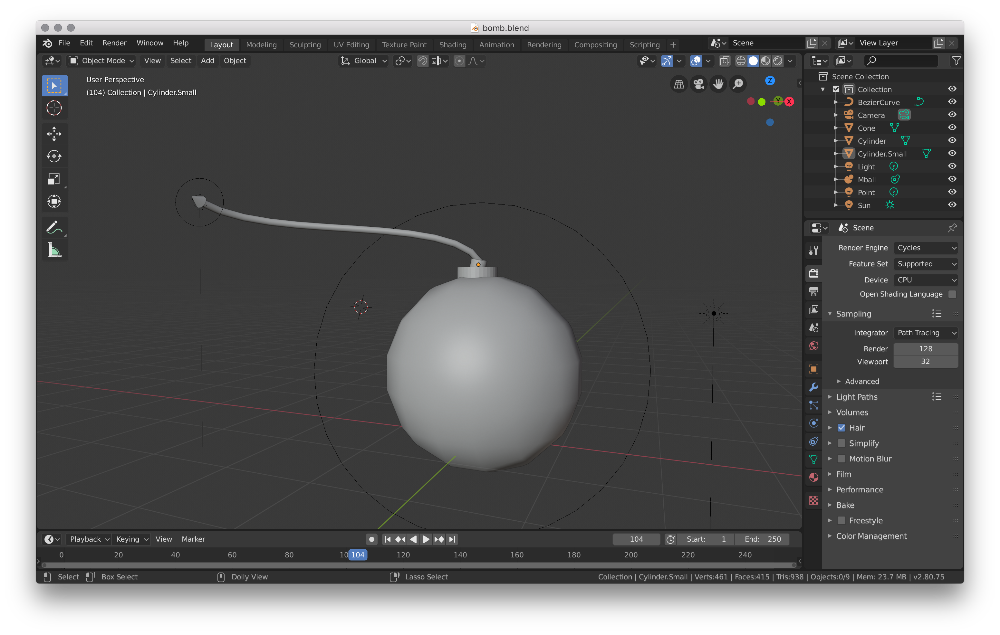
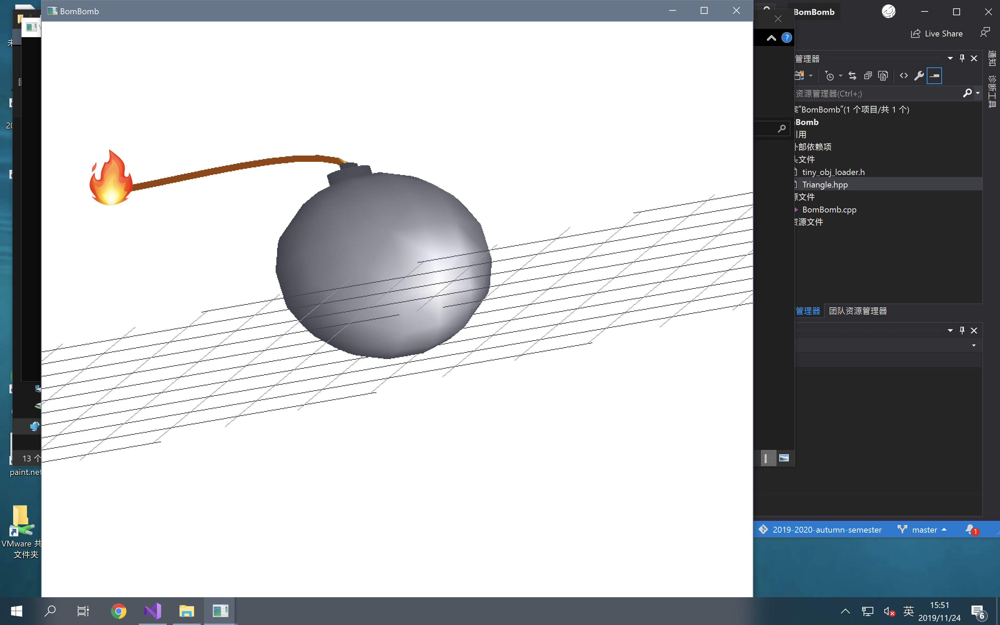
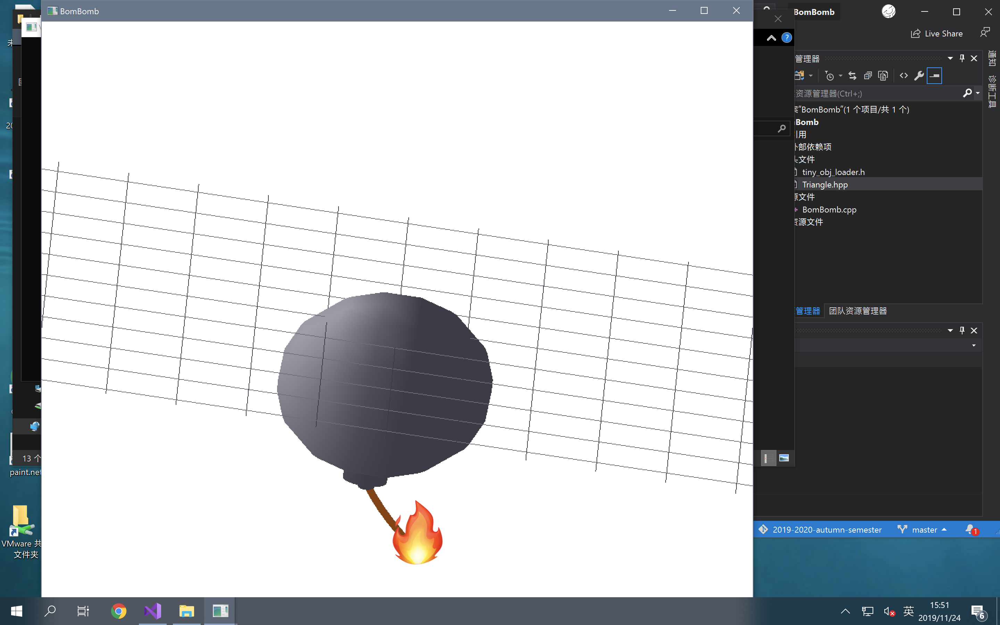
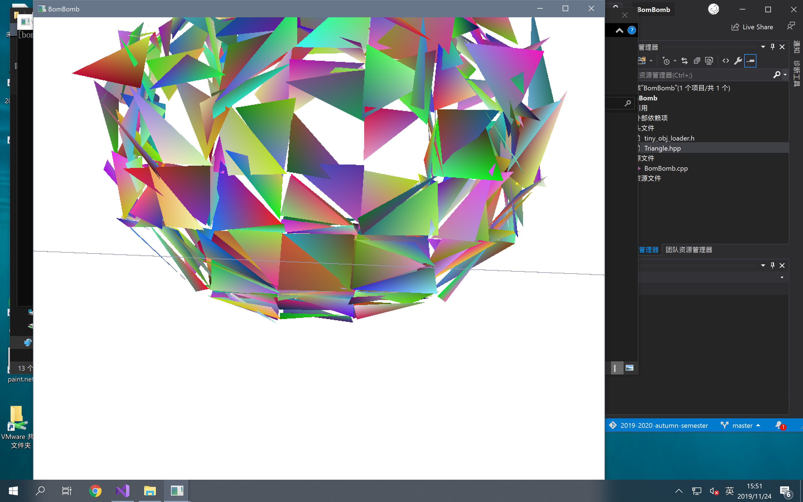

# SE-344

## Assignment #3 Report

### 过程描述

#### 第一部分：搭建 OpenGL 编程环境

##### 环境设定

*   Windows 10 x64 LTSC 1809 (`17763.737`)
*   Visual Studio 2019 Community (`16.2.4`)
*   FreeGLUT

此处，比照 Assignment #1 和 Assignment #2 中的环境设定办理。

#### 第二部分：模型建立

##### 格式介绍

根据课程上的学习了解，我认识到最容易被读取的文件格式必定是 Wavefront Format，即常见的 `.obj` 格式。

Wavefront 格式的基本思想是使用 $x$，$y$，$z$ 信息来定义出一系列的点，再使用点 ID 来构造出线、面。此格式本身不包含材质信息，额外的材质信息将被放置在同名的 `.mtl` 文件（Material Format）下。

##### 模型制作

绝大多数的 3D 建构软件都能够汇出标准的 Wavefront 格式。因此我选择了跨平台的 Blender 软件来进行模型的制作。

Blender 是一个跨平台的三维动画制作软件，功能相当全面丰富；这里仅仅使用了其中一小部分功能：模型制作。



在建模的过程中，使用了 Mball 作为球形炸弹的本体；两个 Cylinder 构件作为炸弹和引信的连接体；而引信则是借助 Bezier Curve 实现。

##### 隔离

考虑到在实际动画的制作中，我们需要让引信逐渐「燃尽」，因此有必要将炸弹的引信和本体隔离开来，方便对两类不同的三角形来制作不同的动画（即燃尽或爆裂）。

>   炸弹本体模型文件参见 `./ass3/release/bomb_body.obj`。
>
>   炸弹引信模型文件参见 `./ass3/release/bomb_line.obj`。

#### 第三部分：模型读取

上面已经提到，Wavefront 格式文件读取相当简单；考虑到点对面的映射关系实际相对麻烦，因此使用一个相对简单的 ObjLoader 辅助程序来读取 `.obj` 文件。

这里，我们采用了一个名为 Tiny Object Loader 的辅助库来帮助 Wavefront 的 Parsing。

>   Tiny Object Loader 以 MIT License 分发。

由于采用了第三方库，因此有必要说明其使用范围，以免过当使用之虞。

这里，TOL 仅仅只用于将点和面的分离表示转化为三个一组的点集合，进一步的三角形组织、绘制功能皆自行实现。

在完成 Wavefront 文件的读取之后，将其构造为 `Triangle` 三角形并将其存储在 `vector` 之中。

留意到为隔离起见，炸弹本体和炸弹引信的三角形面片分离存储。

```c++
std::vector<Triangle> bombBody;
std::vector<Triangle> fireLine;
```

#### 第四部分：三角形渲染

这个部分…在 Assignment #1 跟 #2 中都已经多次实行了，因此不过多赘述。

由于 Assignment #2 中自行实现的扫描线算法渲染器性能过于糟糕，因此不提供 `useDefaultRenderingSystem` 的开关，而始终使用随附的深度检测器来进行渲染。

其余部分和之前的操作都完全一致。代码已复用。

#### 第五部分：光和材质

##### 光

首先说明如何创建「光」本身。

FreeGLUT 也提供了三类标准的可选择的光。

*   Ambient（环境光）
*   Specular（镜面光）
*   Diffuse（散射光）

>   参考 Q & A 部分来了解三类光的分类区别。

FreeGLUT 最大支持 8 个光源；自 `GL_LIGHT0` 到 `GL_LIGHT7` 编号。

使用 `glLightfv(GL_LIGHT<i>, GL_<LIGHTTYPE>, <GLfloat[4]>)` 函数来初始化一个光源的信息，将其定义为一个指定颜色（浮点数四元组，分别对应 R、G、B、Alpha）的光源。

可以使用 `glLightfv(GL_LIGHT<i>, GL_POSITION, [x, y, z])` 函数来制定光源的位置。 

最后，不要忘记需要使用 `glEnable(GL_LIGHT<id>)` 来打开单个光源开关。

最最后，需要使用 `glEnable(GL_LIGHTING)` 来开启光线渲染。

##### 应用光

我们首先在炸弹本体旁放置了一个环境光，作为整体的环境照明。

为了炸弹引信的真实性，我们随时追踪炸弹引信的燃烧地点，并在该处创建一个偏暖色调的 Diffuse 光，伪装成火光。

##### 材质

同样是通过调用 `glMaterialfv` 函数来指定笔刷下的图形的材质。

参数可取下面的值：

*   GL_AMBIENT
*   GL_DIFFUSE
*   GL_SPECULAR
*   GL_EMISSION
*   GL_SHININESS

依次决定了材质在环境光下、镜面光下、散射光下所表示的颜色，以及决定了自发光和闪光的颜色。

通过设置「颜色」来模拟出不同的材质，这是一个略有 Tricky 的策略。

##### 应用材质

将炸弹本体设定为灰黑色，且反射较强的光滑材质。

将引信设定为灰棕色，且反射很弱的粗糙材质。

#### 第六部分：动画部分

动画部分，本质上就是在 `onRender` 被调用时，更新各面片的位置、颜色等信息，实现变化中的动画效果。

##### 引信缩短

引信缩短的效果，是通过从 Triangle Vector 之中逐个弹出三角形面片来实现的；由于在制作 Wavefront 文件时严格按照相对远近顺序定义 Triangle 对象，因此不会造成乱序。

同时，每次弹出 Triangle 面片时，记录其空间坐标，并将「火光」物体放置在该位置上，实现引信渐渐燃尽的效果。





>   留意到为了更好地展示材质效果，因此将 Assignment #2 中引用的镜头旋转和网格都引入了。

##### 炸弹爆炸

爆炸的效果，是将构成炸弹本体的三角形面片的材质全部删除，填入随机杂色，并将其坐标按比例加入随机值后放大，实现错落地碎裂效果，伪装成炸弹的爆炸效果。



>   如上图所示。

##### 第七部分：事件绑定

在 Assignment 要求中，提到了需要实现「点击炸弹」使其爆炸的效果。

FreeGLUT 已经对鼠标事件做了很不错的封装，加入一个点击事件轻而易举。

注册回调函数的代码片段如下所示：

```c++
glutMouseFunc(onMouseClicked);

void mouse(int button, int state, int x, int y) 
{ 
	// ...
} 
```

由于在爆炸开始前镜头不进行旋转，因此可以对限定范围内的 x、y 进行硬编码，通过传入的参数值来判断是否触发了引信。

利用事件绑定还能实现更多的奇特功能，这里不展开。

### 笔记整理

#### Nov 21 Thu

```markdown
##SE-344::CG

Computer Graphics, again.

上節課我們講到的是幾何變換在計算機動畫中的應用。

所有這些東西都需要我們「重定位」我們的點、線、面的幾何信息。

### 進行變換

#### 矩陣變換

為了實現我們的「重定位」，基本要做的就是利用 4×4 的矩陣來修理元數據。

等等，為什麼是 4×4？

為了實現齊次坐標系。

為何要齊次坐標系？

表示平移。

1.  为什么引入齐次坐标可以表示平移？

首先我们用一个矢量来表示空间中一个点：![[公式]](https://www.zhihu.com/equation?tex=r+%3D+%5B+r_%7Bx%7D%2C+r_%7By%7D%2C+r_%7Bz%7D%5D+)
如果我们要将其平移，平移的矢量为：![[公式]](https://www.zhihu.com/equation?tex=t%3D%5B+t_%7Bx%7D%2C+t_%7By%7D%2C+t_%7Bz%7D%5D+)
那么正常的做法就是：![[公式]](https://www.zhihu.com/equation?tex=r+%2B+t+%3D%5B+r_%7Bx%7D%2Bt_%7Bx%7D%2C+r_%7By%7D%2Bt_%7By%7D%2C+r_%7Bz%7D%2Bt_%7Bz%7D%5D+)

如果不引入齐次坐标，单纯采用3×3矩阵乘法来实现平移
你想做的就是找到一个矩阵![[公式]](https://www.zhihu.com/equation?tex=m)，使得
![[公式]](https://www.zhihu.com/equation?tex=r%5Ccdot+m+%3D+)![[公式]](https://www.zhihu.com/equation?tex=r+%2B+t+%3D%5B+r_%7Bx%7D%2Bt_%7Bx%7D%2C+r_%7By%7D%2Bt_%7By%7D%2C+r_%7Bz%7D%2Bt_%7Bz%7D%5D+)
然后你就会发现你永远也找不到这样的矩阵

所以我们需要新引入一个维度，原来![[公式]](https://www.zhihu.com/equation?tex=r+%3D+%5B+r_%7Bx%7D%2C+r_%7By%7D%2C+r_%7Bz%7D%2C1%5D+)
那么我们可以找到一个4×4的矩阵来实现平移
![[公式]](https://www.zhihu.com/equation?tex=%5Cleft%5B+1%2C0%2C0%2C0+%5Cright%5D)
![[公式]](https://www.zhihu.com/equation?tex=%5Cleft%5B+0%2C1%2C0%2C0+%5Cright%5D)
![[公式]](https://www.zhihu.com/equation?tex=%5Cleft%5B+0%2C0%2C1%2C0+%5Cright%5D)
![[公式]](https://www.zhihu.com/equation?tex=%5Cleft%5B+t_%7Bx%7D+%2Ct_%7By%7D%2Ct_%7Bz%7D%2C1+%5Cright%5D)
现在，就有：
![[公式]](https://www.zhihu.com/equation?tex=r%5Ccdot+m+%3D+)![[公式]](https://www.zhihu.com/equation?tex=r+%2B+t+%3D%5B+r_%7Bx%7D%2Bt_%7Bx%7D%2C+r_%7By%7D%2Bt_%7By%7D%2C+r_%7Bz%7D%2Bt_%7Bz%7D%2C+1%5D+)

2.  为什么要引入齐次坐标来表示平移？

在计算机图形学中，坐标转换通常不是单一的，一个几何体在每一帧可能都设计了多个平移，旋转，缩放等变化，这些变化我们通常使用串接各个子变化矩阵的方式得到一个最终变化矩阵，从而减少计算量。所以我们需要将平移也表示为变化矩阵的形式。因此，只能引入齐次坐标系。

#### 矩陣級聯

級聯？為何？

因為對於同一個節點，可能我們需要對其應用多個矩陣對其進行變形。然而，考慮到一次次利用矩陣進行變換耗時過多，我們決定先把級聯的矩陣計算為獨一個變換矩陣，再將其 Apply 到實際的受變換者上。

就這樣了。

級聯之後的矩陣還是一個 4×4 的變換矩陣。將其應用到對象上的過程稱為複合變換。

#### 公式推導

去看上節課的內容。

#### 反射變換

有一個有趣的東西：如何按照指定平面對某一物體實施「鏡像」？

回答：只需要「繞此平面」在四維空間中旋轉 180 度就好了。

很可惜我們不能直觀想像或是理解四維空間。太弱了。

### 觀察變換

上面我們已經做好了變換工作。那麼用戶該如何去觀察呢？

觀察本質上就是三維空間的信息將其投影到指定的投影平面中，變成一個二維像，丟給用戶看。

#### 觀察坐標系

「Vision Coordinate」

觀察坐標系需要指定的事務包括：

*   Position。相機所在的位置。這也就是觀察坐標系的坐標原點。
*   Looking-at Direction。相機所觀察的方向。（指定一個方向太麻煩了，我們一般再指定一個點）
*   View-up Direction。指定相機朝上的方向。

這三個值就可以唯一確定這個座標系了。

View-up Direction 方向定義為 $yv$ 軸，Looking-at Direction 方向定義為 $zv$ 軸。相機所在位置 Position 定義為坐標原點，按照左手座標系建系。

#### 矩陣變換

如何從世界座標系 World Coordinate 轉換到觀察座標系 Vision Coordinate？

也是個套路；先平移，再旋轉。結束了。

1.  將觀察原點平移到世界座標系的原點；
2.  進行旋轉變換，將 $xv$、$yv$、$zv$ 座標軸旋轉到和 $x$、$y$、$z$ 座標軸重合。

做完這兩步，就拿到了所需的變換矩陣。

### 投影

這裏，主要有兩種投影方式：一是平行投影；二是透視投影。

#### 平行投影

平行投影的特點是：投影不改變圖形尺寸關係和平行關係。

即，原圖中平行的線還是平行；不平行的還是不平行。

所有的投影線都是平行的。

#### 透視投影

這種投影方法更困難。

在投影過程中，先確定一個離投影平面足夠遠的滅點 $vP$（Vanishing Point），作為投影參考點；

將其與目標點連線並延長到與觀察平面的交點處作為投影結果點。

簡單說，可以實現「近大遠小」的效果。*幾乎*類似人眼的觀察效果。

本質上，是基於三角形相似的線性縮放的結果。

>   P.S. 人眼觀察的效果實際上並不是這麼簡單的。但這種線性簡化的效果已經足夠好了。

#### FoV

Field of View。觀察體，在觀察平面上的一部分。

我們在做投影時，並不會直接將所有的物體都向上投影；人的視野是有限的，不可能盡收眼底。

因此我們用觀察平面上的兩個點確定一個矩形區域，並決定只投影在這個窗口中可見的物體。

#### 遠端面 & 近端面

對透視投影的優化。

只有在近端面和遠端面之間的物體才對其進行投影，否則直接去除。

比遠端面更遠的物體投影出來沒啥意義，投出來肯定也很小；（甚至比滅點還遠就根本投不出來了）

比近端面更近的物體很可能會「一葉障目」，嚴重影響視線。丟掉它們！

>   P.S. 投影滅點絕不可以設定在近端面和遠端面之間。否則中間的物體會被錯誤投影。

### APIs

OpenGL 提供了設定 FoV、ViewPort 的方法。

窗口（Window）定義的是世界座標系中需要顯示的區域。

視口（ViewPort）定義的是投影之後要取的區域。

硬件提供了三維空間中的 Clipping 方法。

OpenGL 也封裝好了。直接 Call 就好了。

#### 視點變換

$(eyex, eyey, eyez)$ 定義了視點的位置；

$(centerx, centery, centerz)$ 定義了參考點的位置；

$(upx, upy, upz)$ 定義了視口上方的點位置。

這樣三個點就決定了我們的座標系。

#### 透視投影

採用 `glFrustrum()` 函數來聲明透視投影。

留意到在這個函數裡，沿視線方向，$x$ 軸跟 $y$ 軸不一定是對稱的。可以獨立設定其方向。

如果一定要求正向視線，那麼就調用 `glPerspective()` 函數。

#### 正視投影

調用 `glOrtho()` 函數來實現正投影。

#### 矩陣棧

`glPushMatrix()` 和 `glPopMatrix()` 可以將變換矩陣作為一個棧進行處理；確保每一步的過程都可以被觀察，不易出現大問題。

### Summary

以上就是計算機動畫的一點點入門內容。

## SE-344::CG

再開始。這一次我們講：建模與動畫。

### 建模與動畫

多邊形拼出來的表面，總歸是不能完美的。要麼達不到想要的精度，要麽佔用空間巨大。

精度不夠的結果當然大家都知道了；佔用空間過大呢，會導致爆炸式的計算量增長。中間計算結果存儲也同樣會爆炸。

因此我們希望在建模的過程中，對於一個具體的模型，是用一個「緊湊」的曲線曲面對其進行表示。

僅僅存儲很少量的數據點，儘可能精確地表示原來的模型。

而且，繪製結果連續光滑平整。

這⋯有可能嗎？

#### 優點

利用曲線曲面進行模型描述，可以根據我們的需求來任意調整採樣密度，在不需要很精確的地方直接使用差勁的模型效果，在需要精確的地方進行額外計算來解決問題。

究其根本，因為這些節點都是根據「曲面公式」計算出來的。所以，我們才能夠根據需求來改計算精度。

### 曲線曲面的表示和繪製

#### 顯式表示

~Explicitly Representation~

就是一個普通的 $y = f(x)$ 函數。一個 $x$ 唯一對應一個 $y$。

很可惜，因為這一點，我們無法表示那些封閉曲線和多值曲線。

顯示表示還是太弱了啊。

#### 隱式表示

~Implicitly Representation~

$x ^ 2 + y ^ 2 = r ^ 2$。類似這樣的一個公式做為曲線曲面的表示。

這個（或許）可以表示封閉和多值曲線了。

#### Myth

上面的 Implicit 和 Explicit 都是座標軸相關的。

也就是說，只要在座標軸中進行移動，就可能會根本地改變表達式的形式。

況且，基於解方程的計算在編程時會帶來麻煩的精度問題。

能否有一種表示方法，和座標軸的選擇無關，僅僅和圖形本身有關的表示方法？

#### 參數表示

~Parametric Representation~

就是這種方法了。

一般形式為 $x = x(t); y = y(t)$ 的形式；$x$ 跟 $y$ 都唯一地由獨立參數 $t$ 決定。

通過規格化 $t$（規定 $t$ 的取值範圍），可以容易地對曲線進行裁減。

況且無需進行複雜的表達式變形和解方程，只要代入，求值就行了！

咱們就用這種方法。

### 參數方程的好處

#### 自由度

所謂自由度，就是影響圖形的參量個數。簡單看，就是方程中可變參數的個數。

在參數方程中，通常來說自由度更大，方便進行圖形形狀的細緻調整。

#### 矩陣化

參數方程非常方便做矩陣化。

#### 規避邊角值

上面的表示方法可能在斜率無窮大的時候需要進行特殊處理。

然而參數方程表示法不需要特別處理。

#### 便於擴展

可以輕易地將二維參數曲線擴展到三維。

加一句 $z = 0$ 就是了！

（P.S. 我覺得這也是在扯淡⋯⋯上面的表示方法根本一句話都不用加，就可以在高維裏表示了⋯）

（雖然確實可以簡單的擴展⋯⋯）

### 參數曲線

#### 一般表示

$x = x(t), y = y(t), z = z(t).$

說了跟沒說一樣的一般表示。

習慣上，將 $t$ 的範圍限定在 $[0, 1]$ 中。

#### 位置矢量

在曲線上任意一點的位置矢量定義為 $[x(t), y(t), z(t)]$。

#### 切矢量

~Tangent Vector~

專門用 $T$ 來表示曲線上任意一點的切矢量。

利用極限情況下，弧長約等於弦長的特點來計算切矢量。

### 樣條

#### 概念

\~Spline\~

是一個傳統手工藝的概念；

A traditional spline used for drawing smooth curves.

The wooden spline is bent into shape using spline weights.

根據給定的一些點建構出來的曲線，是謂樣條曲線。

#### 線性插值

Linear Interpolation

線性插值：簡單說就是把給出來的點連起來⋯

雖然還是不光滑，好歹連續了⋯

#### 二次插值

用二次函數來擬合圖形，比上面的好一點兒了⋯

用相鄰的三個點來擬合一個二次函數。

跟二次插值比起來，線性插值本質上也就是用每連續的兩個點「擬合」一個一次函數⋯

（雖然這麼講還是很掉價）

#### 光滑和光順

看起來是主觀的詞彙。但是實際上是有數學的表徵的。

##### 平面曲線：光順的條件

*   要求二階（G^2^）幾何連續；
*   不存在多餘的拐點；
*   曲率變化盡可能小。

##### 曲線之間：連續的條件

分為兩種黑話⋯

「參數連續性」C 和「幾何連續性」G。

###### C^0^ & G^0^

兩段曲線如果有一個公共接續點 P，則稱為 C^0^ 和 G^0^ 連續。

這個條件是很弱的⋯⋯只要連上就算。

###### C^1^

在 P 處如果兩曲線的切矢量方向相同，大小相等，則稱為 C^1^ 連續。

###### G^1^

在 P 處如果兩曲線的切矢量方向相同（不要求大小相等），則稱為 G^1^ 連續。

######C^n^

在 P 處如果兩曲線的 n 階導矢量方向相同，大小相等，則稱為 C^n^ 連續。

###### G^n^

在 P 處如果兩曲線的 n 階導矢量方向相同（不要求大小相等），則稱為 G^n^ 連續。

>   可以感覺到，在 $n \ge 2$ 時，C^n^ 連續的條件似乎都比 G^n^ 連續的條件要強很多。

##### 黑話

所以，學會了這些黑話，以後就能弄明白連續性表示的意思了。
```

#### Nov 14 Thu

```markdown
## SE-344::CG

_could someone take me away from this planet_

### 復習

上節課我們提到了⋯⋯多邊形化的方法。

希望盡可能快（高效率）。

用盡可能少的頂點數。

且最多地保留原有形狀（保形性）。

滿足上面三條的算法：自適應型多邊形化。這個有用的。

### 合併與條帶化

考慮到如果我們分別獨立存儲每個三角形，就會造成同樣的頂點被多次存儲。同樣的，被三角形共享的邊也會被多次存儲，不夠經濟實惠。

如果我們抽離出那些被共享的頂點和邊，然後據此來構建條帶化的三角形，就能節約空間，提升效能。

「合併與條帶化」做的事情就是這些了。

### 網格簡化與 LOD

網格簡化的目的：在圖形外觀（基本）不變的情況下，盡可能減少模型的頂點數量。

實際最好的情況是可以動態地調整目標頂點數量。

#### LOD

多分辨率模型：預先計算好多種分辨率的模型。

*   Remeshing
*   Parametric Surfaces
*   Subdivision Surfaces

#### Vertex Clustering

頂點聚合。[Rossignac & Borrel 93]

這個問題就在於，沒辦法保證下一次做聚合時，哪些點會遭到聚合，哪些又不會。

並且，無法控制頂點聚合之後，結果的細粒度是多少。

再並且，這個操作是不可逆的。聚合了就再也分不開。

#### Edge Collapse

邊塌陷法。所謂邊塌陷，相當於兩點合併為一點。減少了一個點，減少了兩個三角形，減少了三條邊。

好處就在於，我們做一次邊塌陷，減少的點、邊、三角形數目都是固定的。

可以精細地控制最終剩餘多少點、邊、三角形。

而且，我們只要記錄下來我們把哪兩個點合併了，就還能進行 Undo。是個可逆操作。

### 動態網格簡化

#### Hoppe's 漸進網格法

#### Garland 和 Heckbert 的方法

利用「代價函數」來改進。代價函數定義為平面與該頂點新位置之間距離的平方和。

通過定量的代價函數，我們就可以嚴格地進行動態網格簡化。

#### 基於保持表面特徵不變的代價函數

人類的觀察是很複雜的。要保持其表面特徵，很難量化地表述。

Linston & Turk 提出了一種可以量化「相似性」的算法，可以定量地衡量走樣的程度。

### Transformation

I love transformation!

OpenGL has provided much APIs, and it could be implemented quite easily.

However, what does the transformation APIs do indeed? What should we do if we're going to implement it by ourselves?

#### Geometric Transformation

Changing Shapes' position, size, rotation to implement animation, design, and layout.

#### Animations

As human eye are not functionally good, it can't separatedly tell the segmentation of frames when the FPS (Frame per Second) is about over than 24fps. Human eyes sucked at all.

So we can trick our eyes, constructing animation at low costs.

#### Coordinate

Coordinate: 所謂坐標系。Commonly accepted coordinate includes: 

*   **Modeling Coordinate**, created by the main object (model) as the central of the object. 
*   **World Coordinate**, created when the world was created.
*   **Vision Coordinate**, transformed from the world coordinate. That could be used for the viewpoint's generation.

#### Rotation

That's simple. Give me the base point $(x_0, y_0)$ and the rotation angle $\theta$.

The transformed point would be $(x_0\cos\theta, y_0\cos\theta)$。

It's very easy to conclude under the polar coordinate.

If the rotation operation was referenced as another point, we just need to move the coordinate to the reference point, do the rotation, and then move back the coordinate.

#### Scaling

Under 2D coordinate, the transformed position can be calculated by:

$x' = x \times s_x$, $y' = y \times s_y$.

If we want to scale by another base point, just do as above!

*   Move the object to another base point
*   Scale
*   Move it back

That's it.

#### 2D to 3D

It's getting more complex. Why?

Moving and Scaling are nothing different. However, here's the problem:

The rotation stuff 需要指定在哪個平面上進行旋轉。
```

#### Nov 7 Thu

```markdown
## SE-344::CG

### 章节三：建模与动画

今天要讲的内容：

*   细化/Tessellation
*   并化/Consolidation
*   条化/Stripification
*   简化/Simplification
*   细节层次模型/LOD

#### 高效的多边形化（细化）

所谓的 *Efficient* Tessellation。根据细化施加对象来分类，主要分为以下三类：

1.  将一系列离散点给多边形化。（本来一系列点之间是离散而不连续的。本质上类似于从取样点中重建出几何结构。）
2.  多边形细化。（以茶壶集合为例，可以使得不连续的多边形趋于光滑。）这里有一些我们为何要进行多边形细化的原因：

>   P.S. 大部分的 API 及硬件都针对三角形进行了特殊优化。
>
>   P.P.S. 大部分绘制器只能够处理凸多边形。那假如我们有了一个凹多边形，就不得不通过细化将其拆分为凸多边形片再进行绘制。
>
>   P.P.P.S. 为了实现光滑的光照计算，一般会先进行多边形细化之後再计算光照。

3.  曲面多边形化。

>   这有什么意义呢？曲面本身光顺的，多边形化了不就离散了？
>
>   主要是为了方便绘制…曲面是不好画的。（而细化之後的四边形／三角形就方便了。）

把离散点集合／复杂多边形／曲面转换为多个三角形的过程称为三角形化（Triangulation）。

也称之为三角剖分。

逐个来看。

##### 离散点集合的三角形化

###### 要求

把曲面剖开成三角形之後，每块碎片都是曲边三角形；

任意两个三角形**最多**只有一条公共边。不可以重叠。

###### 欧拉示性公式

$e = p - l + n$

对于一个确定曲面的所有剖分，$e$ 是一个常数。

$p$、$l$、$n$ 分别为点、边、和面的个数。

###### 洞眼

示性数 $e = 2 - 2g$

$g$ 是曲面上「洞眼」的个数。

###### 法一：Delaunay 三角剖分

【定义一】某一条边具有两个端点 $a$ $b$；存在过 $a$、$b$ 两个点的圆不包含任何其他点；则称此边为 Delaunay 边。

给人的直观感觉就是：按照 Delaunay 边来剖分的话，「感觉」剖线会较小，分割较匀称。（完全感觉）

【定义二】只通过 Delaunay 边进行的剖分称为 Delaunay 三角剖分。

【准则】最大化最小角；在点集合可能形成的三角剖分之中，Delaunay 三角剖分所形成的三角形的最小角最大。

从这个意义上讲，Delaunay三角网是「最接近于规则化的」的三角网。具体的说是指在两个相邻的三角形构成凸四边形的对角线，在相互交换后，六个内角的最小角不再增大。

*   最接近：以最近的三点形成三角形，且各线段（三角形的边）皆不相交。
*   唯一性：不论从区域何处开始构建，最终都将得到一致的结果。
*   最优性：任意两个相邻三角形形成的凸四边形的对角线如果可以互换的话，那么两个三角形六个内角中最小的角度不会变大。
*   最规则：如果将三角网中的每个三角形的最小角进行升序排列，则Delaunay三角网的排列得到的数值最大。
*   区域性：新增、删除、移动某一个顶点时只会影响临近的三角形。
*   具有凸多边形的外壳：三角网最外层的边界形成一个凸多边形的外壳（Shell）。

###### 法二：Lawson 局部优化算法

~~开便利店的也来做 CG 了~~

所谓 Local Optimization Procedure。做法就是在 Delaunay 剖分时，每产生一次点变换就进行一次局部检查： 

将两个具有共同边的三角形合成一个四边形；以最大空圆准则来检查，看任取三个点确定的圆是否包含了第四个点。如果检测发现落在其外，就交换对角线以进行修正。

缺点：因为每次插入／删除点操作都必须进行操作。

另外，在存在空洞时，Lawson 算法会出错。 

###### 实际情况

现实世界总是纷繁复杂的。没有一种公理可以进行「绝对正确」的剖分。

只有适合要进行操作的剖分。

##### 多边形的细化算法

###### 法一：将三位多边形投影成二维图形来处理

先对多边形进行面积测试，或是通过法向量的算法来决定；

决定丢弃掉 $x$、$y$、或 $z$ 中的某一个坐标，再做类似于上面的方法。

问题也很明显：投影会丢失信息。在自交错比较明显的时候无法很好处理。

###### 法二：三角形细化

检查多边形中任意两顶点之间的线段，将多边形分成了两个部分；再分别对每个方面进行这样的操作，直到只有三角形。

复杂度：$O(n^3)$。痛苦。

###### 法三：耳状剪切

Ear Clipping 法的思路是：每次总是挑出一个「尖角」来切掉，确保切去的那一部分一定是一个三角形。

另外，每次都选角度最小的耳状物来切分作为最优解。

复杂度：$O(n^2)$。略好。

​```
简单多边形的耳朵，是指由连续顶点V0,V1和V2组成的内部不包含其他任意顶点的三角形。在计算机几何术语中，v0与V2之间的连线 称之为多边形的对角线，点V1称之为耳尖。虽然你可以将耳尖放到三角形的任意一个顶点上，但是我们认为三角形包含一个耳尖。一个由四个顶点（或者更多）组成的多变形至少有两个不重叠的耳尖。这个特性提供了一个通过递归来解决三角化分割的方法。针对由N个定点组成的多边形，找到其耳尖，移除唯一耳尖上的顶点，此时剩余顶点组成了一个n-1个顶点的简单多边形。我们重复这个操作知道剩余三个顶点。这样的话会产生一个复杂度为O(N3)的算法

随着一些细节改进，耳朵消除可以在O （ N2）的时间来完成。第一步是将多边形使用双向链表存储，这样可以快速的移除耳朵。列表的构建复杂度是O（n），第二部是遍历顶点寻找耳朵。对于每一个顶点Vi和围绕该顶点的三角形<Vi-1,Vi，Vi+1>，(总长度为N，所以Vn=V0，兵器V-1=Vn-1),测试其他顶点是否在当前三角形中，如果有一个顶点在三角形里面，则不是耳朵，只有都不在的情况，才算是找到一个耳朵。具体实现的时候我们可以考虑以下因素让这个算法更为高效。当发现有一个点在三角形里面的时候便可以开始放弃当前测试。一个凹拐角其两边的夹角大于180，而一个凸拐角两边夹角小于180。存储多边形的数据结构使用四个链表，具体使用数组而不是标准的动态需要分配合释放存储器的链表。多边形的顶点存储在在一个循环链表中，凹顶点和凸顶点存储在线型表中，耳尖存储在一个循环列表中。

一旦凸顶点和耳朵的链表构建成功，每次遍历都会移除一个耳朵。假设当前Vi是个耳朵并且被移除掉，那么边结构的相邻点Vi-1,Vi+1则会发生变化，如果相邻点是凸顶点，那么依旧保持凸点，如果相邻点是个耳朵，那么当Vi被移除后则不一定能保持耳朵的状态，如果相邻点是个凹点，那么他则有可能变为一个凸点甚至是耳朵。因此当移除顶点Vi后，如果相邻点是凸点，则必须遍历相关顶点，通过遍历查看是否包含其他点，来测试它是否是一个耳朵。我们有n个耳朵，每一次更新都会触发一个耳朵检测，每次过程中更新O（n），所以移除进程的复杂度是O(n2)。
​```

##### 多轮廓多边形细化

首先，得把多轮廓多边形转换成单轮廓。

所谓多轮廓，本质上还是因为存在内孔洞。

我们只需要首先通过一个「连接到内孔洞」的分割线将其降格为外轮廓即可。

##### 曲面的细化算法

###### 法一：均匀细化

Uniform Tesselation

在 $u$、$v$ 方向上均匀地取间隔来实现。

问题在于：不够快。等距离取样太费时间；而且对于曲面形状的保留不好；有些很平缓的地方取样点太多，有的变化急促的地方又没有足够的取样。

###### 法二：差分细化：向前

将 Bèzier 曲线写成多项式形式，在向前差分的过程中计算间距均匀为 $t$ 的多项式。

###### 法三：自适应细化

均匀细化的问题就在于平缓的地方和陡峭的地方都要采用同样精度的采样；但他们并不是都需要。

有一些陡峭的地方可能需要更多的面片来逼近；有的平缓的地方可能需要更少。

有没有一个算法可以自我适应，自己决定采用多高的精度来采样呢？

有的。主要思路是「判断三角形及其边是否已经被足够地细分了」。

通过判断三角形和实际曲面、三角形边和实际曲线的「差异大小」来判断「细分的充分性」。

对于一个三角形来说，有以下四种情况：

*   三角形的三条边的细分都不充分。（太粗略了，直接取三条边上的中点，拆成四个三角形吧）
*   有两条边细分不充分。（用不充分的两条边的中点加上任取一个顶点，拆分成三个三角形）
*   有一条边细分不充分。（用不充分边的中点加上该边对应的顶点连起来，拆分成两个三角形）
*   三条边都充分细分了，只是三角形面片本身还没细分充分。（直接用三角形重心和三个顶点拆分成四个三角形）

留意：不要太苛刻了。如果你的要求太苛刻，可能会出现无限细分的死循环。要给出一个合理的退出条件。

###### 法四：分数细化

Fractional Tessellation。自适应细化的变体。

##### 一些优化

*   首先判断物体的局部邻域是否在我们可见的视锥内。
*   判断其的可显示面是否朝向我们。
*   判断其是否在屏幕空间内占据有较大的区域。（如果只占有很少的几个像素，就不进行细分）
*   判断其是否靠近当前视点的轮廓部位。（如果在，就应该使用相对更细节的划分）
*   判断其是否收到大量镜面光的照射。（如然，则应采用极为细节的划分。因为在高光下很容易看出三角形，一定要尽力避免这种情况。）

##### 迷思

###### 着色问题

为了方便渲染和着色，我们一般会把四边形分割为三角形。

考虑到三角形有比较方便的「重心法」来实现颜色双线性插值，拆分为三角形似乎是最好的办法。

然而问题来了：三角剖分的不同选择会明显地产生不一样的着色效果。

假如我们将两个颜色或亮度差异很大的两个点连接在一起作为剖分，就会产生一条很明显的亮线。

Too bad。

这种顶点被称为「T 形顶点」，不合适的分割会造成诡异的着色分块。

因此在此时，三角剖分方案又和我们需求的着色样式有关了。

###### 纹理问题

跟上面的着色同样，不同的划分方法会严重影响贴图实际效果。

###### 边缘裂缝

为什么会产生裂缝呢？

有的时候，是绘制误差带来的极细小的裂缝；有的时候，可能是舍入误差导致的模型破裂。

#### 合并

Consolidation. Show me how?

细化完成了。顶点和边都找出来了；但是是散乱的。我们还需要搜索并调整细化处理得到的多边形的连接关系；此过程称之为「合并」。

原有数据的连接和融合；新数据的衍生（法矢量的生成和规范）

##### 基本流程

*   得到所有多边形的边、面结构，并对其进行排序。
*   找到相连的多边形组；确定体特性，寻找其边界边。
*   对每组边都进行必要的反转来保证一致性。
*   确定网格内部方向；如有需要，对面片进行翻转。
*   找出折叠边界。
*   生成多边形网格 Mesh（网）。

Mesh 中所有的点都只存储一次；通过点之间的拓扑关系来决定图形。

#### 条化

Stripification.

将三角形网格转化为多边形条带。

##### Triangle Strips

三角形条带…OpenGL 已经提供了画条带的方法了。
```

### Q & A

#### Q

*   Ambient（环境光）
*   Specular（镜面光）
*   Diffuse（散射光）

三种光线分别有怎样的区别？

#### A

##### 官话

> Written by *JoeyDeVries*

现实世界的光照是极其复杂的，而且会受到诸多因素的影响，这是以目前我们所拥有的处理能力无法模拟的。因此OpenGL的光照仅仅使用了简化的模型并基于对现实的估计来进行模拟，这样处理起来会更容易一些，而且看起来也差不多一样。这些光照模型都是基于我们对光的物理特性的理解。其中一个模型被称为冯氏光照模型(Phong Lighting Model)。冯氏光照模型的主要结构由3个元素组成：环境(Ambient)、漫反射(Diffuse)和镜面(Specular)光照。

环境光照(Ambient Lighting)：即使在黑暗的情况下，世界上也仍然有一些光亮(月亮、一个来自远处的光)，所以物体永远不会是完全黑暗的。我们使用环境光照来模拟这种情况，也就是无论如何永远都给物体一些颜色。

漫反射光照(Diffuse Lighting)：模拟一个发光物对物体的方向性影响(Directional Impact)。它是冯氏光照模型最显著的组成部分。面向光源的一面比其他面会更亮。

镜面光照(Specular Lighting)：模拟有光泽物体上面出现的亮点。镜面光照的颜色，相比于物体的颜色更倾向于光的颜色。

##### 个人理解

环境光是相当随意的光，基本可以给每个物体雨露均沾地打光；因此其具体的位置、方向基本不重要。同时，通过其观察结果很难看出具体环境光的方向。

漫反射光相对不那么随意；相对环境光，方向性、反射性更强一些；但相对于镜面光，却又更加「散漫」；会给更多的物体予光照。

镜面光照基本不漫反射；几乎所有的光线都会被高亮反射；会产生镜面光泽的效果。