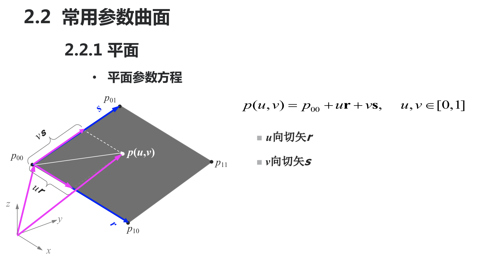
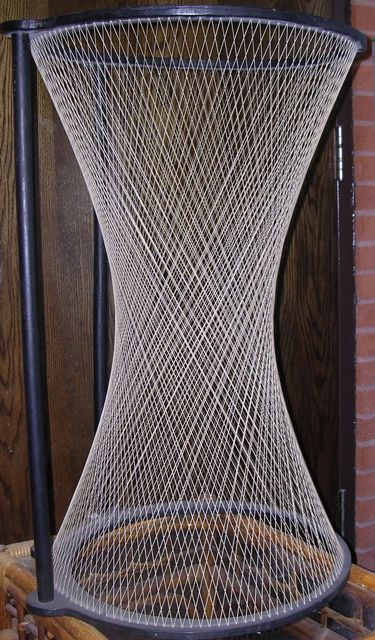
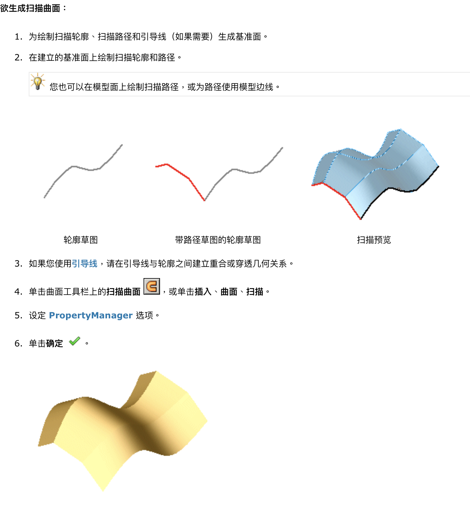

# Dec 5 Thu

## SE-344::CG

### NURBS

NURBS 看起来很眼熟…3ds max 里似乎有叫这个名字的功能。

翻译成人话就是非均匀有理 B 样条曲线。换句话说，他也是上面我们提到的 B 样条曲线的一种。

#### 特征

*   非均匀
*   有理

所谓非均匀的意思就是，每个节点分量在参数轴上的分布非均匀。

也就是说，每个控制顶点不再平等了，他们可能会拥有不同的权重，对整体曲线的影响力也就不同。


在函数中的表示，就是增加了一个权重分量 `W`。

#### 优点

*   投影变换／仿射变换下都保持不变
*   相比均匀的 B 样条曲线更灵活
*   ISO 认证，唯一表示法
*   高度直觀性和可預測性

>   控制点看起来要么跟最终的结果直接相连，要么表现起来跟结果用一根「橡皮筋」相连。

#### 缺点

*   运算耗时长
*   权重决定不好选，选错了问题大
*   点的映射算法在 NURBS 下不稳定（？？？）

>   ？为什么不稳定？
>
>   正向运算肯定是稳定的，也就是说通过各个参数值求出实际点位置肯定稳。
>
>   而反向运算跟均匀的 B 样条有什么区别呢？
>
>   非均匀。就是因为非均匀，计算上耗时肯定没那么方便了。
>
>   况且，鉴于权值分布不均匀，必然存在一些控制柄的权值低于平均，在反求他们的参数的时候，较小的误差就可能带来较大的不同。这种误差可能来自采样精度、浮点数运算精度等等。
>
>   无法逆运算是个比较致命的问题。

### Draw Bezier

道理我都懂了，但是 OpenGL 怎么画曲线？

#### 首先

打开一些神秘宏定义的开关（这种开关在 OpenGL 里可太多了）

```c++
glEnable(GL_MAP1_VERTEXT_3);
glEnable(GL_MAP1_TEXTURE_COORD_3);
```

#### 然后

调用 `glEvalCoord1f` 函数来确认在不同的参数取值下，对应到结果曲线的坐标。

#### 最后

用 `glBegin(GL_LINE_STRIP)` 开始把这些点连成折线。

虽然本质上是折线……但是呢，函数帮我们算好了非常贴近 Bezier 曲线的点序列，把他们画出来看起来就是那么回事了。

#### Draw NURBS

看起来 Bezier 曲线满含酸的…连独立的 API 都没有，对应的工具函数只是做数学计算。最后还要我们自己画折线（伪·曲线）。

NURBS 就不一样了：居然还有自己的类。

```c++
nobj= gluNewNurbsRenderer() ;
gluNurbsCallback (nobj, GLU_ERROR, ErrorCallback);
gluNurbsProperty(nobj,GLU_U_STEP,15.0 );
gluNurbsProperty(nobj,GLU_V_STEP,15.0 );
gluBeginCurve(nobj) ；
		gluNurbsCurve (nobj,…,GL_MAP1_TEXTURES_COORD_2); 
		gluNurbsCurve (nobj,…,GL_MAP1_NORMAL);
		gluNurbsCurve (nobj,…,GL_VERTEX_4);
gluEndCurve (nobj);
```

`gluNurbsRenderer` 类型的实例创建之後，就可以通过 `gluNurbsCurve` 来声明曲线的一些信息了。

```c++
void gluNurbsCurve (GLUnurbs *nurb,
                    GLint knotCount, 
                    GLfloat *knot, 
                    GLint stride, 
                    GLfloat *control, 
                    GLint order, 
                    GLenum type)
```

其中，nurb 是 NURBS 对象指针；
knotCount 指定 knots 中节点的数目；
knots 指定一个 knotCount 的非减节点值的数组；
stride 指定连续的曲线控制点之间的偏移量；
control 是控制顶点数组的指针；
order 是 NURBS 曲线的阶数；
type 指定 NURBS 对象的类型。

>   这里没啥好说的…总归直接画就完了。
>
>   要讨论 API 设计的话，那 CG 里每一个都是一塌糊涂。这个复杂度没办法设计得干净。

### Line to Curve

从曲线到曲面：重大突破！

#### 参数曲面

参数曲面定义跟参数曲线相当类似：

参数曲线是一个参数 $t$ 决定出一组 $(x, y)$；

而参数曲面则是两个参数 $(u, v)$ 决定出一组 $(x, y, z)$。

反正结果就是取遍了所有的 $t$，返回值组合在一起就能得到一根线；

取遍了所有的 $u$ 跟 $v$ 的组合，返回值组合在一起就拼成了一个曲面。

#### 连续性

跟参数曲线一样，参数曲面也具有 C 和 G 的连续判别法。

规则也是蛮神似的：

*   假如两个曲面有公共连接线，那么他们至少 C^0^ 连续，也至少 G^0^ 连续。
*   假如要求 C^i^ 连续，那么要求存在一条公共连接线，在这条连接线上每一处都具有 $i$ 阶的连续偏导。
*   假如要求 G^1^ 连续，那么要求存在一条公共连接线，在这条连接线上每一处都存在公共切平面。

>   存在公共切平面 = 存在公共的曲面法线，一码事。

*   那么更高级的 G 连续呢？不太好理解。

看一篇 2010 年的老文：

>   G0两个对象相连或两个对象的位置是连续的。G0连续（也称为点连续）在每个表面上产生一次反射，这种连续仅仅保证曲面间没有缝隙而是完全接触。 
>   G1两个对象光顺连续，一阶微分连续，或者是相切连续的。G1连续（也称为切线连续）将产生一次完整的表面反射，反射线连续但是扭曲状，这种连续仅是方向的连续而没有半径连续。我们通常的倒圆角就是这种情况。 
>   G2两个对象光顺连续，二阶微分连续，或者两个对象的曲率是连续的。G2连续（也称为曲率连续）将产生横过所以边界的完整的和光滑的反射纹。曲率连续意味着在任何曲面上的任一“点”中沿着边界有相同的曲率半径。外观质量要求高的产品需要曲率做到G2连续，其实曲面做到这一点难度是很大发。在我们一般的产品设计中G1连续就能满足大部分产品开发需要。 
>   G3两的对象光顺连续，三阶微分连续等。 
>   Gn的连续性是独立于表示（参数化）的。

用简单的话说，就是 G0 - 接触，G1 - 共切线，G2 - 共曲率。

本质一点看，就是 0 阶微分，1 阶、2 阶的问题了。

#### Example

##### 平面



平面就是简单的线性比例加和。手指头就能想明白。

##### 直纹面


>   啥是直纹面啊？

在[幾何學](https://zh.wikipedia.org/wiki/幾何學)中，如果一個曲面上的任意一點上均有至少一條[直線](https://zh.wikipedia.org/wiki/直線)經過，則稱該曲面為**直紋曲面**。另一種常見的說法是，如果一個曲面可以由一條直線通過連續運動構成，則可稱其為直紋曲面。



比如很好看的单叶双曲面就是直纹面。

##### 双线性曲面


根据这个想象一下，相当于把 $u$、$v$ 的 0 ～ 1 取值范围给 Map 到了四个 P 对应的四边形里了…

矩阵表示看起来是真漂亮。

##### Linear Coons Curve

##### Type II Coons Curve

##### Bezier 曲面


控件中的一堆点组成点列来决定曲面。

这时候不像二维的控制柄了，这会儿控制柄进化为一个控制网格，每一个点对应网格中的一个小面片。

##### B 样条曲面


##### NURBS


##### 扫描面

Swept Surface...

这个很有意思了。



用两个正交平面上的曲线来构造出一个曲面，结果灵活而直观。

### OpenGL APIs

跟二维里一个套路…用 `glMap2` 造出一个求值器，然后只要按照一定的密度调用求值函数，它就会帮你用 (u, v) 吐出一堆 (x, y, z)。

可以通过 `glEvalCoord2` 来计算单个顶点，也可以用 `glMapGrid2` 和 `glEvalMesh2` 来计算均匀曲面的坐标。

你拿到顶点之後，再用这个来画图就得了。