# SE-344

## Assignment Final Report

### 概述

#### 第一部分：技术框架

##### GLFW

由于 GLFW 相较于 FreeGLUT 提供了更接近底层的 Shader 支持，因此第一部分涉及到法线贴图的动画将基于 GLFW 开发。

使用的 GLFW 版本是 `3.3`。

##### FreeGLUT

由于这一 Utility Toolkit 提供了封装过的大量的实用工具函数，极大地简化了 OpenGL 的开发进程，因此後续一些相对简单的动画制作将基于 FreeGLUT 完成。

使用的 FreeGLUT 版本是 `3.2.1`。

##### SOIL

由于本次作业涉及到大量背景和材质图片的读取，而 OpenGL 本身没有提供除 `.bmp` 格式之外的图片读取器。因此，引入了 SOIL 库作为 `.png` 格式素材的读取器。

##### 编译环境

使用的操作系统是 Windows 10 x64 LTSC 1809 (`17763.737`)。

使用的 IDE 是 Visual Studio 2019 Community (`16.2.4`)。

##### 编程语言

为了方便管理及控制复杂度，本次大作业的主体部分被拆分成了四个基于 OpenGL 的程序，每一个对应故事情节中的一部分。他们分别基于 GLFW 和 FreeGLUT，均以 C++ 写成。

为了方便展示观看，还使用 C# 写了一个调度器。她将按照故事剧情依次进行调度，同时播放适当的音频以渲染气氛。

#### 第二部分：运行时截图

##### Intro 页面

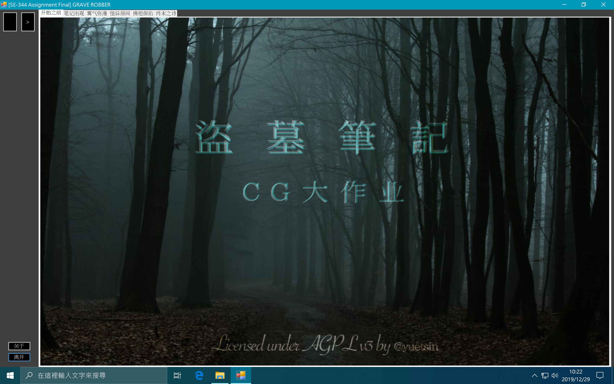

>   静态片头画面。

##### Notebook 页面

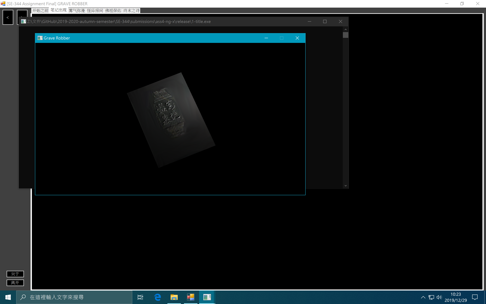

>   笔记本翻转着进入镜头。同时，可以感受到光线带来的表面凹凸效果。


>   笔记本渐渐飘远，进入下一场景。

##### Smoke 页面

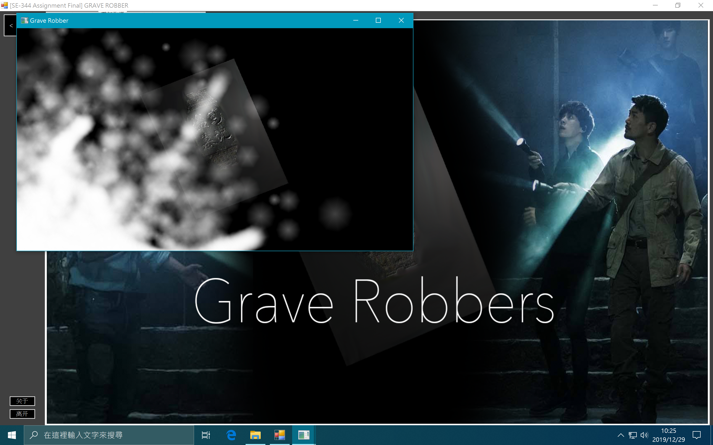

>   具有粒子效果的迷雾扩散并遮盖了笔记本。

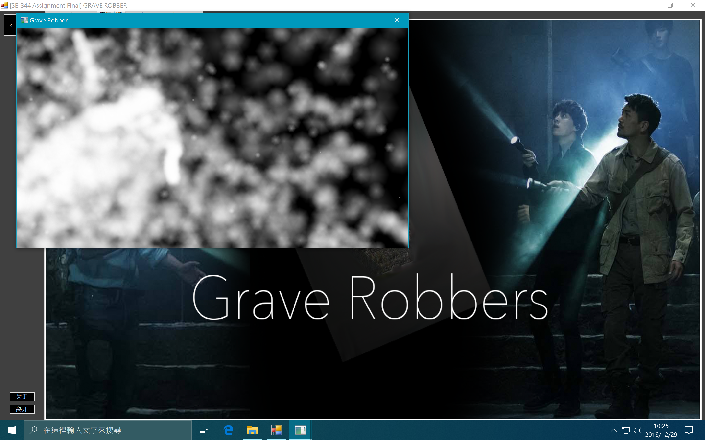

>   笔记本已经看不见了。

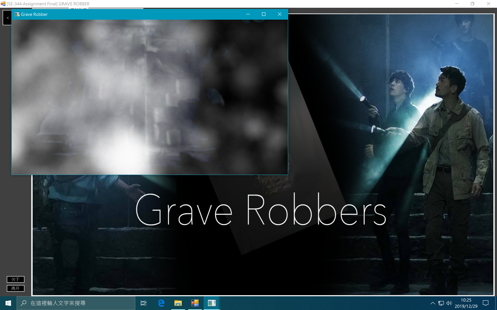

>   迷雾散去，出现了一间暗室。

##### Darkroom 页面

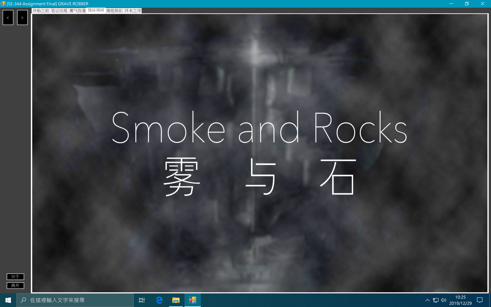

>   过场静态图片。进入下一场景。

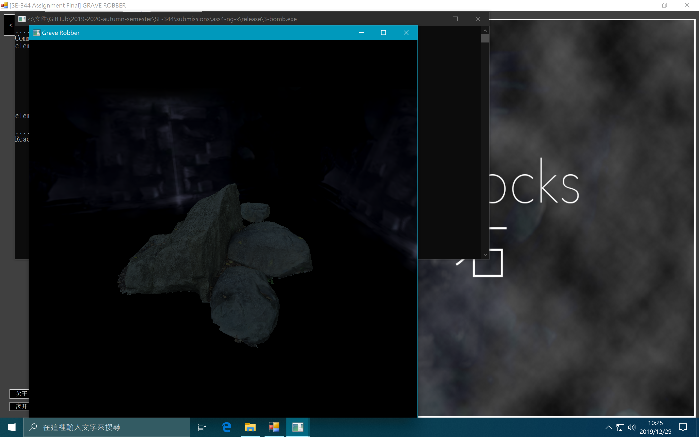

>   暗室里几乎什么都看不见，除了面前的一堆石头和四面隐隐发光的墙。

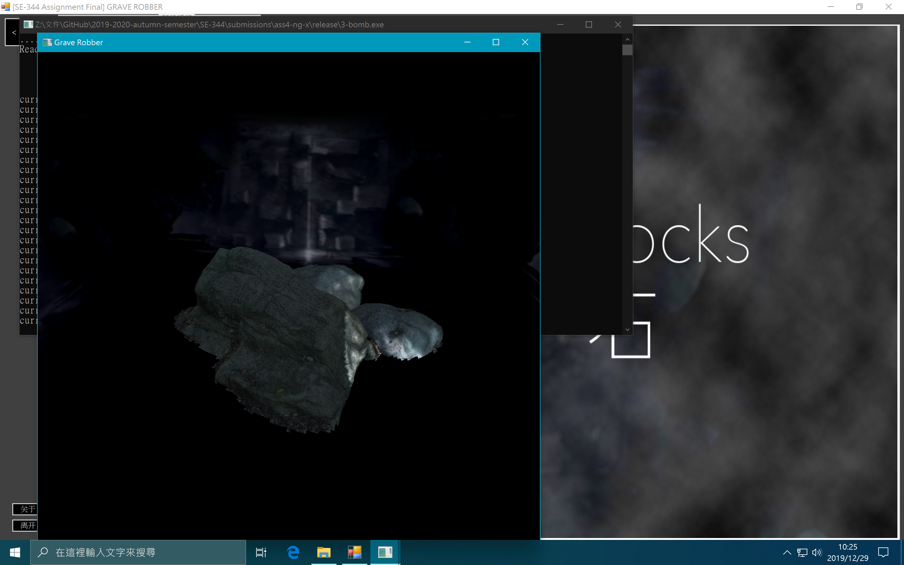

>   按 Space 键打开手电筒，可以看到明显的高光效果和石头表面凹凸不平的效果。
>
>   按 W、A、S、D 键调整光源的位置。按 R 键复位。

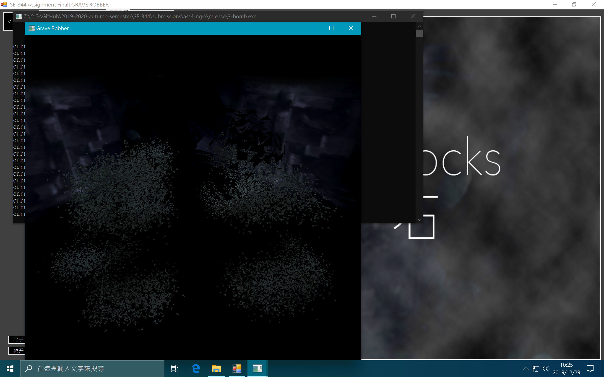

>   按下 B 键，炸弹从天而降，碰撞到石头之後产生爆炸。

##### Buddha 页面

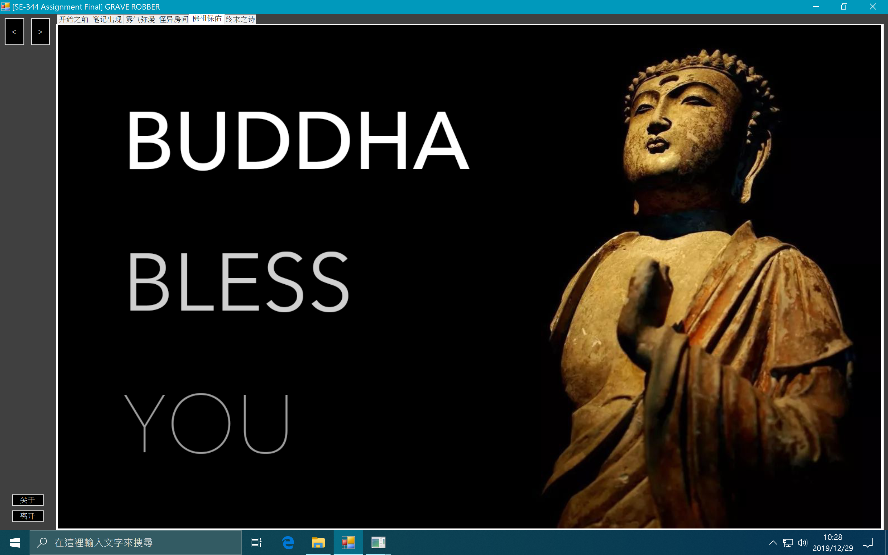

>   静态过场图片。进入下一场景。

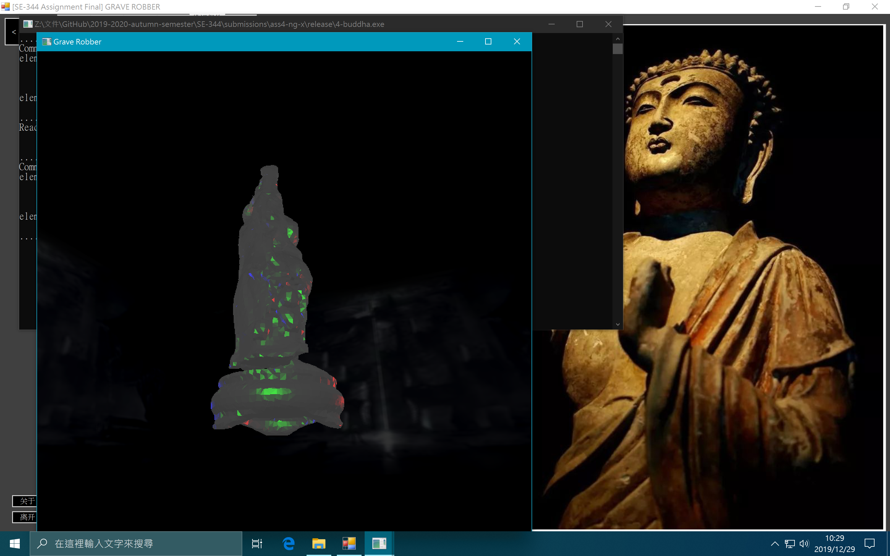

>   此时场景仍然在之前的房间里，但相较上一个画面亮度提高了些，视角也有所改变。
>
>   初始情况下，模型分辨率很低。
>
>   为了更明显地表现出方向感和纵深感，场景中放置了三盏 R、G、B 色的灯光，彼此相隔 $\frac 1 3$ 个圆摆放。

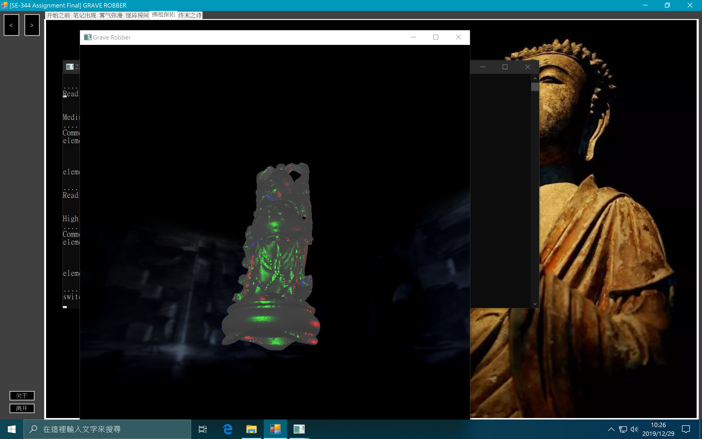

>   模型在运行时动态地加载并使用了中等分辨率的模型。
>
>   可以看出此时模型表面光滑了一些。

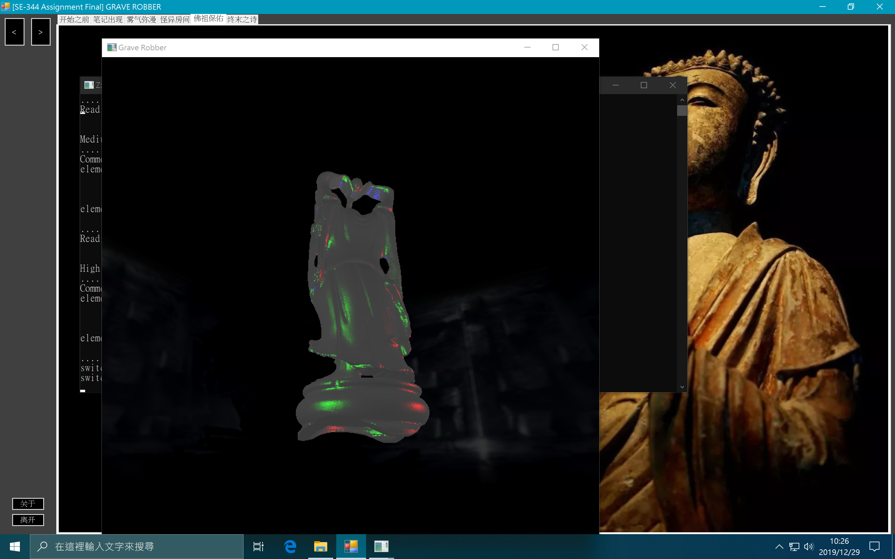

>   模型在运行时动态地加载并使用了高分辨率的模型。
>
>   此时模型的表面光滑了不少，表面带着银色的光泽。

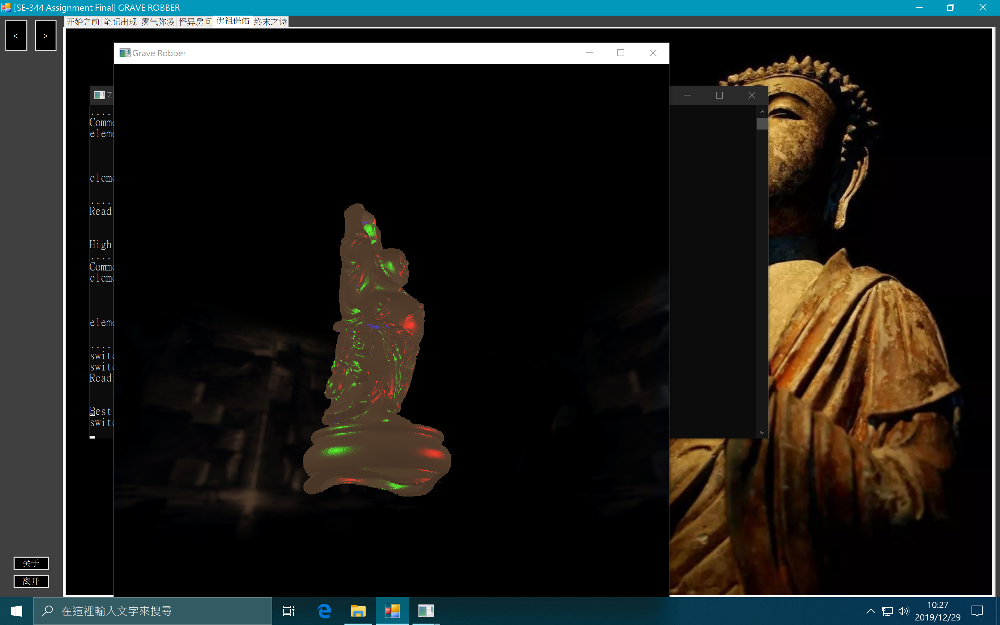

>   模型在运行时动态地加载并使用了最高分辨率的模型。
>
>   此时模型的表面已经相当光滑了，表面还带着金色的光泽。

##### Outro 页面

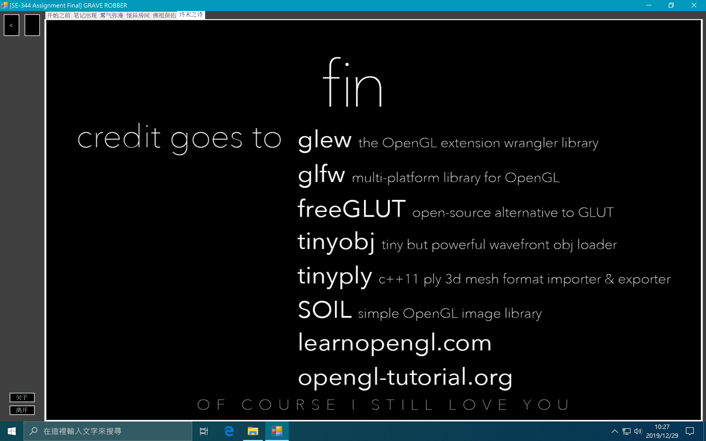

>    展示了开发过程中引用的第三方库以及参考网站。
>
>    非常感谢。

#### 第三部分：操作说明

* 在 Supervisor 外壳程序中，可点按左下角的「关于」按钮来查看信息。
* 在 Supervisor 外壳程序中，可点按左下角的「离开」按钮来结束程序。
* 在 Supervisor 外壳程序中，可以通过点按左上角的 `<` 和 `>` 按钮在不同页面之间切换。
* 在 Supervisor 外壳程序中，还可以通过点按屏幕顶部的 Tab 菜单页来切换分页。

* 在 Darkroom 页面子程序中，点按空格键即可打开「手电筒」。
* 在 Darkroom 页面子程序中，在手电筒开启的状态下可通过按 W、A、S、D 来调整灯光位置。
* 在 Darkroom 页面子程序中，在手电筒开启的状态下可通过按 R 来将灯光复位。
* 在 Darkroom 页面子程序中，在手电筒开启的状态下可通过按 B 来引爆炸弹。

### 详细

#### 第一部分：笔记出现

##### 模型建构

这一步骤中需要的模型相对简单：只是一个长宽比为 $\sqrt 2 : 1$、厚度随意的六面立方体而已。为了简单起见，不采用从 `.obj` 或 `.ply` 文件中读取模型的做法，而是直接将模型顶点数据硬编码到源代码中。

> 此部分对应的源文件为 `./1-title/source/ModelKits.hpp`。

模型采用如下的结构体保存：

```c++
typedef struct modelRecord {
    float* buffer;
    size_t size;
} * modelRecordT;
```

`float` 数组中，八个浮点数编为一组表示一个顶点；分别是 3 个顶点坐标、3 个顶点法向量和 2 个顶点纹理坐标 u、v。

正方体有六个面；每个面需要两个三角形拼凑而成。每个三角形有三个顶点（废话）。因此数组中的浮点数个数为 $6 \times 2 \times 3 \times 8 = 288$。

由于 `float*` 类型无法携带数组大小信息，因此将 `size` 包装在结构体中一并传递给渲染器。

##### 材质制作

Assignment Final 中提供的贴图并非是标准的 Normal Mapping 所需的材质。标准材质中的每个像素点的 R、G、B 分量分别对应了法线方向的 x、y、z，其中 z 为垂直纸面向上的方向。

由于大部分材质的起伏都不大，基本都沿着正规的 z 方向，因此反映到材质图片中的 B（蓝色）分量就相对较高，整体色调就偏蓝。

将给出的深度图转换为法线贴图的方式很多；这里采用了 `CrazyBump` 软件来实现这一转换。

转换前后的图片如图所示。

/Users/yue/Documents/GitHub/2019-2020-autumn-semester/SE-344/submissions/ass4-ng-x/report/report.assets/origin_and_nrm.png)

##### 材质加载

为了在保证图片质量的前提下尽量减小文件体积，所有贴图一律采用 `.png` 格式保存。

首先，使用 `glGenTextures` 函数初始化一类材质 ID。用 `glActiveTexture` 函数将其在上下文中激活。

接着，通过 `stbi_load` 函数即可将贴图文件读取到 `unsigned char* buffer` 缓冲区中。

随后，使用 `glTexImage2D` 函数即可使用缓冲区初始化材质。

最后，别忘了用 `stbi_image_free` 释放缓冲区，以免内存泄漏。

通过这种操作，依次引入三种材质：一种是 `title.png` 对应的一般表面贴图；一种是 `title_spec.png` 对应的反射光贴图；一种是 `title_NRM.png` 对应的法线贴图。

> 反射光贴图通过明/暗的区域来指定物体表面反射光的强度，以增强真实感。

##### 绘制模型

GLFW 的模型绘制没有 FreeGLUT 那样良好的封装。因此步骤相对来说复杂一些。

由于这里需要大量空间向量的计算，因此引入了 `glm` 库来辅助。

为了实现镜头逐渐拉远的效果，使用下面的代码来计算视角向量：

```c++
if ( zoomOutSpeed > 0.01f ) {
  zoomOutSpeed *= 0.5f;
}

view = glm::translate( view, glm::vec3( 0.0f, 0.0f, -zoomOutSpeed ) );
```

将视角位置向量 `view` 保存好，稍后会用到。

同时模型还需要自转，因此使用下面的代码来旋转模型：

```c++
model = glm::rotate( model, radius, glm::vec3( 0.5f, 0.1f, 0.0f ) );
```

代码将模型向量 `model` 以 $(0.5, 0.1, 0.0)$ 向量为轴旋转 `radius` 度。

最后，我们使用 `glBindVertexArray` 绑定顶点缓冲，并使用 `glDrawArrays` 绘制模型。

##### 着色器

尝试了很多种着色器的实现方法，最终采用的着色器是内嵌在 `./1-title/rendering/shader.cpp` 中的那一种。

其中顶点着色器相对简单，接受的参数包括一个 `position`、一个 `normal` 和一个 `textureCoordinate`。就是我们上面的顶点缓冲区里的八项内容。

另外还有全局变量 `projection`、`view`、`model` 和 `normalMatrix`，分别代表投影灭点位置、视角位置、模型变换矩阵和法线变换矩阵。

算法只有四行：

```c++
gl_Position = projection * view * model * vec4(position, 2.0f);
fragPosition = vec3(model * vec4(position, 2.0f));
outNormal = normalMatrix * normal;
textureCoordinates = inTextureCoordinates;
```

最终的位置 `gl_Position` 将会由投影点、视角位置、模型位置共同决定。将他们做叉乘来实现计算。

而每个片段的 `fragPosition` 则直接用 `model` 和 `position` 叉乘得到。

真实的法线方向也由输入的法线方向和坐标变换矩阵叉乘得到。

而 `textureCoordinates` 保持不变，直接传递给片段着色器。

 片段着色器就比较复杂了。为了实现凹凸效果，我们需要对法向量开刀，将其改写为 Normal Mapping 的数据。

留意到法线贴图中，R、G、B 分量的取值范围都是 $[0, 1]$；然而实际的法线方向取值范围则是 $[-1, 1]$。

因此我们必须进行一次线性变换来将其进行重定向，将每一个分量进行 $\times 2 - 1$ 的操作：

```c++
vec3 normalMap = texture(material.emission, textureCoordinates).rgb * 2.0 - 1.0;
vec3 normalNormal = normalize(normalMap.rgb);
```

随后，为了计算环境光的颜色，利用下面的公式：

```c++
vec3 ambientLight = ambientStrength * lightColor * vec3(texture(material.diffuse, textureCoordinates));
```

计算「光强 × 光色 ×（漫反射系数 结合 贴图坐标）」，即可得到环境光对物体产生的颜色影响。

用同样的方法计算漫反射光的颜色：

```c++
vec3 diffuseColor = diffuseStrength * lightColor * vec3(texture(material.diffuse, textureCoordinates));
```

接着，计算反射光的颜色，利用下面的公式：

```c++
vec3 specular = specularStrength * lightColor * vec3(texture(material.specular, textureCoordinates));
```

计算「光强 × 光色 ×（镜面反射系数 结合 贴图坐标）」，即可得到反射光对物体产生的颜色影响。

最后，将三种颜色混合在一起，即可得到最终的片段颜色了。

```c++
gl_FragColor = vec4(ambientLight + diffuseColor + specular, 1.0f);
```

##### 电闪雷鸣

为了模拟闪电的效果，采用下面这个~~随便写的~~随机算法来实现：

```c++
if ( int( rand_color * 27544 ) % 13 == 0 ) {
  // simulates the storm effect
  glClearColor( rand_color, rand_color, rand_color, 1.0f );
}
else {
  glClearColor( 0.0f, 0.0f, 0.0f, 1.0f );
}
```

本质上就是随机用带颜色的笔刷绘制背景而已。配合上外壳程序的声音效果还勉强能看。

#### 第二部分：雾气弥漫

##### 粒子系统

这一部分的难点主要是如何模拟真实的雾气弥漫和消散的效果。因此，自行实现了一个简单的、带有增值、耗散的粒子系统。

> 此部分代码参见文件 `./2-smoke/particles/particle_generator.hpp`。

每个粒子具有下面一些属性：

```c++
struct Particle {
    float posx, posy;
    float spdx, spdy;
    float alpha;
    bool  valid;
};
```

依次为二维空间中的位置、速度，粒子的透明度，以及是否有效的标识位。

由于对于「雾气」来说，粒子存活的时间越久，透明度越低，且半径越大（由于扩散的稀释效应）。

因此将三个变量综合到同一个 `alpha` 变量中，方便。

关键的粒子系统更新函数主要做下面这些事情：

* 按照每个粒子的速度更新其位置；
* 令每个粒子在一定范围内随机地失去生命值（对应上面的 `alpha`）；
* 假如粒子越界、或是生命值降低为 0，则将其从粒子系统中清除；
* 随机更新粒子的速度。

由于每次更新包含对数组本身的更新，因此采用互斥锁 `mutex` 来防止 Race。

##### 绘制粒子

第二部分的需求很简单，因此也就没有使用 GLFW 的理由了。

核心代码如下：

```c++
for ( const auto& i : master->particles ) {
        float radius      = ( 1.5f - i.alpha ) * 50.0f;
        auto  actualAlpha = i.alpha / 3.0f;

        double n = double( random_int() % 6 ) + 6;  // fragment count

        glColor4f( 1.0f, 1.0f, 1.0f, actualAlpha );
        glBegin( GL_TRIANGLE_FAN );
        _glVertex3f( i.posx, i.posy, 0.1f );

        glColor4f( 1.0f, 1.0f, 1.0f, 0.0f );
        for ( size_t ic = 0; ic <= n; ic++ ) {
            _glVertex3f( i.posx + radius * cos( 2 * M_PI / n * ic ), i.posy + radius * sin( 2 * M_PI / n * ic ), 0.1f );
        }
        glEnd();
}
```

由于 FreeGLUT 不提供绘制圆的函数，因此需要手动用三角形来贴近圆形。

为了减少突兀的渐变，将贴近圆形边缘的顶点不透明度设定为 0。

另外，需要在 `onRender` 函数每次被调用时，更新一次整个粒子系统，以便实现扩散效果。

##### 混色

特别留意，通常带深度检测的 OpenGL 绘制不会绘制被覆盖的物体，而在这里我们不希望这种事情发生，因为半透明的粒子可能会相互遮盖产生混色。

因此，我们不要开启深度检测功能，同时使用下面的代码启动混色：

```c++
glEnable( GL_BLEND );
glBlendFunc( GL_SRC_ALPHA, GL_ONE_MINUS_SRC_ALPHA );
```

这样，烟雾效果就基本实现了。

##### 背景绘制

FreeGLUT 在渲染材质的混色时，会产生诡异的问题，拒绝绘制任何元素。

因此作为 Workaround，这里使用了 SOIL 手动读取背景图片的每个像素，并将其绘制到屏幕上。

> 具体的代码参见 `./2-smoke/TexLoader/texLoader.hpp`。

