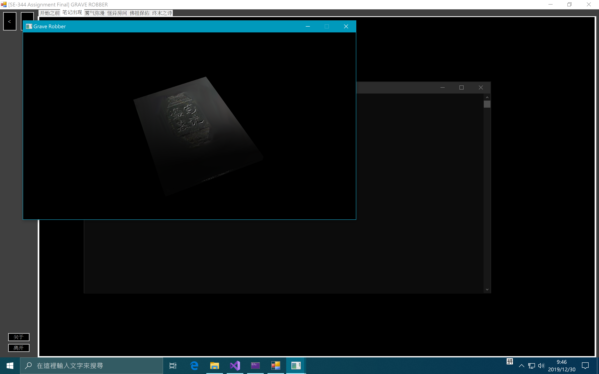

# SE-344

## Assignment Final Report

### 概述

#### 第一部分：技术框架

##### GLFW

由于 GLFW 相较于 FreeGLUT 提供了更接近底层的 Shader 支持，因此第一部分涉及到法线贴图的动画将基于 GLFW 开发。

使用的 GLFW 版本是 `3.3`。

##### FreeGLUT

由于这一 Utility Toolkit 提供了封装过的大量的实用工具函数，极大地简化了 OpenGL 的开发进程，因此後续一些相对简单的动画制作将基于 FreeGLUT 完成。

使用的 FreeGLUT 版本是 `3.2.1`。

##### SOIL

由于本次作业涉及到大量背景和材质图片的读取，而 OpenGL 本身没有提供除 `.bmp` 格式之外的图片读取器。因此，引入了 SOIL 库作为 `.png` 格式素材的读取器。

##### 编译环境

使用的操作系统是 Windows 10 x64 LTSC 1809 (`17763.737`)。

使用的 IDE 是 Visual Studio 2019 Community (`16.2.4`)。

##### 编程语言

为了方便管理及控制复杂度，本次大作业的主体部分被拆分成了四个基于 OpenGL 的程序，每一个对应故事情节中的一部分。他们分别基于 GLFW 和 FreeGLUT，均以 C++ 写成。

为了方便展示观看，还使用 C# 写了一个调度器。她将按照故事剧情依次进行调度，同时播放适当的音频以渲染气氛。

#### 第二部分：运行时截图

##### Intro 页面

>   静态片头画面。

##### Notebook 页面

>   笔记本翻转着进入镜头。同时，可以感受到光线带来的表面凹凸效果。

>   笔记本渐渐飘远，进入下一场景。

##### Smoke 页面

>   具有粒子效果的迷雾扩散并遮盖了笔记本。

>   笔记本已经看不见了。

>   迷雾散去，出现了一间暗室。

##### Darkroom 页面

>   过场静态图片。进入下一场景。

>   暗室里几乎什么都看不见，除了面前的一堆石头和四面隐隐发光的墙。

>   打开手电筒，可以看到明显的高光效果和石头表面凹凸不平的效果。
>
>   按 W、A、S、D 键调整光源的位置。按 R 键复位。

>   按下 B 键，炸弹从天而降，碰撞到石头之後产生爆炸。

##### Buddha 页面

>   静态过场图片。进入下一场景。

>   此时场景仍然在之前的房间里，但相较上一个画面亮度提高了些，视角也有所改变。
>
>   初始情况下，模型分辨率很低。
>
>   为了更明显地表现出方向感和纵深感，场景中放置了三盏 R、G、B 色的灯光，彼此相隔 $\frac 1 3$ 个圆摆放。

>   模型在运行时动态地加载并使用了中等分辨率的模型。
>
>   可以看出此时模型表面光滑了一些。

>   模型在运行时动态地加载并使用了高分辨率的模型。
>
>   此时模型的表面光滑了不少，表面带着银色的光泽。

>   模型在运行时动态地加载并使用了最高分辨率的模型。
>
>   此时模型的表面已经相当光滑了，表面还带着金色的光泽。

##### Outro 页面

>    展示了开发过程中引用的第三方库以及参考网站。